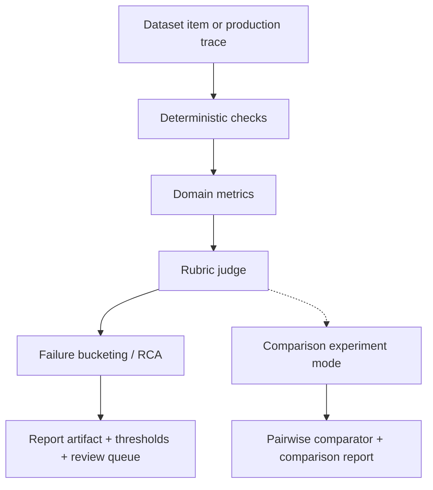

# Rustyfin AI Judge Improvement Plan

Date: 2026-04-07
Status: completed

## Purpose

Rustyfin already has a working fixture-driven AI eval harness for planner, retrieval, memory, execution, and task flows in [crates/server/src/ai_eval_harness/mod.rs](/Users/iwan/Desktop/Rustyfin/crates/server/src/ai_eval_harness/mod.rs), with the runnable CLI entrypoint in [crates/ai-evals/src/main.rs](/Users/iwan/Desktop/Rustyfin/crates/ai-evals/src/main.rs). That harness proves the assistant can be regression-tested in a structured way, but it still behaves more like a suite of metric checks than a true judge.

This document defines the next layer: a judge system that scores answer quality, concision, groundedness, safety, and trace fidelity in a consistent way across modes and domains.

The goal is not to replace the current eval suites. The goal is to add a higher-level adjudication layer on top of them.

## What the Judge Must Solve

The current eval stack is good at answering questions like:

- Did the planner choose the right tool?
- Did retrieval rank the right evidence?
- Did execution stop for the right reason?
- Did a task complete within budget?

The judge has a different job:

- Was the final answer actually useful?
- Was it concise enough for the question?
- Did it stay grounded in the evidence?
- Did it ask for clarification when it should have?
- Did it avoid unsupported detail, raw JSON leakage, or policy mistakes?
- Did it produce the right answer shape for the mode?

In short, the judge is the layer that tells us whether Rustyfin answered well, not just whether it ran correctly.

## Current Rustyfin Baseline

Rustyfin already has the raw material needed for a serious judge:

- fixture-driven AI eval harness modules for planner, retrieval, memory, execution, and tasks
- structured suite-level report output in [crates/server/src/ai_eval_harness/report.rs](/Users/iwan/Desktop/Rustyfin/crates/server/src/ai_eval_harness/report.rs)
- production traces and execution summaries persisted in the AI runtime/admin surfaces
- compact grounding chunks and tool traces
- a clear distinction between deterministic reply logic and model-generated answer text

That means the judge can be built as an incremental layer:

1. keep the current suite-level metric checks
2. add answer-level scoring on top of the existing traces and outputs
3. make the scoring reproducible and versioned
4. use the same harness for offline regression and production-trace review

## How Open Source Projects Do It

Rustyfin should borrow from several established patterns rather than invent a one-off scoring system.

| Project | How it works | What to copy into Rustyfin |
|---|---|---|
| [OpenAI evaluation best practices](https://platform.openai.com/docs/guides/evaluation-best-practices), [Getting started with datasets](https://platform.openai.com/docs/guides/evaluation-getting-started), [Trace grading](https://platform.openai.com/docs/guides/trace-grading) | Define success criteria first, use representative datasets, log everything, automate when possible, calibrate against humans, and grade end-to-end traces when workflow behavior matters. | Start with explicit success criteria, mine logs into datasets, keep evals continuous, and grade traces for full agent workflows rather than only final text. |
| [OpenAI Evals](https://github.com/openai/evals) and [build-eval.md](https://github.com/openai/evals/blob/main/docs/build-eval.md) | Evals are defined from data plus an eval definition, with reproducible comparisons across datasets and models. | Treat judge cases as versioned datasets, keep the judge prompt/schema versioned, and make every metric reproducible from fixtures. |
| [Anthropic: Define your success criteria](https://docs.anthropic.com/en/docs/test-and-evaluate/define-success), [Create strong empirical evaluations](https://docs.anthropic.com/en/docs/build-with-claude/develop-tests), [Prompt engineering overview](https://docs.anthropic.com/en/docs/build-with-claude/prompt-engineering/overview) | Start from clear, measurable criteria; design task-specific tests that mirror production; automate when possible; use detailed rubrics; prefer the fastest reliable grading method; and use prompt engineering only for criteria that are actually prompt-controllable. | Turn each expected behavior into a measurable criterion, use code-based checks for rigid constraints, and reserve LLM grading for nuanced judgments that need rubric-based scoring. |
| [Promptfoo intro](https://www.promptfoo.dev/docs/intro/), [LLM Rubric](https://www.promptfoo.dev/docs/configuration/expected-outputs/model-graded/llm-rubric/), [Search Rubric](https://www.promptfoo.dev/docs/configuration/expected-outputs/model-graded/search-rubric/), [Select Best](https://www.promptfoo.dev/docs/configuration/expected-outputs/model-graded/select-best/), [Max Score](https://www.promptfoo.dev/docs/configuration/expected-outputs/model-graded/max-score/) | Tests are declarative. Deterministic assertions and model-graded assertions can be mixed in the same case. `search-rubric` is for tests that intentionally need current facts. `select-best` is for comparing multiple outputs in one case row. `max-score` is for selecting the highest-scoring output from other assertions. | Use layered assertions: hard checks first, rubric judge second, and pairwise selection only in comparison experiments. Add a deterministic score aggregator for objective metrics. |
| [DeepEval](https://deepeval.com/) | Unit-testing for LLMs with Pytest-style workflows, LLM-as-a-judge metrics, multi-turn tests, multimodal tests, synthetic data generation, and human annotations. | Make judge cases code-reviewable, support multi-turn conversations, generate synthetic edge cases only as a supplement, and keep a human-annotation path for disagreements. |
| [Google Vertex AI evaluation overview](https://docs.cloud.google.com/vertex-ai/generative-ai/docs/models/evaluation-overview), [evaluation dataset](https://docs.cloud.google.com/vertex-ai/generative-ai/docs/models/evaluation-dataset), [define metrics](https://cloud.google.com/vertex-ai/generative-ai/docs/models/eval-python-sdk/determine-eval), [evaluate a judge model](https://docs.cloud.google.com/vertex-ai/generative-ai/docs/models/evaluate-judge-model) | Use representative datasets, pointwise and pairwise metrics, adaptive rubrics, human-rated ground truth for judge calibration, and around 100 examples as a practical starting point for aggregated metrics. | Use prompt/response/reference-style rows, plus history or baseline_model_response when the task requires them, calibrate judge behavior against human labels, and use pairwise comparisons only when comparing candidates. |
| [Langfuse evaluation overview](https://langfuse.com/docs/evaluation/overview) and [datasets/experiments](https://langfuse.com/docs/evaluation/experiments/overview) | Datasets and experiments are first-class. Test cases can be created from production traces, LLM-as-a-judge can run on traces, and annotation queues support human calibration. | Build the judge around versioned datasets, production-trace imports, and explicit human-review queues. |
| [Ragas faithfulness](https://docs.ragas.io/en/stable/concepts/metrics/available_metrics/faithfulness/), [context precision](https://docs.ragas.io/en/stable/concepts/metrics/available_metrics/context_precision/), [response relevancy](https://docs.ragas.io/en/stable/concepts/metrics/available_metrics/answer_relevance/) | Retrieval and answer quality are scored with separate metrics: context precision/recall, faithfulness, and response relevancy. | Split grounding quality from final answer quality. Do not collapse both into one generic score. |
| [UpTrain](https://docs.uptrain.ai/) | Provides preconfigured checks, local dashboarding, and root-cause analysis for failure cases. | Add failure buckets and root-cause summaries so the judge explains why a case failed, not just that it failed. |
| [lm-evaluation-harness](https://github.com/EleutherAI/lm-evaluation-harness) | Benchmarking is config-driven, reproducible, and backend-agnostic. Public task configs improve comparability and sharing. | Keep judge corpora config-driven and portable. Use stable task versions and reproducible outputs. |

All source links in this section point to official project docs or repository pages.

The common pattern across these projects is simple:

1. version the test corpus
2. separate objective checks from subjective judgment
3. keep the judge output structured
4. preserve traceability back to the dataset item or production trace
5. compare results across versions, not only against a single threshold

### Cross-vendor implementation rules

The judge should follow these rules everywhere:

- Define success criteria before writing the judge logic.
- Use representative datasets that mirror production traffic, including edge cases.
- Keep hard checks deterministic.
- Use model-graded scoring only for subjective or partially subjective quality dimensions.
- Use pairwise evaluation for prompt and model comparisons.
- Calibrate automated scoring against human labels.
- Log every run and mine logs continuously for new eval cases.
- Keep trace-based grading available for end-to-end agent workflows.
- Prefer structured outputs, not free-form explanations, for machine consumption.
- Re-evaluate continuously after changes, not only before release.

### Design constraints from the source material

These are the implementation rules that fall out of the source material above:

- Use dataset/version pairs as the unit of reproducibility.
- Keep deterministic checks separate from model-graded checks.
- Grade with the fastest reliable method first: code-based, then human review when necessary, then LLM grading for nuanced judgments.
- Use rubric scoring for qualitative judgment, not for hard privacy or ACL decisions.
- Use current-facts search only for tests that intentionally require current facts.
- Keep pairwise comparison in a separate comparison-experiment path, not the default per-answer judge path.
- Support multi-turn cases and human annotations as first-class calibration tools.
- Keep retrieval-quality metrics separate from answer-quality metrics.
- Make production-trace imports explicit, reviewable, and access-controlled.
- Treat human review as a calibration input, not an afterthought.
- Prefer task-specific evals over generic “good answer” rubrics.
- Keep dataset examples dense enough that another engineer can reproduce the intended label.
- Use separate metrics for pointwise scoring, pairwise scoring, and trace grading.
- Include explicit rubric examples of acceptable and unacceptable outputs when the target behavior is subjective.

## Proposed Judge Architecture

The judge should be layered, not monolithic.



### 1. Input capture

Every judge case should capture:

- the user question or conversation turn
- the assistant answer to be judged
- the grounded evidence that was available
- the selected tools and execution trace, when relevant
- the mode: `Instant`, `Thinking`, or `Extended`
- the domain: calendar, memory, weather, downloads, library, system, rooms, network, AI runtime, tasks, or other
- the source of truth for the case: fixture, production trace, human-labeled gold item, or synthetic example

Every case should also capture the identifiers needed to replay it later without guesswork:

- `case_id`
- `dataset_version`
- `judge_version`
- `rubric_version`
- `trace_id` when the case comes from a production trace
- model or backend configuration
- source type
- review status

### 2. Deterministic checks

These should run first and fail fast.

Examples:

- JSON validity
- output length caps
- forbidden raw JSON leakage
- required mention checks
- explicit refusal checks
- ACL or policy checks
- date/time consistency checks
- citation or source-label presence checks

This layer should be cheap and deterministic. If a response fails a hard check, no judge model should be needed.

Hard checks are binary. If any hard check fails, the case fails regardless of the weighted score.

Hard checks include:

- ACL leakage
- private-data leakage
- policy violations
- invalid schema or invalid JSON
- wrong refusal on a prompt that must be refused
- missing required citation on a citation-bearing response type
- date or time mismatch on exact-time domains

Citation checks must stay scoped to citation-bearing answer types and domains. Do not fail a valid concise response simply because that surface does not emit citations in the first place.

### 3. Domain metrics

These are objective or semi-objective scores that depend on the task family.

Examples:

- retrieval quality
  - context precision
  - context recall
  - faithfulness
  - response relevancy
- concise-answer quality
  - brevity
  - repetition penalty
  - directness
- trace fidelity
  - correct tool family
  - correct stop reason
  - correct clarification behavior
- safety
  - no unsupported claims
  - no private data leakage
  - no auth scope leakage

### 4. Rubric judge

This is the LLM-as-a-judge layer for subjective aspects that do not reduce cleanly to exact-match rules.

It should score:

- clarity
- helpfulness
- concision
- completeness
- groundedness
- tone fit
- answer shape fit
- whether clarification was the right move

The rubric judge should return structured JSON, not free-form prose.

Rubrics should be short, concrete, and example-backed. Use separate rubrics for distinct concerns instead of one vague "good answer" rubric.

When the task is subjective, prefer multiple rubric passes over a single overloaded rubric:

- one rubric for groundedness
- one rubric for concision
- one rubric for helpfulness or tone
- one rubric for answer-shape fit
- one rubric for clarification correctness where needed

### 5. Pairwise comparator

For prompt and model comparisons, the judge should support pairwise selection between candidates.

Use this for questions like:

- which prompt version yields the most concise grounded answer?
- which model configuration yields the best tradeoff between brevity and correctness?
- which answer is more direct without losing important facts?

This is where Promptfoo-style `select-best` and weighted aggregation are useful.

### 6. Failure bucketing / RCA

When a case fails, the judge should not stop at `failed`.

It should identify likely failure buckets such as:

- too verbose
- unsupported claim
- missing grounding
- wrong tool family
- over-clarification
- under-clarification
- stale information
- policy leakage
- ACL leakage
- malformed format
- wrong answer shape
- insufficient evidence

That failure bucketing is what makes the judge useful during prompt iteration.

### 7. Report artifact

Every judge run should emit a machine-readable report plus a compact markdown summary.

The report should include:

- dataset version
- judge version
- target model or configuration
- aggregate scores
- per-case scores
- per-tag scores
- failure buckets
- disagreements
- human-review queue items
- baseline comparison results

## Judge Output Contract

The judge should produce a structured verdict, not just a score.

Recommended shape:

```json
{
  "case_id": "calendar-next-event-short",
  "dataset_version": "2026-04-07-v1",
  "judge_version": "2026-04-07-v1",
  "rubric_version": "2026-04-07-v1",
  "trace_id": "trace-123",
  "source_type": "fixture",
  "model_id": "gpt-5",
  "pass": true,
  "hard_gate_failures": [],
  "score": 0.92,
  "confidence": 0.88,
  "subscores": {
    "groundedness": 1.0,
    "concision": 0.85,
    "completeness": 0.90,
    "clarity": 0.95
  },
  "failure_buckets": [],
  "reason": "Direct answer, grounded in the available evidence, and short enough for the query.",
  "needs_human_review": false,
  "run_id": "run-123"
}
```

Important rules:

- the judge output must be parseable
- the judge must not expose hidden reasoning chains
- the reason field should be short and operational
- thresholds should be explicit
- confidence should be available, even if it is only heuristic at first

## Scoring Model

The judge should use a weighted scorecard for soft scoring and regression sensitivity. The weighted score is not allowed to override hard gates.

Suggested top-level weights:

- groundedness: 30%
- correctness: 30%
- concision: 20%
- completeness: 15%
- clarity: 5%

Safety, ACL, privacy, and refusal correctness are hard gates. They are not expressed as a weighted score because they should never be “mostly okay.”

In this document, correctness means soft semantic correctness after the hard gates already pass.

Those weights should vary by domain and mode.

### Mode-specific expectations

#### `Instant`

- extremely short answers
- no extra exposition unless necessary
- hard penalty for rambling
- strong preference for direct refusal or clarification over speculative detail

#### `Thinking`

- short answer first
- one compact follow-up sentence or bullet list if needed
- allows one clarification or bounded recovery path
- still penalizes unnecessary detail

#### `Extended`

- more room for synthesis
- still capped
- can include brief structure or comparison
- should remain grounded and avoid wall-of-text responses

### Hard-gate / soft-score split

Use the following split everywhere:

- hard gates decide pass/fail
- soft scores decide ranking, regression sensitivity, and report detail

Hard gates must always include:

- privacy and ACL boundaries
- policy boundaries
- exactness for domains that require exact answers
- refusal correctness for prohibited prompts
- schema validity for structured outputs

Soft scores may include:

- concision
- clarity
- completeness
- helpfulness
- tone fit
- comparison quality

### Domain-specific expectations

#### Calendar

- answer shape should be direct
- dates and times must be exact
- if the date window is missing, clarification is better than guessing

#### Memory / Human Dictionary

- privacy and ACL correctness matter as much as factual accuracy
- answer should stay compact and avoid exposing unrelated graph data

#### Weather

- answer should be precise about location and date
- current-vs-forecast-vs-history should be explicit
- brevity matters because the useful information is usually small

#### System / AI runtime

- exact values matter
- brevity matters
- no speculative interpretation of metrics

#### Libraries / Downloads

- the judge should prefer item-specific details only when requested
- compact answer shape is preferred
- no raw JSON dumps

### Domain coverage matrix

The first judge corpus must cover these Rustyfin surfaces explicitly:

| Domain | Hard gate / authoritative source | Soft-score focus |
|---|---|---|
| Calendar | exact calendar event payloads and time windows | directness, brevity |
| Memory / Human Dictionary | ACL-aware graph and account-link state | compactness, no unrelated graph spill |
| Weather | fixed-provider weather payloads | location/date precision, brevity |
| System / AI runtime | runtime endpoint and host diagnostics | exact values, no speculation |
| Libraries / Downloads | library items and download catalog records | item-specific detail only when requested |
| Transcripts / Channels | channel transcript and excerpt metadata | compactness, stable citation anchors when present |
| Public web sources | curated source catalog and constrained fetch/search results | source selection and answer shape |
| Tasks / execution traces | execution trace and stop reason | failure explanation, bounded recovery language |

## Dataset Design

The judge will only be as good as the cases it sees.

### Corpus sources

Use three sources in priority order:

1. production traces that ended badly or looked suspicious
2. curated golden cases for known failure modes
3. synthetic edge cases to fill coverage gaps

Start with a small but representative gold set, then expand the corpus by domain, mode, and failure class once the scoring rules are stable. Around 100 well-chosen cases is a reasonable starting floor for aggregate comparison work, but high-risk domains should carry their own dedicated gold cases.

Langfuse-style trace-to-dataset ingestion is the right pattern here: production traces become stable test items after a human curates them.

### Harness suite map

Rustyfin's current eval harness is suite-based, not monolithic. The loader currently consumes five concrete JSONL corpora under `tests/fixtures/ai/`:

- `planner_cases.jsonl`
- `retrieval_cases.jsonl`
- `memory_cases.jsonl`
- `execution_cases.jsonl`
- `task_cases.jsonl`

The proposed judge layer should keep that split. A unified manifest can coordinate runs across suites, but each row still has to validate against the suite that consumes it.

### Trace ingestion and privacy

Production traces are not benchmark items until they are redacted, classified, and approved.

Rules:

- redact or hash private user data, secrets, and sensitive identifiers before a trace enters the judge corpus
- keep the raw trace archive separate from the curated benchmark corpus
- store the trace origin, `trace_id`, redaction state, reviewer, and review status with each imported case
- only promote a trace into the corpus after a human reviewer confirms the access boundary is acceptable
- apply retention rules to raw traces and annotation artifacts
- never let the judge corpus become a backdoor for exposing private source material

This aligns with the Langfuse pattern of building datasets from production traces and using annotation queues for calibration, and with DeepEval’s human-annotation workflow for disagreements.

### Shared evaluation envelope

The judge corpus should use explicit fields instead of implied meaning, and the run manifest should carry the replay metadata that does not belong on every row:

- `case_id`: stable ID for a single evaluated item
- `suite`: `planner`, `retrieval`, `memory`, `execution`, or `tasks`
- `suite_case_id`: the suite-local row identifier
- `fixture_file`: the JSONL file that produced the row
- `fixture_version`: stable version for the suite corpus
- `prompt`: the current user input that triggered the evaluation
- `response`: the candidate answer being judged
- `reference`: the golden answer, label, or rubric anchor when one exists
- `conversation_history`: prior turns for multi-turn cases
- `intermediate_events`: tool calls, intermediate model outputs, or agent trace events
- `baseline_model_response`: the comparison response for pairwise or regression comparisons
- `metadata`: domain, mode, source type, access boundary, and other tags

Use `intermediate_events` for trace grading and replay only. Do not use it as a hidden reasoning channel.

### Run manifest

Every judge run should also record:

- `run_id`
- `git_sha`
- `base_sha`
- `dataset_version`
- `judge_version`
- `rubric_version`
- `fixture_digest`
- `schema_digest`
- `tool_registry_digest`
- `model_id`
- `backend_kind`
- `seed`
- `clock_snapshot`
- `timezone`
- `locale`
- `auth_role`
- `workspace_scope`
- `feature_flags`
- `command_line`
- `ci_job_id`

Missing manifest fields should fail the run, not downgrade to a warning.

### Corpus record schema

Each row in a judge corpus must validate before the judge runs.

Required fields:

- `id`
- `prompt`
- `domain`
- `intent`
- `mode`
- `expected`
- `source`
- `metadata`

Required `metadata` fields:

- `source_type`
- `difficulty`
- `sensitivity`
- `access_boundary`
- `expected_answer_shape`
- `review_status`
- `redaction_state` for production-derived cases

Optional fields:

- `reference`
- `conversation_history`
- `intermediate_events`
- `baseline_model_response`
- `review`

Validation rules:

- `mode` must be one of `instant`, `thinking`, or `extended`
- `source.kind` must be one of `fixture`, `production_trace`, `human_labeled`, or `synthetic`
- `access_boundary` must be one of `public`, `workspace`, `private`, or `admin_only`
- `sensitivity` must be one of `low`, `medium`, `high`, or `restricted`
- `review_status` must be one of `draft`, `approved`, `rejected`, or `deprecated`
- `expected.hard_gates` is required on every case and must map to named deterministic checks
- `expected.max_words` is required on concise-answer cases and must be an integer limit
- `baseline_model_response` is required on pairwise comparison cases
- `intermediate_events` is required on trace-grading cases
- `reference` is required on exact-answer or human-labeled gold cases
- `metadata.source_type` and `source.kind` must agree
- `metadata.review_status` and `review.status` must agree when both are present
- `must_include` and `must_not_include` entries must be concrete strings, not prose
- `source.version` must be a stable corpus version string, not a temporary path or ad hoc note

Keep the corpus row small and declarative. The judged answer belongs in the run output, not the fixture row.

### Suite-specific record contracts

The current harness already deserializes into suite-specific Rust structs. The judge plan should preserve that shape rather than collapsing everything into one opaque row type.

| Fixture file | Current Rust type | Required fields | Strict checks |
| --- | --- | --- | --- |
| `planner_cases.jsonl` | `PlannerCase` | `name`, `user_role`, `message`, `history`, `model_responses`, `expected_tools`, `expected_mode`, `forbidden_tools` | Tool names must resolve to real registry entries; `expected_mode` must be a known planner mode; `model_responses` must drive either a valid structured plan or a deterministic fallback; forbidden tools must not appear in the final plan |
| `retrieval_cases.jsonl` | `RetrievalCase` | `name`, `question`, `chunks`, `required_evidence_ids` | Every required evidence ID must exist in the chunk set; chunk IDs must be unique; top-5 recall and prompt inclusion must be measured against the fixture rows as written |
| `memory_cases.jsonl` | `MemoryCase` | `name`, `history`, `memory_chunks`, `question`, `expected_fact_substring`, `expected_topic`, optional `expected_preference_substring` | History must deserialize as assistant/user turns; derived topic and selected chunk topic must be consistent; required fact substrings must be present in the selected memory text |
| `execution_cases.jsonl` | `ExecutionCase` | `name`, `message`, `response_mode`, `initial_calls`, `steps`, `expected_stop_reason`, `expected_final_outcome_kind`, `expected_attempt_count`, `expected_attempted_tools` | Step order must replay the executor trace; stop reason and final outcome kind must match the real trace enums; attempted tool sequence must match exactly |
| `task_cases.jsonl` | `TaskCase` | `name`, flattened `CreateAiTaskRequest`, `expected_worker_profiles`, `required_artifact_substrings`, `allowed_runtime_budget_ms` | The request must round-trip into the task API shape; expected worker profiles must appear in planning checkpoints; artifact text must contain the required substrings; runtime must stay within budget |

If a future unified judge corpus is added, it should compile down to these suite records rather than replace them.

### Required dataset tags

Each case should be tagged with:

- domain
- intent
- mode
- difficulty
- sensitivity
- expected answer shape
- failure class
- source type
- review status
- if the case is production-derived, an explicit redaction state

Use a smaller human-labeled gold set for high-risk and disputed cases, and a larger automated set for broader coverage and regression detection.

Recommended failure tags:

- concise
- verbose
- grounded
- ungrounded
- clarification-needed
- ambiguous
- conflict
- stale
- acl-sensitive
- policy-sensitive
- format-sensitive
- pairwise
- multi-turn

### Case types to include

- direct fact lookup
- follow-up clarification
- short answer expected
- comparison expected
- list expected
- refusal expected
- ambiguous prompt needing disambiguation
- conflicting-source prompt
- stale-data prompt
- ACL-limited prompt
- multi-turn memory prompt
- tool-trace-sensitive prompt

### Implementation case schema

This is the proposed superset row shape for a future unified judge corpus. The current suite corpora should still use their own row structs and validate through the suite-specific contracts above.

```json
{
  "id": "calendar-next-event-short",
  "prompt": "What is my next event?",
  "domain": "calendar",
  "intent": "next_event_lookup",
  "mode": "thinking",
  "metadata": {
    "source_type": "fixture",
    "difficulty": "easy",
    "sensitivity": "private",
    "access_boundary": "workspace",
    "expected_answer_shape": "direct_short_answer",
    "review_status": "approved",
    "redaction_state": "not_applicable"
  },
  "conversation_history": [],
  "intermediate_events": [],
  "reference": {
    "answer": "The next event is your 3:00 PM dentist appointment on April 7, 2026.",
    "notes": "Use the exact date and time from the calendar record."
  },
  "expected": {
    "hard_gates": ["exact_time", "no_raw_json"],
    "must_include": ["date", "time"],
    "must_not_include": ["raw_json", "unsupported_detail"],
    "max_words": 40,
    "requires_citation": false
  },
  "review": {
    "status": "approved",
    "consensus_label": "pass"
  },
  "source": {
    "kind": "fixture",
    "version": "v1"
  }
}
```

## Judge Components to Build

This is the recommended Rustyfin module split if the plan is implemented.

- Prefer a shared judge implementation under `crates/server/src/ai_eval_harness/` and expose it through the existing `crates/ai-evals/src/main.rs` CLI so offline runs and server-side runs share the same logic.
- `crates/server/src/ai_eval_harness/judge.rs`
  - orchestrates the judge run
  - loads cases
  - runs deterministic checks
  - invokes rubric scoring
  - aggregates results
- `crates/ai-evals/src/main.rs`
  - CLI entrypoint for running the judge locally and in CI
  - should expose machine-readable and human-readable artifact paths so CI can archive both `--json-out` and a markdown report artifact
- `crates/server/src/ai_eval_harness/report.rs`
  - should grow from suite-level totals into a run-manifest-aware report shape with case-level verdicts, fixture digests, and gate severities
- `crates/server/src/ai_eval_harness/judge_metrics.rs`
  - holds score functions for brevity, relevance, groundedness, and safety
- `crates/server/src/ai_eval_harness/judge_rubric.rs`
  - defines the judge prompt/schema for subjective scoring
- `crates/server/src/ai_eval_harness/judge_reports.rs`
  - renders markdown and JSON outputs
- `tests/fixtures/ai/judge_cases.jsonl`
  - versioned judge corpus
- `tests/fixtures/ai/judge_cases.schema.json`
  - machine-validated schema for corpus rows and required enum values

The exact file names can change, but the separation should not:

1. case loading
2. deterministic scoring
3. rubric scoring
4. pairwise comparison
5. reporting

The comparison step is only for dedicated comparison runs. It should not be required for every single judge verdict.

## Human Review and Calibration

The judge should not be trusted blindly.

It needs a calibration loop.

### Review triggers

Send a case to human review when:

- the judge confidence is low
- deterministic checks and rubric scores disagree
- the case is near the pass/fail threshold
- the case is a new failure class
- the case is safety-sensitive
- the case is from a new domain or prompt family

### Calibration data

Store:

- `case_id`
- `dataset_version`
- `judge_version`
- `rubric_version`
- human label
- judge label
- score
- confidence
- rationale category
- disagreement reason
- redaction state
- access boundary classification

For high-risk or disputed cases, record the final label as a consensus label rather than a single reviewer opinion when practical.

### What to measure

- agreement rate with humans
- disagreement by domain
- disagreement by mode
- disagreement by failure class
- false pass rate
- false fail rate
- calibration drift over time
- inter-reviewer agreement on the gold set

UpTrain-style root cause analysis is useful here: the output should tell us where the judge and the assistant are failing, not just that something failed.

## CI and Release Workflow

The judge should participate in CI, and hard gates should block merges and releases.

CI should run in two modes:

- PR smoke gate: validate manifests, load fixtures, and run deterministic suites on every change
- release gate: run the full corpus, compare against the pinned baseline, and require explicit approval for any accepted regression

### Pre-merge gates

Every pull request or local release candidate must pass:

- schema validation for every corpus row and the shared run manifest
- fixture loading for every corpus row
- deterministic replay checks on a sampled subset using the same pinned manifest twice
- required-suite coverage checks so no suite is silently skipped
- hard safety checks on the release corpus
- ACL and privacy checks on every protected-domain case
- exact-answer checks for exact domains
- refusal checks for prohibited prompts
- runtime and tool-budget checks for any case that declares them
- baseline comparison generation against the last accepted dataset version
- report generation for every run
- strict parse validation of the JSON report and markdown summary

If any hard gate fails, the change is blocked. There is no soft-score override.

Experimental metrics may still run, but they are not allowed to downgrade a failing hard gate into a pass.

### Hard gate checklist

- hard safety checks
- grounding checks for high-risk domains
- answer-shape checks for concise-answer surfaces
- baseline regression checks for key corpora
- no unresolved redaction or access-boundary violations in any imported production trace
- no unreviewed high-risk production trace can enter the release corpus
- no corpus row may be missing a required schema field
- no hard-gate regression may be present in the release corpus
- no high-risk domain may ship without an approved gold subset
- no missing or mismatched run-manifest fields
- no skipped suite or partially executed suite may be treated as a pass
- no nondeterministic rerun mismatch may exist for the pinned manifest
- no case may exceed an explicit runtime or tool budget
- no release corpus row may remain in draft or unreconciled review status

### Gate severity model

| Severity | Blocks | Examples |
| --- | --- | --- |
| `blocker` | Merge and release | Schema mismatch, hard safety failure, unredacted trace, missing manifest, nondeterministic replay, skipped required suite |
| `release_blocker` | Release only | High-risk regression beyond tolerance, unresolved gold label dispute, missing baseline comparison, missing human approval on imported traces |
| `warning` | Never blocks | Soft-score drift, latency regression, pairwise preference drift, lower confidence |
| `informational` | Never blocks | Human-review queue summaries, per-suite notes, calibration deltas |

### Release gates

Release candidates are stricter than pre-merge checks.

A release is blocked unless all of the following are true:

- the current git SHA and base SHA are pinned and recorded in the report
- the current dataset version, judge version, rubric version, fixture digest, schema digest, and tool-registry digest are pinned and recorded in the report
- the current model ID, backend kind, seed, timezone, locale, and command line are pinned and recorded in the report
- every required suite ran and produced case-level results
- the release run reproduces the same per-case verdicts when replayed against the same pinned manifest
- every hard gate passes on the release corpus
- every hard-gate failure from the previous baseline is either fixed or explicitly accepted in writing
- every imported production trace has been redacted and approved
- every high-risk domain has an approved gold subset with a human calibration pass
- no disputed gold label remains unresolved on the release corpus
- every metric threshold that is marked release-blocking passes
- the report contains `run_id`, `dataset_version`, `judge_version`, `rubric_version`, `case_id`, and `suite_case_id` results
- pairwise comparison results are present only if a comparison experiment was run
- experimental rubric metrics may be reported, but they do not override release-blocking thresholds
- every accepted regression has a recorded approval note or changelog entry
- the JSON report and markdown summary both parse cleanly on the release artifact path

### Soft gates

- experimental rubric metrics
- pairwise preference scores
- human-review queue summaries

### Release artifact expectations

Every judge run should publish:

- a markdown summary
- a JSON report
- stable identifiers for the git SHA, base SHA, dataset version, judge version, rubric version, fixture digest, schema digest, and tool-registry digest
- `run_id` for the judge execution itself
- per-case results keyed by `case_id` and `suite_case_id`
- `trace_id` when the case came from a production trace
- the command line used to run the judge
- the replay manifest or manifest digest used for the run
- the seed, timezone, locale, and model/backend configuration for the run
- per-threshold gate policy indicating whether each threshold is release-blocking or informational
- a summary of which suites ran and which suites were required
- a list of hard-gate failures
- a list of regressions
- a list of improvements
- a list of human-review items

This is consistent with the versioned, reproducible benchmark pattern used by [OpenAI Evals](https://github.com/openai/evals), [lm-evaluation-harness](https://github.com/EleutherAI/lm-evaluation-harness), and [Langfuse](https://langfuse.com/docs/evaluation/overview).

## What Not to Copy

The external projects are useful, but Rustyfin should not import their assumptions wholesale.

Do not:

- turn the judge into a generic autonomous agent
- let the judge write product data
- rely on unversioned prompts or ad hoc manual review only
- let a soft score override a hard privacy, ACL, or policy failure
- collapse retrieval quality and answer quality into one score
- depend on hidden reasoning text
- use a judge that cannot be reproduced from fixtures
- let current-fact checks become generic public browsing in the product runtime
- require citations on answer types that do not expose citation metadata
- run pairwise selection in the default per-answer path

## Recommended Rollout Order

### Phase 1: Deterministic judge foundation

- add the judge module and case schema
- score format, JSON validation, length, and hard safety checks
- add failure buckets
- add per-case markdown summaries

### Phase 2: Subjective rubric scoring

- add the LLM rubric judge
- version the rubric prompt
- calibrate against a small human-labeled set
- add confidence and disagreement handling

### Phase 3: Pairwise selection

- add `select-best` / `max-score` style evaluation
- compare prompt versions and model configs
- generate preference reports

### Phase 4: Production trace ingestion

- create dataset items from production traces
- add a review queue for suspicious or failed traces
- track dataset and judge version drift

### Phase 5: CI enforcement

- wire the judge into pre-merge checks
- fail on hard safety regressions
- keep experimental metrics visible but non-blocking

## Phase Pack

Use these companion docs when executing the plan. Keep the phase-doc checklists and this table in sync so progress is visible from the umbrella plan.

| Phase | Focus | Phase doc | Prompt doc | Status |
| --- | --- | --- | --- | --- |
| 1 | Deterministic judge foundation | [Phase 1 doc](/Users/iwan/Desktop/Rustyfin/docs/plans/2026-04-11-ai-judge-phase-1-deterministic-foundation.md) | [Phase 1 prompt](/Users/iwan/Desktop/Rustyfin/docs/prompts/2026-04-11-ai-judge-phase-1-agent-prompt.md) | completed |
| 2 | Subjective rubric scoring | [Phase 2 doc](/Users/iwan/Desktop/Rustyfin/docs/plans/2026-04-11-ai-judge-phase-2-rubric-scoring.md) | [Phase 2 prompt](/Users/iwan/Desktop/Rustyfin/docs/prompts/2026-04-11-ai-judge-phase-2-agent-prompt.md) | completed |
| 3 | Pairwise comparison experiments | [Phase 3 doc](/Users/iwan/Desktop/Rustyfin/docs/plans/2026-04-11-ai-judge-phase-3-pairwise-comparison.md) | [Phase 3 prompt](/Users/iwan/Desktop/Rustyfin/docs/prompts/2026-04-11-ai-judge-phase-3-agent-prompt.md) | completed |
| 4 | Production trace ingestion and calibration | [Phase 4 doc](/Users/iwan/Desktop/Rustyfin/docs/plans/2026-04-11-ai-judge-phase-4-trace-ingestion.md) | [Phase 4 prompt](/Users/iwan/Desktop/Rustyfin/docs/prompts/2026-04-11-ai-judge-phase-4-agent-prompt.md) | completed |
| 5 | CI and release enforcement | [Phase 5 doc](/Users/iwan/Desktop/Rustyfin/docs/plans/2026-04-11-ai-judge-phase-5-ci-enforcement.md) | [Phase 5 prompt](/Users/iwan/Desktop/Rustyfin/docs/prompts/2026-04-11-ai-judge-phase-5-agent-prompt.md) | completed |

## Success Criteria

The judge is good enough when it does all of the following:

- catches verbose but technically correct answers as regressions when brevity matters
- flags unsupported claims reliably
- never allows a hard privacy, ACL, or policy failure to pass because the weighted score was high
- distinguishes clarification-needed from answer-needed
- keeps retrieval quality separate from final answer quality
- explains failures in root-cause terms
- reproduces the same verdict on the same pinned dataset version and manifest
- agrees with human review on the important cases
- helps us choose better prompts and models without adding more raw tools

## Bottom Line

Rustyfin does not primarily need more AI functions right now. It needs a stronger judge.

The right judge is:

- dataset-driven
- versioned
- reproducible
- layered
- trace-aware
- concise-answer-aware
- safety-aware
- human-calibrated

That is the system that will let us improve answer quality without making the assistant more verbose, more brittle, or more agentic than it needs to be.
