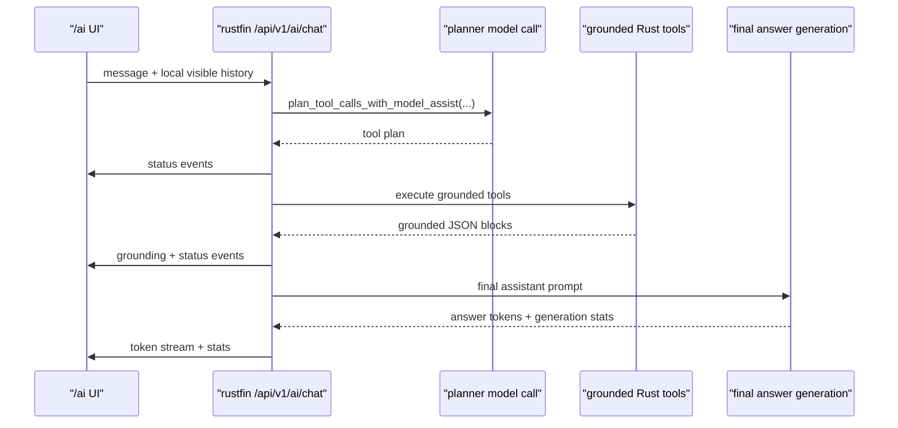
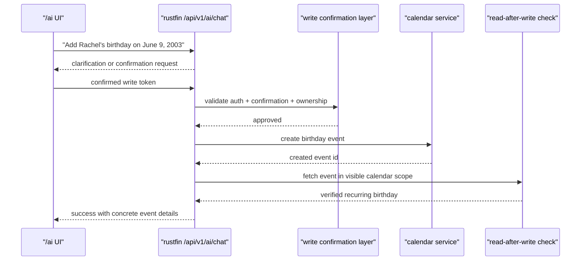

# Rustyfin AI Assistant Delta Plan

Date: 2026-04-01  
Status: design delta and phased implementation plan  
Scope: `/ai` UX, grounded assistant correctness, conversation persistence, calendar behavior, voice input, and live AI runtime telemetry

## Executive Summary

Rustyfin's current `/ai` surface is already useful, but it is still an early grounded assistant rather than a full local-AI product surface.

What works today:

- users can talk to local models through `/ai`
- the backend can ground answers against real Rustyfin state such as libraries, rooms, downloads, host runtime, and calendar reads
- the UI already streams progress and final text
- the backend deliberately keeps the assistant read-only

What is currently broken or incomplete:

- `/ai` is effectively single-chat only
- mobile does not expose a ChatGPT-style conversation drawer
- the assistant activity view is split awkwardly across thinking text, status rows, and source badges
- host runtime answers can surface raw byte counts instead of human units
- the UI labels model generation time as if it were the total turn time
- short follow-up questions can still route to the wrong grounded domain
- there is no deterministic "next event on my calendar" capability
- there is no voice input path on `/ai`
- there is no live AI GPU/runtime panel for end users
- the assistant can imply that it performed a write even though the grounded assistant is still read-only

The most important architectural fact is this:

- the current grounded assistant is intentionally read-only
- calendar write support exists in the calendar service, but it is not exposed through the AI tool registry
- therefore the reported birthday-creation behavior is not a buggy existing AI write path
- it is a correctness and safety failure where the assistant implied a successful write that the grounded AI stack does not actually support yet

The recommended implementation order is:

1. fix honesty, units, routing, and timing accuracy
2. add real conversation persistence plus desktop sidebar and mobile drawer
3. redesign the assistant activity view around `Thinking...`, ordered tool-call rows, and clearer turn phases
4. add safe calendar write tools with confirmation and read-after-write verification
5. add voice input
6. add live AI runtime and GPU telemetry

## Why This Delta Exists

This document captures the gap between:

- the current shipped AI implementation
- the user experience expected from a modern local AI interface
- the specific issues observed in live use

It is intentionally narrower than the earlier grounded-assistant architecture documents. Those documents define the current server-side direction. This document defines the next delta required to make `/ai` feel reliable, understandable, and product-complete.

## Inputs And Live Issues Observed

The following issues were reported from live use and are treated as authoritative product inputs for this delta:

1. `/ai` feels single-threaded. On mobile there is no obvious way to see or start multiple chats.
2. The current layout should move toward a ChatGPT/Claude model with a left hamburger on mobile and a conversation history drawer that slides in from left to right.
3. Host RAM answers are coming back in awkward raw-byte units such as trillions of bytes.
4. A follow-up question like `What is that in gigabytes?` misrouted and returned irrelevant grounded information.
5. Prompt timing is misleading because the UI shows generation time, not full wall-clock turn time including planning and tools.
6. The assistant failed to answer `What's the next event coming up on my calendar?`
7. `/ai` needs speech-to-text voice input so users can talk to the model.
8. `/ai` should expose which GPU/backend is being used and show live resource usage during prompts.
9. When asked to add a birthday to the calendar, the assistant eventually claimed success but no recurring birthday was visible in the calendar afterward.
10. The `/ai` page should show a Codex-style visible `Thinking...` state while the assistant is working.
11. Tool and function calls should be listed neatly beneath that thinking state instead of appearing as loose chips above the answer.

## Resolved Design Decisions

This section removes ambiguity for the implementation phases below. Unless this document is revised, these decisions should be treated as adopted.

### Product And Architecture Decisions

- `/ai` remains a host-owned Rustyfin product area under `/Users/iwanteague/Desktop/Rustyfin/ui/src/app/ai/page.tsx`
- grounded assistant authority remains server-side in `/Users/iwanteague/Desktop/Rustyfin/crates/server/src/ai_assistant`
- the browser must not become the authority for tool routing, tool execution, calendar writes, or activity truth
- admin audit persistence and user-visible chat persistence are separate concerns and must remain separate storage models
- the assistant remains read-only until Phase 3 introduces explicit confirmation-gated writes

### UI Decisions

- the canonical `/ai` layout target is:
  - desktop left rail
  - mobile hamburger + left drawer
  - active conversation in the main panel
  - assistant activity stack inside each assistant turn
- the canonical assistant activity presentation is:
  - `Thinking...`
  - ordered tool rows
  - final answer
- the current floating source-chip presentation above the answer is not the target design
- the current `<think>...</think>` parser may remain as a compatibility fallback, but it is not the target product model

### Data And Persistence Decisions

- conversation persistence will use dedicated PostgreSQL tables and not reuse `ai_assistant_audit_event`
- conversation ids and turn ids should use UUID strings stored as `TEXT`, matching current Rustyfin DB patterns
- archived conversations are hidden by default but still restorable
- deleting a conversation removes user-visible turns but does not delete admin audit history

### Event And Transport Decisions

- streaming remains SSE-based
- the current `status` and `grounding` events are sufficient for v1 compatibility, but the target contract should add explicit phase/activity semantics
- exact internal tool names remain available to the client, but the default UI label must be user-readable

### Calendar Decisions

- `next event` should become a deterministic server capability, not a model inference trick
- AI birthday creation should default to the user's Rustyfin personal calendar unless the user explicitly requests a shared calendar scope
- Rustyfin AI should not silently pivot to external-calendar assumptions
- successful calendar writes must require:
  - explicit confirmation
  - server-side execution
  - read-after-write verification

### Voice Decisions

- `/ai` voice input should be speech-to-text only in this delta
- text-to-speech is not part of this document
- browser-native speech recognition is preferred when available
- server transcription fallback is required so the feature is not browser-fragile

### Runtime Telemetry Decisions

- `/ai` should expose a curated AI-runtime view to authenticated users
- this does not mean exposing the full admin runtime diagnostics surface
- user-visible AI runtime telemetry should focus on:
  - active model
  - backend
  - current turn phase
  - queue depth
  - AI-related host/GPU usage when available

### File-Layout Decisions

To keep the implementation searchable and maintainable, new work should converge on the following structure:

- frontend feature module recommendation:
  - `/Users/iwanteague/Desktop/Rustyfin/ui/src/features/ai-assistant/`
- likely frontend files:
  - `api.ts`
  - `types.ts`
  - `components/AiConversationDrawer.tsx`
  - `components/AiAssistantActivity.tsx`
  - `components/AiThinkingRow.tsx`
  - `components/AiToolCallList.tsx`
  - `components/AiRuntimePanel.tsx`
- likely backend additions:
  - `/Users/iwanteague/Desktop/Rustyfin/crates/server/src/ai_conversations.rs`
  - `/Users/iwanteague/Desktop/Rustyfin/crates/server/src/ai_runtime.rs`
  - `/Users/iwanteague/Desktop/Rustyfin/crates/server/src/ai_voice.rs`
- existing backend ownership that should remain central:
  - `/Users/iwanteague/Desktop/Rustyfin/crates/server/src/ai_enabled.rs`
  - `/Users/iwanteague/Desktop/Rustyfin/crates/server/src/ai_assistant/orchestrator.rs`
  - `/Users/iwanteague/Desktop/Rustyfin/crates/server/src/ai_assistant/tools.rs`

## Verified Current State

The following points were verified directly from the current repository.

### `/ai` UI

Current implementation points:

- `/Users/iwanteague/Desktop/Rustyfin/ui/src/app/ai/page.tsx`
- `/Users/iwanteague/Desktop/Rustyfin/ui/src/lib/aiApi.ts`

Verified behavior:

- the page keeps a single in-memory `messages` array
- `New chat` clears the current in-memory thread instead of creating a persisted conversation
- there is no persisted conversation list, chat title list, sidebar, or mobile drawer
- the client sends the visible message history with each request
- the page currently parses `<think>...</think>` content and can render a visible thinking block
- the page currently renders grounded source badges above the answer bubble
- the page currently renders streamed status updates separately while the assistant is streaming
- the UI displays `prompt_tokens`, `completion_tokens`, `total_duration_ms`, and `tokens_per_second`
- the current `Time` badge reflects model generation time only, not total turn duration
- there is no voice-input UI on the page today

### Grounded Chat Flow

Current implementation points:

- `/Users/iwanteague/Desktop/Rustyfin/crates/server/src/ai_enabled.rs`
- `/Users/iwanteague/Desktop/Rustyfin/crates/server/src/ai_assistant/orchestrator.rs`
- `/Users/iwanteague/Desktop/Rustyfin/crates/server/src/ai_assistant/registry.rs`
- `/Users/iwanteague/Desktop/Rustyfin/crates/server/src/ai_assistant/tools.rs`
- `/Users/iwanteague/Desktop/Rustyfin/crates/ai-agent/src/engine.rs`

Verified flow today:

1. `/api/v1/ai/chat` receives `model`, `message`, and visible `history`
2. the server runs `plan_tool_calls_with_model_assist(...)`
3. the server emits streamed `status` events for planned tools
4. tools run server-side under Rustyfin auth and role checks
5. the server emits `grounding` events
6. the server builds the final assistant prompt with grounded data
7. the model generates the final answer stream
8. the server emits `stats` from the final generation loop

Important consequence:

- a grounded turn can incur planner-model latency, tool latency, and final generation latency
- the current UI only exposes the last of those as `Time`
- this explains why a turn that visibly takes 20 to 30 seconds can still show `1.1s`

### Current Tool Policy

Verified in:

- `/Users/iwanteague/Desktop/Rustyfin/crates/server/src/ai_assistant/registry.rs`
- `/Users/iwanteague/Desktop/Rustyfin/crates/server/src/ai_assistant/tools.rs`

Current tool policy:

- the registry only exposes read-only calendar tools today:
  - `calendar_list_events`
  - `calendar_upcoming_birthdays`
  - `calendar_get_event_details`
- the tool policy layer explicitly blocks write tools and confirmation-gated tools unless support exists
- the assistant is not supposed to claim create/update/delete success under the current grounded model

### Calendar Service Capability

Verified in:

- `/Users/iwanteague/Desktop/Rustyfin/crates/calendar/src/main.rs`
- `/Users/iwanteague/Desktop/Rustyfin/crates/db/src/repo/calendar.rs`

Important distinction:

- the calendar service itself already supports event create and update
- birthday events are normalized to yearly recurrence
- recurring yearly events are included when listing later time windows

This means:

- if an AI-created birthday had actually been written correctly as a Rustyfin birthday event, it should be visible in later years
- because the grounded AI layer does not currently expose calendar writes, the likely failure mode is that no write happened at all even though the assistant implied that it did

### Host Runtime Metrics

Verified in:

- `/Users/iwanteague/Desktop/Rustyfin/crates/server/src/runtime_diagnostics.rs`
- `/Users/iwanteague/Desktop/Rustyfin/crates/server/src/ai_assistant/tools.rs`
- `/Users/iwanteague/Desktop/Rustyfin/ui/src/app/admin/page.tsx`
- `/Users/iwanteague/Desktop/Rustyfin/crates/server/src/routes.rs`

Current state:

- runtime diagnostics capture raw memory byte counts
- the admin UI formats those bytes into human-readable units
- the grounded AI host-runtime tool currently returns raw snapshot values to the model
- `/system/gpu` is oriented toward transcoder GPU capability detection, not live AI inference telemetry

## Root Cause Summary

### Problem 1: Single-Chat Experience

Root cause:

- `/ai` has no conversation persistence model
- the page state is ephemeral and local to the current browser tab
- there is no server-side user conversation table and no sidebar/drawer UX

Impact:

- users cannot build a useful history
- follow-up context is tied to a fragile in-memory thread
- mobile usability is materially worse than desktop expectations

### Problem 2: Assistant Activity View Is Fragmented

Root cause:

- the current page splits assistant activity across three different surfaces:
  - a thinking block
  - streamed status rows
  - grounded source chips
- those surfaces are not presented as one intentional execution trace
- the current visible thinking block is tied to parsed model output rather than a structured server-driven activity contract

Impact:

- users cannot quickly tell what the assistant is currently doing
- function usage feels disconnected from the answer it produced
- the interface risks exposing model reasoning text where a product-safe status indicator would be better

### Problem 3: Awkward RAM Answering

Root cause:

- the host-runtime tool returns raw bytes rather than normalized AI-facing summary fields

Impact:

- the model answers with technically correct but poor units
- users experience the answer as inaccurate or absurd

### Problem 4: Misleading Turn Timing

Root cause:

- `stats.total_duration_ms` currently reflects final generation time only
- planner and tool execution timings are not exposed as first-class turn metrics

Impact:

- users think the timing badge is wrong
- performance work is harder because the UI does not expose where the latency is coming from

### Problem 5: Follow-Up Routing Failure

Root cause:

- short follow-up routing still depends partly on planner interpretation and prior grounded hints
- host-runtime follow-ups are not deterministic enough yet for unit-conversion prompts

Impact:

- prompts such as `What is that in gigabytes?` can land in the wrong grounded domain
- trust in the assistant drops quickly when a simple follow-up misfires

### Problem 6: Missing "Next Event" Behavior

Root cause:

- the current calendar tools provide event listing and event details
- there is no deterministic `next event` tool or normalized `next_event` server-side result

Impact:

- the model has to infer "next" from general list data
- simple personal-calendar queries can fail even though calendar data exists

### Problem 7: No Voice Input

Root cause:

- `/ai` has no microphone capture, STT request path, or transcript-review UX

Impact:

- `/ai` feels behind modern local-AI interfaces
- users cannot use Rustyfin as a convenient spoken assistant

### Problem 8: No Live AI Runtime / GPU View

Root cause:

- Rustyfin exposes model management and some admin runtime information
- it does not yet expose live AI inference telemetry appropriate for the `/ai` page

Impact:

- users cannot tell whether the model is using CPU or GPU
- users cannot see whether a prompt is queued, model-loading, planner-bound, tool-bound, or generation-bound

### Problem 9: False Success On Calendar Writes

Root cause:

- the assistant can still produce language that implies a successful write even though the current grounded tool layer is read-only

Impact:

- the assistant can mislead users about real system state
- this is a product-trust and safety issue, not just a UX issue

## External Product Patterns Worth Borrowing

Rustyfin should borrow proven interaction patterns from successful open-source AI interfaces, but it should not clone them blindly. The right approach is to adopt the working chat/navigation patterns while preserving Rustyfin's darker cinematic styling and orange-to-pink-to-purple identity.

### OpenAI / Codex

Official sources:

- [Codex](https://openai.com/codex/)
- [Introducing Codex](https://openai.com/index/introducing-codex/)

Relevant patterns:

- explicit visible progress while work is happening
- real-time monitoring of ongoing work
- a product expectation that users should be able to tell when the system is still working

What Rustyfin should borrow:

- the idea that assistant work should be visible as a structured activity state
- a calm, technical `Thinking...` indicator rather than a silent blank wait
- clear sequencing between assistant activity and final answer delivery

What Rustyfin should not borrow literally:

- Codex is a coding agent with longer-running task semantics than Rustyfin `/ai`
- Rustyfin should borrow the interaction principle, not the entire app model

### Open WebUI

Official source:

- [Open WebUI Features](https://docs.openwebui.com/features/)

Relevant patterns:

- chat history via a navigation sidebar
- archive and conversation management
- voice input support
- mobile-aware interaction model

What Rustyfin should borrow:

- left-side conversation navigation
- a reliable mobile drawer pattern
- explicit voice-entry affordances

What Rustyfin should not borrow:

- the broader workspace/admin sprawl that is unnecessary for a home-server assistant

### LibreChat

Official sources:

- [LibreChat official site](https://www.librechat.ai/)
- [LibreChat GitHub repository](https://github.com/danny-avila/LibreChat)

Relevant patterns:

- multi-conversation layout
- conversation search and message history expectations
- open-source chat UX that feels like a serious daily-use assistant rather than a demo surface

What Rustyfin should borrow:

- explicit thread management
- better mobile and desktop conversation navigation
- a cleaner separation between thread history and the active turn composer

### LobeChat

Official sources:

- [LobeHub / LobeChat docs](https://lobehub.com/en/docs/usage/start)
- [LobeChat GitHub repository](https://github.com/lobehub/lobe-chat)

Relevant patterns:

- polished mobile-friendly sidebar behavior
- mature chat-shell ergonomics
- good handling of assistant options without overwhelming the main composer

What Rustyfin should borrow:

- responsive left-panel behavior
- compact metadata presentation
- a modern local-AI feel without turning `/ai` into a complicated dashboard

### AnythingLLM

Official source:

- [AnythingLLM GitHub repository](https://github.com/Mintplex-Labs/anything-llm)

Relevant pattern:

- clean separation between contexts/workspaces and active chat

What Rustyfin should borrow:

- the idea that persistent contexts should be durable objects, not just local browser state

## Target Product Direction

### UX Direction

The target `/ai` experience should feel closer to ChatGPT, Claude, Open WebUI, and LibreChat in the following ways:

- desktop gets a persistent left conversation rail
- mobile gets a left hamburger that opens a sliding drawer
- new chats are real objects, not just cleared local state
- the active thread title updates automatically from the first meaningful user turn
- status is transparent:
  - planning
  - checking calendar
  - checking host runtime
  - generating answer
- turn metrics distinguish wall-clock time from model decode time
- the page can optionally show live AI runtime usage during a turn

The target visual direction should still remain Rustyfin:

- dark, cinematic, high-contrast surface
- orange-to-pink-to-purple accents
- no light-mode-first clone layout
- reuse shared Rustyfin button and motion patterns

### Assistant Activity Presentation

This is a priority UI requirement for the `/ai` redesign.

Rustyfin should adopt a Codex-style assistant activity stack:

1. show a visible `Thinking...` row while the assistant is planning, grounding, or generating
2. use a subtle animated sweep through that row to indicate live work
3. list tool or function calls directly beneath the thinking row as structured activity items
4. render the final answer beneath the activity items

The intended user-visible order is:

- `Thinking...`
- `Checking your next calendar event`
- `Checking Rustyfin host runtime stats`
- final assistant response

Important implementation rule:

- do not treat raw model chain-of-thought as a product feature
- the visible `Thinking...` state should come from structured server status and phase events
- if short explanatory text is needed, it should be safe labels such as `Checking your calendar` or `Reviewing server runtime`
- the UI should not depend on model-emitted `<think>` text as the canonical experience

### Visual Behavior For `Thinking...`

The `Thinking...` row should borrow the feel of Codex without becoming a visual clone.

Recommended behavior:

- muted grey baseline text and track
- a soft white or near-white highlight sweeps left to right and repeats while work is active
- the sweep stops cleanly when the turn enters the final answer state
- the motion stays calm and technical rather than flashy

Recommended Rustyfin styling:

- keep the animation inside the existing dark cinematic palette
- use the Rustyfin gradient only as a secondary edge accent, not as the whole indicator
- keep the primary motion highlight neutral so the tool-call rows remain readable

### Tool / Function Call Listing

Function usage should become part of the assistant execution trace rather than floating source chips.

Recommended model:

- each tool call appears as a compact activity row beneath `Thinking...`
- rows are chronological
- each row includes:
  - an icon state
  - a user-readable label
  - an optional completion state such as `done` or `failed`

Example labels:

- `Checking your next calendar event`
- `Checking Rustyfin host runtime stats`
- `Loading room activity`

If exact internal tool identity is still needed, use a disclosure pattern:

- the primary label stays user-readable
- the exact internal tool name such as `calendar_get_next_event` can appear in secondary detail

This keeps the interface understandable without losing traceability.

### Capability Direction

The next capability tier should be:

- correct and honest read-only assistant
- durable conversation history
- deterministic personal-calendar next-event answering
- safe voice-to-text input
- safe and explicit write operations only after confirmation design is in place

## Current And Target Turn Flow

### Current Grounded Turn



Current reporting flaw:

- the displayed `Time` badge mostly corresponds to the `Model` segment
- the user experiences the total of `Planner + Tools + Model`

### Target Safe Calendar Write Turn



This is the required model for any future AI write:

- explicit confirmation
- explicit server-side auth
- read-after-write verification
- only then user-visible success text

## Phased Implementation Plan

## Phase 0: Correctness, Honesty, And Timing

### Goals

- stop misleading users
- make simple runtime answers human-readable
- stop false success on unsupported writes
- make turn timing accurate
- harden follow-up routing for common host-runtime and unit-conversion questions

### Scope

1. Add human-readable runtime fields to grounded host-runtime results.
2. Add end-to-end turn timing and sub-stage timing.
3. Add deterministic follow-up routing for host-runtime unit conversions.
4. Add a hard response guard so the assistant cannot claim unsupported writes succeeded.
5. Add deterministic "next event" read support.

### Backend Changes

Primary files:

- `/Users/iwanteague/Desktop/Rustyfin/crates/server/src/ai_enabled.rs`
- `/Users/iwanteague/Desktop/Rustyfin/crates/server/src/ai_assistant/orchestrator.rs`
- `/Users/iwanteague/Desktop/Rustyfin/crates/server/src/ai_assistant/tools.rs`
- `/Users/iwanteague/Desktop/Rustyfin/crates/server/src/ai_assistant/types.rs`
- `/Users/iwanteague/Desktop/Rustyfin/crates/server/src/runtime_diagnostics.rs`
- `/Users/iwanteague/Desktop/Rustyfin/crates/ai-agent/src/engine.rs`

Required changes:

- extend host-runtime tool payloads to include:
  - `used_memory_human`
  - `total_memory_human`
  - `used_memory_gib`
  - `total_memory_gib`
  - `memory_summary`
- extend streamed stats to include:
  - `planner_duration_ms`
  - `tool_duration_ms`
  - `generation_duration_ms`
  - `end_to_end_duration_ms`
  - `queue_duration_ms`
  - `model_load_duration_ms` when relevant
- keep `tokens_per_second` explicitly generation-only
- add deterministic routing for follow-up prompts like:
  - `what is that in gigabytes`
  - `what about in GB`
  - `convert that to gigabytes`
- add a new grounded read tool:
  - `calendar_get_next_event`
- or, less preferably, extend `calendar_list_events` with a normalized `next_event`
- add a response-safety guard after grounding and before final output persistence so the assistant cannot claim write success unless a verified write-capable tool actually ran

### UI Changes

Primary files:

- `/Users/iwanteague/Desktop/Rustyfin/ui/src/app/ai/page.tsx`
- `/Users/iwanteague/Desktop/Rustyfin/ui/src/lib/aiApi.ts`

Required changes:

- relabel timing to distinguish:
  - `Turn`
  - `Plan`
  - `Tools`
  - `Generate`
- present human-readable memory directly in grounded answer chips or formatted answer templates when the tool is the host-runtime tool
- keep raw token counts available, but do not imply that generation time equals total turn time

### Tests

- unit tests for host-runtime formatting helpers
- planner tests for unit-conversion follow-ups
- integration test for `calendar_get_next_event`
- regression test that unsupported write requests cannot return a success-style answer

### Acceptance Criteria

- `How much RAM is the server using right now?` returns human-friendly units by default
- `What is that in gigabytes?` stays in the host-runtime domain
- the timing badges on `/ai` explain real wall-clock behavior
- `What is my next calendar event?` works for visible personal events
- unsupported write prompts do not claim success

## Phase 1: Conversation Persistence And Navigation

### Goals

- move `/ai` from a transient chat box to a real multi-conversation product surface
- provide ChatGPT/Claude-style desktop and mobile navigation

### Scope

1. Add durable conversation storage per user.
2. Add conversation list APIs.
3. Add desktop sidebar and mobile hamburger drawer.
4. Add real new-chat creation, rename, archive, and delete.

### Data Model

Add new PostgreSQL tables, separate from admin audit:

- `ai_conversation`
- `ai_conversation_turn`

Recommended shape:

- `ai_conversation`
  - `id uuid primary key`
  - `user_id bigint not null`
  - `title text not null`
  - `archived boolean not null default false`
  - `last_message_preview text`
  - `created_ts timestamptz not null`
  - `updated_ts timestamptz not null`
- `ai_conversation_turn`
  - `id uuid primary key`
  - `conversation_id uuid not null`
  - `user_id bigint not null`
  - `role text not null`
  - `content text not null`
  - `model_name text`
  - `grounding_tools jsonb not null default '[]'`
  - `stats jsonb`
  - `trace_id text`
  - `created_ts timestamptz not null`
  - `turn_index integer not null`

Reason to keep this separate from existing audit:

- audit exists for admin diagnostics and retention
- user-visible chat history has different retention, UX, and privacy expectations

### Backend Changes

Primary files and likely additions:

- new migration under `/Users/iwanteague/Desktop/Rustyfin/crates/db/migrations_pg/`
- new repo module near `/Users/iwanteague/Desktop/Rustyfin/crates/db/src/repo/ai_assistant_audit.rs`
- `/Users/iwanteague/Desktop/Rustyfin/crates/server/src/ai_enabled.rs`
- potentially a new `/Users/iwanteague/Desktop/Rustyfin/crates/server/src/ai_conversations.rs`

Required API surface:

- `GET /api/v1/ai/conversations`
- `POST /api/v1/ai/conversations`
- `GET /api/v1/ai/conversations/:id`
- `PATCH /api/v1/ai/conversations/:id`
- `DELETE /api/v1/ai/conversations/:id`
- `POST /api/v1/ai/conversations/:id/messages`

Rules:

- strict per-user ownership
- archived conversations remain hidden by default
- admin audit does not become a user chat API

### UI Changes

Primary files:

- `/Users/iwanteague/Desktop/Rustyfin/ui/src/app/ai/page.tsx`
- `/Users/iwanteague/Desktop/Rustyfin/ui/src/lib/aiApi.ts`

Recommended layout:

- desktop:
  - fixed left rail with recent chats
  - `New chat` at the top
  - active chat in the main panel
- mobile:
  - top-left hamburger
  - slide-out drawer from left to right
  - drawer overlay closes on tap outside or swipe

Required UX:

- first user message auto-generates a title
- rename chat
- archive chat
- delete chat
- conversation switching without losing current thread state

### Tests

- repo tests for ownership and ordering
- API tests for create/list/get/update/delete conversation flows
- UI tests for mobile drawer opening and conversation switching

### Acceptance Criteria

- users can see multiple chats
- mobile users can open a left drawer and switch threads
- `New chat` creates a real stored conversation
- refreshing the page preserves thread history

## Phase 2: Assistant Activity View And Better Observability

### Goals

- make the assistant's work visible and understandable
- reduce perceived delay before answers
- make delays explainable when they cannot be removed

### Scope

1. Redesign the assistant activity stack in the UI.
2. Replace grounded source chips with structured tool-call listing.
3. Add better stage-level observability.
4. Reduce avoidable planner calls.

### Architectural Position

There is a real cost here that cannot be driven to zero. The current grounded flow can require:

- one planner-model pass
- one or more grounded tool calls
- one final answer-model pass

That is inherently slower than a plain chat completion. The right goal is not "remove all delay." The right goal is:

- short-circuit obvious cases before planner inference
- reduce planner work where deterministic routing is sufficient
- expose progress clearly so users know what is happening

### Backend Changes

Primary files:

- `/Users/iwanteague/Desktop/Rustyfin/crates/server/src/ai_enabled.rs`
- `/Users/iwanteague/Desktop/Rustyfin/crates/server/src/ai_assistant/orchestrator.rs`
- `/Users/iwanteague/Desktop/Rustyfin/crates/ai-agent/src/engine.rs`

Required changes:

- emit explicit phase events or enrich current status events so the UI can render:
  - thinking
  - planned tool call
  - tool completed
  - generating answer
- add deterministic short-circuits before planner-model use for:
  - obvious host-runtime follow-ups
  - obvious calendar-next-event queries
  - simple unit conversions tied to the last grounded host-runtime tool
- consider a smaller planner model or cheaper planner mode if the inference stack allows it cleanly
- persist planner/tool/generation durations into user-visible turn stats
- emit status transitions with timestamps:
  - queued
  - loading model
  - planning
  - running tools
  - generating

### UI Changes

- replace grounded source chips above assistant bubbles with an integrated activity stack
- use a dedicated `Thinking...` row with a subtle Codex-inspired sweep animation
- list tool calls directly beneath `Thinking...`
- keep activity rows visible while the answer streams
- collapse exact internal tool names behind a secondary disclosure if needed
- show progress as a timeline rather than a single spinner
- display wall-clock turn time
- optionally show `This took longer because Rustyfin checked calendar + server state first`

### Frontend Implementation Notes

Primary files:

- `/Users/iwanteague/Desktop/Rustyfin/ui/src/app/ai/page.tsx`
- optionally extract new activity components into a dedicated AI feature module if the page continues to grow

Recommended component split:

- `AiConversationShell`
- `AiConversationDrawer`
- `AiAssistantActivity`
- `AiThinkingRow`
- `AiToolCallList`
- `AiTurnStats`

Recommended CSS behavior:

- drive the `Thinking...` sweep with a shared CSS keyframe rather than ad hoc inline animation
- keep row heights stable so the assistant bubble does not jump while tools complete
- reserve enough vertical rhythm for one to three tool rows before the final answer begins

Recommended data contract additions from the server:

- per-turn `phase`
- status timestamps
- optional exact tool name plus user-facing label
- an ordered activity list for persisted turns so reloaded chats can render the same trace cleanly

### Acceptance Criteria

- while the assistant is working, the user sees a clear `Thinking...` row
- tool calls appear beneath that row in chronological order
- the final answer appears beneath the activity rows
- the current loose grounded-source badge pattern is removed from the main answer flow
- the UI does not rely on exposing raw chain-of-thought text
- obviously simple follow-ups do not trigger avoidable planner delays
- users can tell where time was spent
- the `/ai` page no longer implies that the model alone took the full turn time

## Phase 3: Safe Calendar Writes And Birthday Support

### Goals

- add actual AI calendar write capability safely
- ensure birthdays are written as Rustyfin-recurring events
- never tell the user a write succeeded unless it truly did

### Scope

1. Add write-capable calendar tools behind confirmation.
2. Support recurring birthdays as a first-class AI write.
3. Verify writes by reading them back.

### Important Product Rule

Do not let the model directly "decide" that a calendar write happened. The backend must remain authoritative.

### Required Tooling

Recommended new grounded tools:

- `calendar_create_event`
- `calendar_create_birthday`
- optionally later:
  - `calendar_update_event`
  - `calendar_delete_event`

Recommended registry policy:

- `access = write`
- confirmation required
- user scope enforced

### Birthday-Specific Requirements

When a user asks to add a birthday:

- default to the Rustyfin personal calendar unless the user explicitly chooses shared scope
- create a Rustyfin birthday event, not an external-calendar placeholder
- enforce:
  - `event_type = birthday`
  - `recurrence = yearly`
  - `birthday_year` present
- after create, read the event back through a visible read path
- only then report success

### Confirmation Model

Required pattern:

- first turn collects or clarifies fields
- second step asks for explicit confirmation
- backend issues and validates a short-lived confirmation token
- only confirmed write turns may call the write-capable tool

### Backend Changes

Primary files:

- `/Users/iwanteague/Desktop/Rustyfin/crates/server/src/ai_assistant/registry.rs`
- `/Users/iwanteague/Desktop/Rustyfin/crates/server/src/ai_assistant/tools.rs`
- `/Users/iwanteague/Desktop/Rustyfin/crates/server/src/ai_enabled.rs`
- `/Users/iwanteague/Desktop/Rustyfin/crates/calendar/src/main.rs`
- `/Users/iwanteague/Desktop/Rustyfin/crates/db/src/repo/calendar.rs`

Possible supporting additions:

- confirmation-token storage, likely parallel to other protected-action patterns already used elsewhere in the repo

### Tests

- integration tests for create-birthday with yearly recurrence
- verification tests that the event appears in future-year calendar views
- negative tests proving no success text is returned when confirmation is missing or verification fails

### Acceptance Criteria

- `Add Rachel's birthday on June 9, 2003` results in a real recurring Rustyfin birthday after confirmation
- the birthday appears on June 9 in later years
- the assistant cannot claim write success without a verified event id

## Phase 4: Voice Input

### Goals

- let users speak to `/ai`
- keep the interaction simple and local-first

### Recommended Product Model

Use a two-tier voice-input strategy:

1. browser-native speech recognition when available for fastest UX
2. Rustyfin server transcription fallback for broader coverage and consistent behavior

This keeps `/ai` responsive on capable browsers while still giving Rustyfin a server-owned fallback path.

### Implementation Direction

#### Frontend

Primary files:

- `/Users/iwanteague/Desktop/Rustyfin/ui/src/app/ai/page.tsx`
- new feature-scoped components under a dedicated AI feature module if the page grows further

Required UX:

- microphone button beside the composer
- recording state indicator
- transcription preview in the text box
- user can edit before send
- explicit failure messages for denied mic access or STT failures

#### Backend

Primary files:

- new AI transcription route in `/Users/iwanteague/Desktop/Rustyfin/crates/server/src/`
- reuse ideas from:
  - `/Users/iwanteague/Desktop/Rustyfin/crates/server/src/transcription_agent.rs`
  - `/Users/iwanteague/Desktop/Rustyfin/crates/server/src/channels/handlers.rs`

Recommended route:

- `POST /api/v1/ai/transcribe`

Rules:

- short request windows only
- authenticated only
- size and duration limits
- no silent background storage of raw audio unless explicitly needed and documented

### Operational Note

Microphone features depend on secure origin rules. Rustyfin already serves `/ai` over HTTPS in the native deployment model, which is the correct base for browser microphone permissions.

### Acceptance Criteria

- users can dictate a prompt on desktop and mobile browsers that support the capability
- the transcript appears for review before the prompt is sent
- fallback transcription works when browser-native STT is unavailable

## Phase 5: Live AI Runtime And GPU Telemetry

### Goals

- show users what backend/model is active
- show whether AI is using CPU or GPU
- show live resource impact while a turn runs

### Scope

1. Add AI-runtime telemetry endpoints.
2. Expose active-model and backend configuration.
3. Add polling or SSE-based live updates during prompts.

### Required Telemetry Fields

At minimum:

- active model name
- backend in use:
  - `cpu`
  - `cuda`
  - `rocm`
  - `vulkan`
  - `disabled`
- `n_threads`
- `n_ctx`
- `n_gpu_layers`
- queue depth
- whether the model is currently loading
- whether a turn is currently planning or generating
- host process RSS
- host CPU and RAM usage

GPU telemetry when available:

- GPU name
- VRAM total / used
- utilization percentage
- temperature if available
- power draw if available

### Technical Reality

This telemetry will be backend- and host-dependent. The design should tolerate partial support:

- if live GPU metrics are available, show them
- if only backend selection is available, show that clearly
- do not invent unsupported GPU metrics

### Backend Changes

Likely additions:

- new AI-runtime telemetry module under `/Users/iwanteague/Desktop/Rustyfin/crates/server/src/`
- route additions in `/Users/iwanteague/Desktop/Rustyfin/crates/server/src/routes.rs`
- engine instrumentation in `/Users/iwanteague/Desktop/Rustyfin/crates/ai-agent/src/engine.rs`

Recommended routes:

- `GET /api/v1/ai/runtime`
- `GET /api/v1/ai/runtime/live` as SSE if continuous streaming is chosen

### UI Changes

- compact runtime panel in `/ai`
- live during an active turn
- collapsed by default on mobile
- clearly separate:
  - model/backend info
  - turn status
  - host/GPU utilization

### Acceptance Criteria

- the user can see what backend and model are active
- the user can see resource usage change during prompts when the host can supply it
- unsupported metrics degrade gracefully instead of showing fake zeroes

## Detailed Delta Execution Notes

This section is intentionally more implementation-specific than the phase summaries above. It exists to reduce ambiguity, reduce rediscovery work, and shorten the path from current Rustyfin code to the target `/ai` experience.

## Phase 0 Detailed Execution Notes

### Current Starting Point

Current files and signals:

- `/Users/iwanteague/Desktop/Rustyfin/crates/server/src/ai_enabled.rs`
  - streams `status`, `grounding`, `token`, `stats`, and `done`
- `/Users/iwanteague/Desktop/Rustyfin/crates/server/src/ai_assistant/orchestrator.rs`
  - owns planner/follow-up logic
- `/Users/iwanteague/Desktop/Rustyfin/crates/server/src/ai_assistant/tools.rs`
  - owns `system_get_host_runtime_summary`
  - owns current calendar read tools
- `/Users/iwanteague/Desktop/Rustyfin/ui/src/lib/aiApi.ts`
  - defines current SSE event parsing
- `/Users/iwanteague/Desktop/Rustyfin/ui/src/app/ai/page.tsx`
  - renders current timing and activity UI

### Exact Delta To Implement

#### 1. Introduce a richer turn-stats contract

Target TypeScript shape:

```ts
interface AiTurnStats {
  prompt_tokens: number;
  completion_tokens: number;
  generation_duration_ms: number;
  planner_duration_ms: number;
  tool_duration_ms: number;
  end_to_end_duration_ms: number;
  queue_duration_ms: number;
  model_load_duration_ms: number;
  tokens_per_second: number;
}
```

Target Rust-side equivalent:

```rust
pub struct AssistantTurnStats {
    pub prompt_tokens: u32,
    pub completion_tokens: u32,
    pub generation_duration_ms: u64,
    pub planner_duration_ms: u64,
    pub tool_duration_ms: u64,
    pub end_to_end_duration_ms: u64,
    pub queue_duration_ms: u64,
    pub model_load_duration_ms: u64,
    pub tokens_per_second: f64,
}
```

Design rule:

- `total_duration_ms` should remain readable by legacy clients during transition
- the new UI should prefer the explicit sub-stage fields

#### 2. Make unsupported writes deterministic server refusals

Current issue:

- if the assistant receives a write-intent prompt and no write tool exists, the model can still produce language that sounds like success or partial success

Implementation rule:

- detect unsupported write intent before final generation
- if no supported write-capable tool exists for that intent, return a server-authored response directly
- do not pass unsupported write prompts through to a normal final generation step

Examples that should short-circuit server-side:

- `add this birthday to my calendar`
- `delete that event`
- `rename that room`

Result model:

- no grounded tools execute
- no model-generated faux-success text
- a clear safe response is returned, for example:
  - `I can view your calendar right now, but I can't create or edit calendar entries yet through Rustyfin AI.`

#### 3. Add deterministic `next event`

New tool recommendation:

- `calendar_get_next_event`

Target output shape:

```json
{
  "label": "Next visible calendar event",
  "next_event": {
    "id": "text-uuid",
    "title": "Rachel birthday",
    "event_date": "2026-06-09",
    "event_type": "birthday",
    "scope": "personal",
    "owner_username": "iwan",
    "recurrence": "yearly",
    "next_occurs_on": "2026-06-09"
  }
}
```

Deterministic ordering rules:

- primary sort by the next visible occurrence date
- one-off events use `event_date`
- yearly birthdays use computed next occurrence in the current or next year
- if multiple events share the same day:
  - sort personal before shared
  - sort title ascending
  - sort id ascending

This avoids leaving "next" to model interpretation.

#### 4. Normalize host runtime units in the tool itself

Do not expect the model to convert raw bytes consistently.

Target tool additions:

```json
{
  "used_memory_bytes": 12568473600,
  "total_memory_bytes": 34359738368,
  "used_memory_gib": 11.7,
  "total_memory_gib": 32.0,
  "used_memory_human": "11.7 GiB",
  "total_memory_human": "32.0 GiB",
  "memory_summary": "The server is currently using 11.7 GiB of RAM out of 32.0 GiB."
}
```

#### 5. Preserve current route while preparing migration

Phase 0 should not block on Phase 1.

That means:

- keep `POST /api/v1/ai/chat` working
- enrich its event contract and timing payload
- defer conversation-specific streaming routes to Phase 1

### Ordered Implementation Steps

1. extend Rust timing capture in `/Users/iwanteague/Desktop/Rustyfin/crates/server/src/ai_enabled.rs`
2. add richer `stats` payload support in `/Users/iwanteague/Desktop/Rustyfin/ui/src/lib/aiApi.ts`
3. update `/Users/iwanteague/Desktop/Rustyfin/ui/src/app/ai/page.tsx` to display sub-stage timing
4. add deterministic unsupported-write short-circuit in `/Users/iwanteague/Desktop/Rustyfin/crates/server/src/ai_assistant/orchestrator.rs` or the top-level chat handler
5. add `calendar_get_next_event`
6. add host-runtime normalized fields
7. add tests

### Search Targets

Use these search handles when implementing Phase 0:

- `AssistantStatusEvent`
- `total_duration_ms`
- `system_get_host_runtime_summary`
- `plan_tool_calls_with_model_assist`
- `build_assistant_messages`
- `status_label_for_tool_call`
- `StatsBar`
- `formatMs`

## Phase 1 Detailed Execution Notes

### Current Starting Point

Current reality:

- the page state is held in `messages` in `/Users/iwanteague/Desktop/Rustyfin/ui/src/app/ai/page.tsx`
- `handleNewChat()` clears local state
- there is already an admin-only AI audit table, but it is not suitable for end-user conversations
- the Channels page already contains a mobile sidebar toggle pattern that can be reused:
  - `/Users/iwanteague/Desktop/Rustyfin/ui/src/app/channels/page.tsx`

### Concrete Database Plan

Recommended migration file:

- `/Users/iwanteague/Desktop/Rustyfin/crates/db/migrations_pg/044_ai_conversations.sql`

Recommended schema:

```sql
CREATE TABLE ai_conversation (
    id TEXT PRIMARY KEY,
    user_id TEXT NOT NULL,
    title TEXT NOT NULL,
    archived BOOLEAN NOT NULL DEFAULT FALSE,
    last_message_preview TEXT,
    last_model_name TEXT,
    created_ts BIGINT NOT NULL,
    updated_ts BIGINT NOT NULL
);

CREATE INDEX idx_ai_conversation_user_updated
    ON ai_conversation (user_id, archived, updated_ts DESC);

CREATE TABLE ai_conversation_turn (
    id TEXT PRIMARY KEY,
    conversation_id TEXT NOT NULL REFERENCES ai_conversation(id) ON DELETE CASCADE,
    user_id TEXT NOT NULL,
    turn_index BIGINT NOT NULL,
    role TEXT NOT NULL,
    content TEXT NOT NULL,
    model_name TEXT,
    grounding_tools_json TEXT NOT NULL,
    follow_up_contexts_json TEXT NOT NULL,
    grounding_sources_json TEXT NOT NULL,
    activity_trace_json TEXT NOT NULL,
    stats_json TEXT,
    trace_id TEXT,
    created_ts BIGINT NOT NULL
);

CREATE UNIQUE INDEX idx_ai_conversation_turn_conversation_turn_index
    ON ai_conversation_turn (conversation_id, turn_index);

CREATE INDEX idx_ai_conversation_turn_conversation_created
    ON ai_conversation_turn (conversation_id, created_ts ASC);
```

Important choice:

- use `TEXT` ids containing UUID strings for consistency with current AI audit patterns and other Rustyfin repo usage

### Conversation API Contract

Recommended server module:

- `/Users/iwanteague/Desktop/Rustyfin/crates/server/src/ai_conversations.rs`

Recommended routes:

- `GET /api/v1/ai/conversations`
- `POST /api/v1/ai/conversations`
- `GET /api/v1/ai/conversations/:id`
- `PATCH /api/v1/ai/conversations/:id`
- `DELETE /api/v1/ai/conversations/:id`
- `POST /api/v1/ai/conversations/:id/messages/stream`

Recommended list response:

```json
{
  "conversations": [
    {
      "id": "uuid",
      "title": "Server RAM question",
      "last_message_preview": "That is approximately 11.7 GiB...",
      "last_model_name": "qwen2.5-1.5b-instruct-q4_k_m",
      "updated_ts": 1760000000,
      "archived": false
    }
  ]
}
```

Recommended single-conversation response:

```json
{
  "conversation": {
    "id": "uuid",
    "title": "Calendar checks",
    "archived": false,
    "messages": [
      {
        "id": "turn-1",
        "role": "user",
        "content": "What's my next event?",
        "created_ts": 1760000100
      },
      {
        "id": "turn-2",
        "role": "assistant",
        "content": "Your next event is...",
        "activity_trace": [],
        "grounding_sources": [],
        "stats": {},
        "created_ts": 1760000104
      }
    ]
  }
}
```

Recommended mutation behavior:

- `POST /api/v1/ai/conversations`
  - creates an empty conversation with title `New chat`
- `PATCH`
  - supports `title` and `archived`
- `DELETE`
  - hard deletes the user-visible conversation and its turns
  - does not touch admin audit records

### Streaming Route Strategy

Recommended transition:

- keep `/api/v1/ai/chat` for compatibility during rollout
- new `/ai` UI should move to `POST /api/v1/ai/conversations/:id/messages/stream`
- once the new UI is stable, `/api/v1/ai/chat` can remain as a compatibility shim for internal or legacy callers

Recommended request body:

```json
{
  "model": "qwen2.5-1.5b-instruct-q4_k_m",
  "message": "How much RAM is the server using?",
  "client_turn_id": "optional-client-uuid"
}
```

Why this is cleaner:

- the conversation id anchors the server-side thread
- the server can load prior turns itself
- the browser no longer needs to send the full visible history every time

### UI Layout And State Plan

Recommended high-level component split:

- `AiPage`
- `AiConversationRail`
- `AiConversationDrawer`
- `AiConversationList`
- `AiComposer`
- `AiMessageList`

Suggested state ownership:

- page-level:
  - selected conversation id
  - conversation summaries
  - drawer open/closed
  - selected model
- conversation-level:
  - loaded turns
  - streaming state
  - optimistic title updates

Recommended mobile behavior:

- copy the existing Channels pattern for `sidebarOpen`
- use a full-height drawer on the left
- on small screens, close the drawer after selecting a conversation

### Ordered Implementation Steps

1. add migration and DB repo for conversations
2. add server CRUD routes with strict ownership checks
3. add streaming-by-conversation route
4. switch `/ai` page to server-backed conversation summaries
5. add desktop rail
6. add mobile drawer using the Channels pattern
7. remove local-only `handleNewChat()` semantics

### Search Targets

- `handleNewChat`
- `messages: ChatEntry[]`
- `ai_assistant_audit_event`
- `sidebarOpen`
- `Toggle sidebar`
- `streamChat(`

## Phase 2 Detailed Execution Notes

### Current Starting Point

Current UI behavior:

- `ThinkingBlock` is driven by parsed `<think>` text
- `StatusList` is rendered separately
- grounded source chips are rendered above the answer
- `streamChat` currently only understands:
  - `status`
  - `token`
  - `stats`
  - `grounding`
  - `done`
  - `error`

### Event Contract To Adopt

Recommended target SSE event additions:

- `phase`
- `tool`

Recommended event shapes:

```json
{
  "type": "phase",
  "phase": "planning",
  "label": "Thinking...",
  "started_ts_ms": 1760001000123
}
```

```json
{
  "type": "tool",
  "id": "tool-1",
  "tool": "calendar_get_next_event",
  "label": "Checking your next calendar event",
  "state": "running",
  "started_ts_ms": 1760001000456
}
```

```json
{
  "type": "tool",
  "id": "tool-1",
  "tool": "calendar_get_next_event",
  "label": "Checking your next calendar event",
  "state": "complete",
  "started_ts_ms": 1760001000456,
  "finished_ts_ms": 1760001000582
}
```

Backwards-compatibility rule:

- keep emitting `status` during migration
- new UI should normalize `status` into the richer activity model until the backend fully moves to explicit `phase` and `tool` events

### Activity Trace Storage

The conversation turn record should preserve enough activity data to replay the trace when the user reloads a chat.

Recommended `activity_trace_json` shape:

```json
[
  {
    "kind": "phase",
    "phase": "planning",
    "label": "Thinking...",
    "started_ts_ms": 1760001000123,
    "finished_ts_ms": 1760001000450
  },
  {
    "kind": "tool",
    "tool": "calendar_get_next_event",
    "label": "Checking your next calendar event",
    "state": "complete",
    "started_ts_ms": 1760001000456,
    "finished_ts_ms": 1760001000582
  }
]
```

### Frontend Rendering Rules

#### Rule 1: Activity comes before answer text

Assistant turn render order should be:

1. activity trace
2. answer bubble text
3. turn stats

#### Rule 2: User-readable labels are primary

Default label:

- `Checking your next calendar event`

Secondary technical label:

- `calendar_get_next_event`

The technical label should not dominate the layout.

#### Rule 3: The shimmer is decorative, not semantic

The moving sweep on `Thinking...` should indicate liveness only.

It must not:

- convey progress percentage
- imply deterministic completion time

#### Rule 4: Preserve stable layout

Avoid vertical jump while tool rows stream in.

Recommended behavior:

- reserve compact space for activity rows
- animate opacity, not height explosions

### CSS Direction

Recommended CSS classes:

- `.ai-thinking-row`
- `.ai-thinking-sweep`
- `.ai-tool-call-row`
- `.ai-tool-call-row[data-state="running"]`
- `.ai-tool-call-row[data-state="complete"]`
- `.ai-tool-call-row[data-state="error"]`

Recommended animation implementation:

- pseudo-element or absolutely positioned overlay
- neutral grey base
- sweeping white highlight using a linear gradient
- 1.2s to 1.8s repeating duration

### Backend Emission Order

Target order for a grounded turn:

1. `phase(planning)`
2. `tool(running)` for each tool
3. `tool(complete/error)` for each tool
4. `phase(generating)`
5. `token` stream
6. `stats`
7. `done`

This explicit order makes the UI simpler and reduces inference on the client.

### Ordered Implementation Steps

1. extend SSE event definitions in `/Users/iwanteague/Desktop/Rustyfin/ui/src/lib/aiApi.ts`
2. add richer emitted phase/tool events in `/Users/iwanteague/Desktop/Rustyfin/crates/server/src/ai_enabled.rs`
3. replace chip-first rendering in `/Users/iwanteague/Desktop/Rustyfin/ui/src/app/ai/page.tsx`
4. move activity rendering into dedicated components
5. persist `activity_trace_json` for assistant turns

### Search Targets

- `parseContent`
- `ThinkingBlock`
- `StatusList`
- `groundingSources`
- `statusUpdates`
- `status_label_for_tool_call`

## Phase 3 Detailed Execution Notes

### Current Starting Point

Current facts:

- the AI registry is read-only today
- calendar writes exist in the calendar service
- birthday creation in the calendar service already forces `recurrence = "yearly"`
- there is no AI confirmation token flow yet

### Confirmation Token Design

Recommended migration:

- `/Users/iwanteague/Desktop/Rustyfin/crates/db/migrations_pg/045_ai_assistant_confirmation.sql`

Recommended table:

```sql
CREATE TABLE ai_assistant_confirmation_token (
    id TEXT PRIMARY KEY,
    user_id TEXT NOT NULL,
    action_kind TEXT NOT NULL,
    payload_json TEXT NOT NULL,
    expires_ts BIGINT NOT NULL,
    consumed_ts BIGINT
);

CREATE INDEX idx_ai_assistant_confirmation_user_expires
    ON ai_assistant_confirmation_token (user_id, expires_ts DESC);
```

Recommended action kinds:

- `calendar_create_event`
- `calendar_create_birthday`

### Write Flow Contract

Recommended SSE addition:

- `confirmation_required`

Suggested event payload:

```json
{
  "type": "confirmation_required",
  "token": "uuid",
  "action_kind": "calendar_create_birthday",
  "summary": "Create recurring birthday for Rachel on June 9, 2003 in your personal calendar",
  "expires_ts": 1760002000
}
```

Recommended follow-up execution request:

```json
{
  "model": "qwen2.5-1.5b-instruct-q4_k_m",
  "message": "Confirm",
  "confirmation_token": "uuid"
}
```

### Birthday Tool Input Contract

Recommended tool input shape:

```json
{
  "scope": "personal",
  "title": "Rachel birthday",
  "description": "Birthday",
  "event_type": "birthday",
  "event_date": "2003-06-09",
  "recurrence": "yearly",
  "birthday_year": 2003
}
```

Required mapping rules:

- if the user says `Rachel's birthday`, set the event title to a predictable birthday title rather than free-form assistant prose
- if `scope` is not explicitly shared, use personal scope
- do not use external calendar language unless the user has explicitly requested an external integration

### Read-After-Write Verification Rules

After create:

1. capture returned event id
2. fetch the event back through a normal visible read path
3. verify:
  - id matches
  - `event_type == birthday`
  - `recurrence == yearly`
  - `birthday_year` matches
4. only then emit success text

If verification fails:

- return a failure message
- do not say the write completed

### Ordered Implementation Steps

1. add confirmation token storage
2. add AI calendar write tools to the registry with confirmation gating
3. add confirmation-required event handling in the UI
4. wire assistant write execution to the calendar service
5. add read-after-write verification
6. add recurring-birthday regression tests

### Search Targets

- `ToolConfirmationPolicy`
- `assistant writes are disabled`
- `birthday_year`
- `recurrence`
- `ensure_recurrence`
- `event_type == "birthday"`

## Phase 4 Detailed Execution Notes

### Current Starting Point

Existing useful building blocks:

- browser audio capture patterns already exist elsewhere in the app
- transcription infrastructure already exists in:
  - `/Users/iwanteague/Desktop/Rustyfin/crates/server/src/transcription_agent.rs`
  - `/Users/iwanteague/Desktop/Rustyfin/crates/server/src/channels/handlers.rs`

### Frontend State Machine

Recommended voice-input states:

- `idle`
- `recording`
- `stopping`
- `transcribing`
- `ready`
- `error`

Recommended UI behavior:

- pressing the mic enters `recording`
- stopping audio moves to `transcribing`
- successful transcript fills the composer
- user edits text if needed, then presses send

### Browser-First Contract

Prefer:

- `SpeechRecognition`
- `webkitSpeechRecognition`

Fallback:

- `getUserMedia`
- `MediaRecorder`
- upload audio blob to Rustyfin

Recommended client route wrapper:

- add `transcribeAiInput(blob: Blob): Promise<{ text: string }>` to the AI feature API layer

Recommended server route:

- `POST /api/v1/ai/transcribe`

Recommended request type:

- `multipart/form-data`
  - audio file field
  - optional mime metadata

Recommended response:

```json
{
  "text": "How much RAM is the server using right now?"
}
```

### Limits And Guards

Recommended limits:

- max 30 seconds audio in v1
- max 10 MB request body in v1
- authenticated only
- no background retention of raw audio by default

### Ordered Implementation Steps

1. add AI voice API wrapper on the frontend
2. add browser-native STT path
3. add server fallback route
4. wire fallback to existing transcription backend
5. add composer and permission UX

### Search Targets

- `getUserMedia`
- `MediaRecorder`
- `transcription_agent`
- `voice`
- `audio`

## Phase 5 Detailed Execution Notes

### Current Starting Point

Current signals:

- `RUSTFIN_AI_GPU_BACKEND` already exists
- `crates/ai-agent/src/engine.rs` already knows about loaded model/runtime configuration
- `/system/gpu` exists but is transcoder-focused

### Curated User-Facing Runtime Contract

Recommended route:

- `GET /api/v1/ai/runtime`

Recommended response:

```json
{
  "model": {
    "name": "qwen2.5-1.5b-instruct-q4_k_m",
    "backend": "cpu",
    "context_length": 4096,
    "n_threads": 8,
    "n_gpu_layers": 0,
    "loaded": true
  },
  "turn": {
    "phase": "idle",
    "queue_depth": 0,
    "active_request_count": 0
  },
  "resources": {
    "process_rss_bytes": 934281216,
    "process_rss_human": "891 MiB",
    "host_cpu_percent": 12.1,
    "host_ram_used_human": "11.7 GiB"
  },
  "gpus": [
    {
      "name": "NVIDIA RTX 4060",
      "utilization_percent": 43,
      "vram_used_human": "2.8 GiB",
      "vram_total_human": "8.0 GiB"
    }
  ]
}
```

### Auth Boundary

Recommended visibility:

- all authenticated users may see the curated AI runtime contract above
- full host diagnostics remain admin-only elsewhere

This gives users the AI performance information they asked for without exposing the entire admin runtime surface.

### Live Update Strategy

Recommended polling/SSE hybrid:

- idle: poll every 10 seconds
- while a turn is active: poll every 2 seconds or subscribe to `runtime/live`

This avoids making the entire `/ai` page SSE-heavy when idle while still giving responsive runtime visibility during prompts.

### Ordered Implementation Steps

1. add AI-runtime summary module on the server
2. expose current engine/backend/model configuration
3. add per-turn active phase/queue counters
4. add optional GPU polling if the host backend supports it
5. render a compact runtime panel on `/ai`

### Search Targets

- `RUSTFIN_AI_GPU_BACKEND`
- `get_gpu_caps`
- `runtime_metrics`
- `list_models_with_storage_status`
- `current_model_dir`

## Work Breakdown Structure

### WBS Tree

1. AI Correctness And Trust
1.1 Runtime answer normalization
1.2 End-to-end timing metrics
1.3 Host-runtime follow-up routing hardening
1.4 Next-event deterministic read support
1.5 Unsupported-write success guard
2. AI Conversation Experience
2.1 Conversation persistence schema
2.2 Conversation API layer
2.3 Desktop sidebar UI
2.4 Mobile hamburger drawer
2.5 Rename/archive/delete flows
3. AI Assistant Activity View And Observability
3.1 Assistant activity stack
3.2 Planner short-circuiting
3.3 Planner timing instrumentation
3.4 UI progress timeline
4. AI Calendar Writes
4.1 Confirmation-token design
4.2 Birthday write tool
4.3 Read-after-write verification
4.4 Recurrence regression tests
5. AI Voice Input
5.1 Browser STT integration
5.2 Server transcription fallback
5.3 Composer and microphone UX
6. AI Runtime Telemetry
6.1 Backend/runtime status API
6.2 GPU metric integration where supported
6.3 `/ai` live resource panel

### WBS Dictionary

| WBS | Work Package | Primary Repo Areas | Definition of Done |
| --- | --- | --- | --- |
| 1.1 | Runtime answer normalization | `crates/server/src/runtime_diagnostics.rs`, `crates/server/src/ai_assistant/tools.rs` | host-runtime answers default to human-readable units |
| 1.2 | End-to-end timing metrics | `crates/server/src/ai_enabled.rs`, `crates/ai-agent/src/engine.rs` | UI receives planner, tool, generate, and wall-clock timings |
| 1.3 | Follow-up routing hardening | `crates/server/src/ai_assistant/orchestrator.rs` | simple unit-conversion follow-ups stay in the correct domain |
| 1.4 | Next-event support | `crates/server/src/ai_assistant/tools.rs`, calendar repo/service | assistant can answer the next visible event deterministically |
| 1.5 | Unsupported-write safety guard | `crates/server/src/ai_enabled.rs`, assistant orchestration/tests | assistant cannot claim success for writes that did not run |
| 2.1 | Conversation persistence schema | `crates/db/migrations_pg`, `crates/db/src/repo` | user conversations are durably stored |
| 2.2 | Conversation API layer | `crates/server/src` | list/create/get/update/delete conversation endpoints exist with ownership checks |
| 2.3 | Desktop sidebar UI | `ui/src/app/ai/page.tsx` | desktop users can navigate chats from a left rail |
| 2.4 | Mobile drawer | `ui/src/app/ai/page.tsx` | mobile users can open and close a left drawer from a hamburger button |
| 2.5 | Conversation lifecycle UX | `ui/src/app/ai/page.tsx`, `ui/src/lib/aiApi.ts` | users can rename, archive, delete, and switch chats |
| 3.1 | Assistant activity stack | `ui/src/app/ai/page.tsx`, `ui/src/lib/aiApi.ts` | `/ai` renders `Thinking...`, tool calls, and answer as one coherent flow |
| 3.2 | Planner short-circuiting | `crates/server/src/ai_assistant/orchestrator.rs` | obvious prompts avoid unnecessary planner-model passes |
| 3.3 | Planner observability | `crates/server/src/ai_enabled.rs` | per-stage timings and status timestamps are emitted |
| 3.4 | UI progress timeline | `ui/src/app/ai/page.tsx` | users can tell whether Rustyfin is planning, grounding, or generating |
| 4.1 | Confirmation-token design | assistant tool policy + server confirmation module | write turns require explicit confirmation |
| 4.2 | Birthday write tool | `crates/server/src/ai_assistant/registry.rs`, `tools.rs`, calendar service | AI can create recurring birthdays safely |
| 4.3 | Read-after-write verification | server assistant orchestration + calendar reads | assistant only reports success after verified visibility |
| 4.4 | Recurrence tests | calendar and server integration tests | yearly birthdays appear in future-year views |
| 5.1 | Browser STT integration | `ui/src/app/ai/page.tsx` | supported browsers can dictate prompts directly |
| 5.2 | Server STT fallback | server transcription route + transcription agent integration | unsupported browsers still have a usable voice path |
| 5.3 | Voice UX polish | `/ai` UI | recording, transcript preview, and error states are clear |
| 6.1 | AI runtime status API | server routes + AI engine instrumentation | `/ai` can fetch backend/model/runtime status |
| 6.2 | GPU metric integration | host/runtime telemetry module | supported hosts expose live GPU usage |
| 6.3 | Live runtime panel | `/ai` UI | users can observe active model and resource usage during prompts |

## Code-Level Implementation Map

### UI

- `/Users/iwanteague/Desktop/Rustyfin/ui/src/app/ai/page.tsx`
  - conversation shell
  - mobile drawer
  - assistant activity stack
  - thinking shimmer row
  - tool-call listing
  - progress timeline
  - voice input button and transcript UX
  - runtime panel
- `/Users/iwanteague/Desktop/Rustyfin/ui/src/lib/aiApi.ts`
  - conversation CRUD
  - richer chat stats transport
  - assistant phase and activity transport
  - runtime telemetry transport
  - transcription transport

### Server

- `/Users/iwanteague/Desktop/Rustyfin/crates/server/src/ai_enabled.rs`
  - chat orchestration
  - stage timing
  - conversation persistence hooks
  - response honesty guards
- `/Users/iwanteague/Desktop/Rustyfin/crates/server/src/ai_assistant/orchestrator.rs`
  - deterministic routing
  - follow-up hardening
  - next-event heuristics or direct tool routing
- `/Users/iwanteague/Desktop/Rustyfin/crates/server/src/ai_assistant/registry.rs`
  - new tool definitions
  - confirmation/write policy
- `/Users/iwanteague/Desktop/Rustyfin/crates/server/src/ai_assistant/tools.rs`
  - host-runtime formatting
  - next-event tool
  - future calendar write tools
- `/Users/iwanteague/Desktop/Rustyfin/crates/server/src/runtime_diagnostics.rs`
  - host resource normalization
  - basis for live runtime view

### AI Engine

- `/Users/iwanteague/Desktop/Rustyfin/crates/ai-agent/src/engine.rs`
  - generation timing
  - backend/model runtime counters
  - possible planner/runtime instrumentation

### Database

- `/Users/iwanteague/Desktop/Rustyfin/crates/db/migrations_pg/`
  - conversation tables
- `/Users/iwanteague/Desktop/Rustyfin/crates/db/src/repo/`
  - conversation repositories

### Calendar

- `/Users/iwanteague/Desktop/Rustyfin/crates/calendar/src/main.rs`
  - authoritative write behavior
- `/Users/iwanteague/Desktop/Rustyfin/crates/db/src/repo/calendar.rs`
  - next-event query helpers and recurrence validation

## Risks And Constraints

### Planner Latency Is Real

Some of the latency the user is seeing is an unavoidable cost of grounded answering. A grounded turn can require:

- one planner pass
- one or more tool calls
- one final answer pass

This can be reduced, but not eliminated, without dropping capability or safety.

### Conversation History Must Not Reuse Admin Audit Blindly

The existing audit trail is valuable, but it is not the right product object for end-user chat history. Reusing it directly would create poor retention and privacy boundaries.

### Calendar Writes Need A Real Confirmation Model

The repo guidance is explicit: do not introduce write-capable assistant actions without an explicit confirmation-token or protected-action design. That must remain true here.

### GPU Telemetry Is Host-Dependent

Different hosts and AI backends expose different levels of metric detail. The UI must support partial telemetry without implying false precision.

## Recommended Delivery Order

### Must Do First

1. Phase 0 correctness and honesty fixes
2. Phase 1 conversation persistence and navigation
3. Phase 2 assistant activity view and better observability

Reason:

- these are the highest-trust, highest-visibility issues
- they affect every user interaction immediately

### Next

4. Phase 3 safe calendar writes

Reason:

- the assistant activity view must be coherent before richer write flows are layered on
- writes should only come after the system is honest and observable

### Then

5. Phase 4 voice input
6. Phase 5 live runtime/GPU telemetry

Reason:

- both are high-value product features
- neither should come ahead of correctness, multi-chat, and safe write behavior

## Proposed Acceptance Milestone

The `/ai` surface should be considered ready for a broader "daily-use AI" label only when all of the following are true:

- users can maintain multiple chats
- mobile chat history is usable from a drawer
- basic host-runtime answers use human units
- turn timing reflects full wall-clock behavior
- `next event` works reliably
- the assistant cannot claim unsupported writes succeeded
- birthday creation is an actual verified recurring Rustyfin write, not an implied one

## Source References

Official product/reference sources used for this delta:

- [Codex](https://openai.com/codex/)
- [Introducing Codex](https://openai.com/index/introducing-codex/)
- [Open WebUI Features](https://docs.openwebui.com/features/)
- [LibreChat official site](https://www.librechat.ai/)
- [LibreChat GitHub repository](https://github.com/danny-avila/LibreChat)
- [LobeHub / LobeChat docs](https://lobehub.com/en/docs/usage/start)
- [LobeChat GitHub repository](https://github.com/lobehub/lobe-chat)
- [AnythingLLM GitHub repository](https://github.com/Mintplex-Labs/anything-llm)

Internal Rustyfin sources inspected for this document include:

- `/Users/iwanteague/Desktop/Rustyfin/ui/src/app/ai/page.tsx`
- `/Users/iwanteague/Desktop/Rustyfin/ui/src/lib/aiApi.ts`
- `/Users/iwanteague/Desktop/Rustyfin/crates/server/src/ai_enabled.rs`
- `/Users/iwanteague/Desktop/Rustyfin/crates/server/src/ai_assistant/orchestrator.rs`
- `/Users/iwanteague/Desktop/Rustyfin/crates/server/src/ai_assistant/registry.rs`
- `/Users/iwanteague/Desktop/Rustyfin/crates/server/src/ai_assistant/tools.rs`
- `/Users/iwanteague/Desktop/Rustyfin/crates/server/src/runtime_diagnostics.rs`
- `/Users/iwanteague/Desktop/Rustyfin/crates/ai-agent/src/engine.rs`
- `/Users/iwanteague/Desktop/Rustyfin/crates/calendar/src/main.rs`
- `/Users/iwanteague/Desktop/Rustyfin/crates/db/src/repo/calendar.rs`
- `/Users/iwanteague/Desktop/Rustyfin/crates/server/src/ai_audit.rs`
- `/Users/iwanteague/Desktop/Rustyfin/crates/db/src/repo/ai_assistant_audit.rs`
