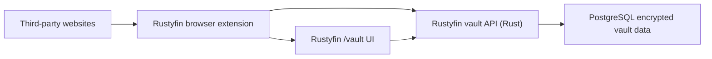

# Rustyfin Password Vault Design

Date: 2026-03-12

Status: proposed design

## Goal

Add a Rustyfin password-vault feature that can:

- securely store login credentials, usernames, emails, notes, and site metadata
- generate strong random passwords locally
- let users browse, search, create, update, and delete vault entries from Rustyfin
- offer saved credentials on supported websites
- prompt to save or update credentials after a login or password change
- stay aligned with Rustyfin's current Rust backend and the existing orange to pink to purple UI language

The feature should fit the current repository:

- Rust backend in `crates/server`
- PostgreSQL storage via `crates/db`
- shared Rust types in `crates/core`
- Next.js UI in `ui`
- native Debian 12 runtime as the supported deployment target

## Executive Summary

Rustyfin can support a serious password-manager feature, but not as a plain website alone.

The current Rustyfin web app can support:

- a secure `/vault` management surface
- encrypted credential storage
- password generation
- manual copy, reveal, edit, import, and export flows
- device/session management

The current Rustyfin web app cannot, by itself, reliably:

- detect that the user visited Instagram or any other arbitrary third-party site
- see credentials entered into arbitrary third-party login forms
- autofill credentials into arbitrary third-party pages

That browser-wide behavior requires a browser extension. A normal web page is constrained by same-origin policy, while browser extensions can run content scripts on pages the user grants permissions for.

Recommended final shape:

1. a Rust-owned vault backend and PostgreSQL data model
2. a Rustyfin `/vault` web experience for management and manual use
3. a thin browser extension for automatic detection, prompting, and autofill



## Hard Boundaries

### What the Rustyfin website can do

- store ciphertext and encrypted metadata
- let the user unlock a vault locally
- let the user manage entries, folders, tags, device sessions, and settings
- generate random passwords locally
- import plaintext data locally in the browser, encrypt it locally, and upload ciphertext
- decrypt locally for export and download

### What the Rustyfin website cannot do

- inspect arbitrary third-party login pages
- detect arbitrary password submissions on other sites
- autofill forms on other sites
- safely promise zero-knowledge security against a malicious Rustyfin server that is actively serving altered JavaScript

### What requires a browser extension

- website detection
- save prompts
- update prompts
- autofill
- generated-password insertion into third-party forms
- URI-based matching against the current page

### What should explicitly not be in v1

- organization sharing
- family plans
- attachments
- native desktop autofill
- mobile autofill
- emergency access
- passkeys
- secure sharing
- server-side breach-check integrations

Deferring sharing and organization features is important. A large fraction of Vaultwarden's recent authorization failures occurred in shared and organization-oriented code paths rather than in basic single-user vault encryption.

## Why This Fits The Current Repo

Rustyfin already has the right broad structure for this feature:

- Rust API server in `crates/server`
- PostgreSQL repo layer in `crates/db`
- shared types in `crates/core`
- authenticated Next.js UI in `ui`
- account and preference surfaces already live in:
  - `crates/server/src/routes.rs`
  - `crates/server/src/account_prefs.rs`
  - `ui/src/app/account/page.tsx`
  - `ui/src/lib/userProfileApi.ts`

The existing UI theme already exposes the core tokens the vault should reuse:

- `--orange`
- `--danger`
- `--purple`
- `.panel`
- `.tile`
- `.chip`
- `.btn-primary`

Those live in `ui/src/app/globals.css`, and should remain the canonical look for the web vault and the extension popup.

## Lessons From Existing Password Managers

The design should directly incorporate the mistakes that Bitwarden and Vaultwarden have already surfaced publicly. The point is not to copy their full architecture. The point is to copy the controls that prevented or fixed known classes of failure.

### Bitwarden product guidance worth copying

Bitwarden's current documentation, help center, and security whitepaper reinforce several patterns that Rustyfin should adopt:

- keep page-load autofill disabled by default
- warn or block on HTTP when HTTPS is expected
- treat untrusted iframes as unsafe autofill targets
- support excluded domains so save and fill prompts can be suppressed
- support explicit URI match modes rather than naive string contains
- keep import encryption client-side
- treat master-password re-prompt as a UI guard, not as extra encryption
- use conservative, tested Argon2id defaults and warn about client compatibility when changing KDF parameters

### Vaultwarden advisories worth learning from

Recent Vaultwarden advisories show a repeat pattern: the encryption model may be sound, yet alternate endpoints, admin surfaces, or permission drift still create real security bugs.

Important examples as of 2026-03-12:

- `CVE-2026-27898`
  - a partial update endpoint exposed another user's cipher details when addressed by attacker-chosen ID
  - lesson: alternate read/write endpoints must share exactly the same authorization path
- `CVE-2026-26012`
  - organization details endpoint returned all ciphers without enforcing collection-level access control
  - lesson: "list" and "detail" endpoints need the same access rules as standard retrieval
- `CVE-2026-27801`
  - 2FA bypass on protected actions
  - lesson: protected actions need a separate, well-defined step-up model with replay resistance
- `CVE-2025-24365`
  - privilege escalation via variable confusion in organization authorization
  - lesson: cross-tenant or cross-scope identifiers must never be trusted from the client
- `CVE-2024-56335`
  - organization group update/delete privilege escalation
  - lesson: shared/group features multiply authorization complexity and are not safe "nice to have" additions
- `CVE-2025-24364`
  - admin-panel remote code execution through unsafe configuration handling
  - lesson: do not expose a separate, weakly isolated vault admin backend
- `GHSA-f7r5-w49x-gxm3`
  - admin-panel CSRF issue
  - lesson: state-changing privileged web actions must have origin-aware CSRF defenses if cookie sessions are used

### What Rustyfin should do differently up front

Rustyfin should explicitly bake these lessons into the design:

- no separate vault admin panel
- no organization sharing in v1
- no generic partial update endpoint that returns expanded item details
- no state-changing vault action without a step-up token for protected operations
- no bulk cross-item mutate endpoints in v1 unless every authorization rule is already covered by tests
- no server-side parsing of plaintext imports in v1
- no HTML rendering of vault notes or imported content
- no server-side favicon or metadata fetches from arbitrary vault URLs

## Non-Negotiable Product Decisions

### 1. Do not ship a password vault that the server can freely decrypt

If Rustyfin stores passwords in plaintext or in a form the server can decrypt without the user's vault secret, then a database leak, backup leak, or server compromise has catastrophic blast radius.

The vault should be end-to-end encrypted in the passive-server sense:

- the user unlocks the vault with a separate master password
- encryption and decryption happen on the client side
- the server stores ciphertext, wrapped keys, salts, and blinded lookup indexes
- the server never stores or receives the master password

### 2. Do not rely on the current site-only client for browser-wide automation

Rustyfin as a web page cannot watch third-party logins across the web. That must be handled by a browser extension.

### 3. Treat this as a new security product area, not a small settings page

This feature is closer to building a password manager than adding a form. It needs:

- a threat model
- cryptographic design
- step-up authorization
- device trust and session lifecycle
- browser-extension architecture
- phishing defenses
- audit logging
- import and export rules
- UI hardening
- a staged rollout

### 4. Keep the backend in Rust, but allow browser-specific code where the browser requires it

The Rust-first policy still fits:

- Rust owns storage, API contracts, authorization, audit logs, sync, and device sessions
- TypeScript should own the browser extension and browser-only crypto glue
- the extension should stay thin and defer durable state to the Rust backend

### 5. Do not overclaim zero-knowledge protection in a self-hosted web UI

This is one of the most important caveats in the entire design.

If the Rustyfin server that serves `/vault` is malicious or compromised and can alter the JavaScript bundle, it can exfiltrate:

- the vault master password
- decrypted vault contents
- generated passwords

Therefore:

- the design protects strongly against database theft, backup theft, passive storage compromise, and honest-but-curious server storage
- the design does not protect against actively malicious code served by the same server

Practical implication:

- the browser extension is the higher-assurance automation surface because its code is packaged and signed through the browser extension ecosystem
- the web vault is still useful, but its trust model is weaker than a signed extension or future native app

## Trust Model And Threat Model

### Assets to protect

- stored passwords
- login emails and usernames
- notes
- future TOTP seeds
- device-session tokens
- export files
- generated passwords before save
- audit metadata about sites and services the user accesses

### Threats this design should address

- PostgreSQL database theft
- backup theft
- passive server-side storage compromise
- accidental secret logging
- network interception
- untrusted or compromised websites trying to trigger autofill or exfiltrate secrets
- authorization bypass between users
- session theft or replay for extension and web sessions
- CSRF if cookie-based sessions are adopted
- XSS in the vault UI

### Threats this design does not solve

- malware or keyloggers on the client
- a hostile browser environment
- a malicious extension with equal or greater permissions
- a fully compromised Rustyfin server that is actively serving altered JavaScript to `/vault`
- a user unlocking the vault on an untrusted device

## Recommended Security Model

### Separate account authentication from vault unlocking

Use two secrets:

- `Rustyfin account password`
  - authenticates the user to Rustyfin
  - server-side identity and session secret
- `Vault master password`
  - unlocks the vault locally
  - never leaves the client
  - is used only to derive a key-encryption key

Do not reuse the Rustyfin account password as the vault master password in the core design.

That coupling would make:

- password changes harder
- server compromise more dangerous
- device approval harder to reason about
- future recovery and migration paths worse

### Cryptographic primitives

Recommended v1 primitives:

- `Argon2id` for deriving the master unlock key from the vault master password
- `HKDF-SHA-256` for deriving subkeys from derived or random key material
- `AES-256-GCM` for wrapping the vault key and encrypting vault blobs
- `HMAC-SHA-256` for blinded lookup indexes
- browser Web Crypto `crypto.getRandomValues()` for client-side randomness
- Rust `OsRng` for server-generated salts, nonces, and token secrets

Bitwarden currently documents AES-CBC plus HMAC authentication for its protocol. Rustyfin can reasonably choose AES-GCM instead because:

- browser Web Crypto support is straightforward
- Rust support is straightforward
- the code path is smaller for a new project
- authenticated encryption is available as a single primitive

This choice must still remain versioned and replaceable:

- store `enc_algorithm` and `kdf_algorithm` in metadata
- do not hardcode a forever-only crypto stack into the schema

### Key hierarchy

Recommended hierarchy:

1. `master_password`
2. `Argon2id(master_password, salt, params)` -> `master_unlock_key`
3. `HKDF(master_unlock_key)` ->:
   - `key_encryption_key`
   - `index_key`
4. generate random `vault_data_key`
5. wrap `vault_data_key` with `key_encryption_key`
6. encrypt vault summaries and full payloads with `vault_data_key`
7. compute blinded URI lookup hashes with `index_key`

This is better than encrypting every item directly with the password-derived key because:

- a master-password change only requires re-wrapping the vault key
- the vault key can rotate independently
- algorithm migration is easier
- future multi-key collections are possible without redesigning the entire schema

### Stored material

Server stores:

- vault-enabled flag
- schema version
- KDF version and Argon2 parameters
- Argon2 salt
- wrapped vault data key
- key-wrap nonce
- encrypted item summaries
- encrypted item payloads
- per-blob nonces
- algorithm version fields
- blinded site-match indexes
- audit events
- device sessions

Server never stores:

- plaintext passwords
- plaintext master passwords
- unwrapped vault data keys
- decrypted notes or login data as a normal operational requirement

### Additional authenticated data

Every encryption operation should bind additional authenticated data such as:

- `user_id`
- `item_id`
- `blob_kind`
- `schema_version`
- `payload_version`

This prevents ciphertext reuse across users, blobs, or item types.

### KDF profile policy

The previous draft was too loose here. The KDF policy should be explicit.

Recommended v1 rule:

- Rustyfin supports one primary Argon2id profile across the web vault and extension:
  - memory: `65536 KiB` or `64 MiB`
  - iterations: `3`
  - parallelism: `4`

Why:

- it matches current Bitwarden default Argon2id guidance
- it is strong enough to be defensible
- it avoids a user-controlled configuration matrix that can strand one client while another still works

Recommended v1 compatibility rule:

- KDF parameters are not user-editable in v1
- if Rustyfin later adds advanced KDF settings, changes must be gated behind a client-compatibility check and a forced backup/export warning

Recommended future rule:

- maintain a server-advertised KDF profile registry
- clients pair only if they declare support for the active profile

Do not ship:

- open-ended client-side benchmarking that silently selects per-device KDF parameters
- user-configurable KDF tuning in the first release

That class of flexibility sounds attractive, but Bitwarden's own docs show it has real compatibility and performance consequences.

### Lookup-index privacy and leakage

The blinded URI index reduces disclosure, but it does not eliminate all leakage.

What the server should not learn:

- the plaintext site URI
- the base domain string
- the password

What the server may still infer:

- that repeated lookups involve the same hidden token for the same user
- how many URI tokens a user has
- how often a user performs lookup requests

This leakage is acceptable for v1 if explicitly acknowledged.

Controls to reduce abuse:

- rate-limit lookup requests per device session
- return only opaque item IDs plus ciphertext summaries
- never return plaintext or decrypted-derived site names from lookup

### Recovery semantics

If the user forgets the vault master password:

- Rustyfin should not be able to recover it
- reset should destroy the wrapped key and make stored ciphertext permanently unreadable

This needs explicit UX copy. A real zero-knowledge vault cannot honestly promise master-password recovery.

### JavaScript memory reality

Neither the web vault nor the extension can guarantee perfect memory zeroization in JavaScript.

So the design should:

- use Web Crypto `CryptoKey` objects as non-extractable where possible
- minimize copies of decrypted plaintext in memory
- avoid putting decrypted data into long-lived global stores
- avoid localStorage and plaintext IndexedDB for secrets
- auto-lock aggressively

## Auth, Sessions, Device Trust, And Protected Actions

### Current Rustyfin auth is not enough by itself

Today Rustyfin issues 24-hour JWTs and stores auth state in browser-managed storage:

- token issuance lives in `crates/server/src/auth.rs`
- the current auth context lives in `ui/src/lib/auth.tsx`

That is workable for normal app access, but weak for a vault because:

- stateless JWTs are harder to revoke per device
- browser-stored bearer tokens increase XSS impact
- the current model does not give first-class extension device sessions
- vault operations need stronger recent-auth semantics than ordinary media browsing

### Recommended session model

Add a dedicated server-backed device session layer for vault clients.

Recommended properties:

- opaque refresh tokens
- refresh-token rotation
- refresh-token family tracking
- replay detection
- revocation by device
- session age and last-used tracking
- separate `client_kind` values such as:
  - `web_vault`
  - `browser_extension`

Recommended direction for the general web app:

- move toward `httpOnly`, `Secure`, `SameSite` session cookies or refresh-token backed sessions
- if cookie sessions are adopted, add CSRF controls and strict origin checks for every state-changing route

### New device pairing

The extension should not silently reuse the same browser page token.

Recommended pairing flow:

1. user logs into Rustyfin in the main app
2. user opens `/vault`
3. user chooses `Pair browser extension`
4. server creates a short-lived pairing request with:
   - request ID
   - human-readable fingerprint phrase
   - short expiration
5. extension presents the same fingerprint phrase
6. user confirms inside `/vault`
7. server creates a dedicated extension device session
8. Rustyfin records audit events and notifies the user

This is intentionally similar to Bitwarden's trusted-device approval model.

### Protected actions

The previous document treated this too loosely.

Protected actions require a formal step-up model.

Protected actions should include at minimum:

- export
- import overwrite
- vault destruction
- master-password change
- new device approval
- device revocation of all other sessions
- API key creation if ever added
- reveal or copy of especially sensitive fields if the user enables extra protection
- future TOTP seed display

Recommended step-up design:

1. client asks server for a protected-action challenge
2. server verifies:
   - authenticated account session
   - device session validity
   - not rate-limited
3. if session is not fresh enough, server requires reauthentication
4. on success, server issues a one-time action token bound to:
   - user ID
   - device session ID
   - action kind
   - target item ID if applicable
   - nonce
   - expiry, for example 60 seconds
5. protected endpoint requires that token
6. token is consumed exactly once

Important clarification:

- a master-password re-prompt inside the UI can exist as a convenience feature
- it is not a substitute for server-side authorization
- Bitwarden explicitly warns that master-password re-prompt is a UI safeguard, not extra encryption

### MFA and step-up recommendation

If Rustyfin grows vault support, account MFA should become a near-term requirement for serious deployments.

Recommended path:

- v1 minimum: account-password reauth plus fresh device session
- stronger target: add WebAuthn or TOTP step-up for protected actions before general release or shortly after

### CSRF model

If Rustyfin keeps pure bearer-token `Authorization` headers for vault APIs, ordinary browser CSRF exposure is lower.

If Rustyfin moves to cookie-based sessions, then every state-changing vault route must require:

- CSRF token or double-submit token
- `Origin` check
- `Referer` validation fallback
- rejection of cross-site simple form POSTs
- rejection of `text/plain` or form-encoded bodies for JSON APIs

Do not repeat Vaultwarden's admin-panel CSRF class.

### No separate vault admin panel

Rustyfin should not create a stand-alone vault admin backend or admin token system.

Admin concerns should be limited to:

- global vault feature enablement
- server health
- audit retention settings

Admins should not have a privileged UI path that can:

- read user vault items
- override item contents
- change device sessions without going through the standard audited flow

If server configuration must change, it should go through the main authenticated admin experience or the existing deployment/runtime config paths, not a special vault-only side panel.

## Data Model

Keep vault state in dedicated tables under `crates/db/migrations_pg/`.

### Design principles

- use opaque IDs, preferably UUID v4 or v7
- include `user_id` in every vault table
- enforce composite uniqueness at the database level where possible
- never rely on client-supplied ownership
- keep audit rows sparse to reduce metadata leakage
- avoid storing plaintext site names, titles, URLs, or notes outside encrypted blobs

### `vault_account`

One row per user's vault.

Suggested fields:

- `user_id` PK and FK to `"user"`
- `status`
- `schema_version`
- `active_key_version`
- `created_ts`
- `updated_ts`
- `last_unlock_required_ts`
- `last_rekey_ts`

### `vault_wrapped_key`

One logical vault key per version.

Suggested fields:

- `id`
- `user_id`
- `key_version`
- `kdf_algorithm`
- `kdf_memory_kib`
- `kdf_iterations`
- `kdf_parallelism`
- `kdf_salt` `BYTEA`
- `hkdf_algorithm`
- `wrap_algorithm`
- `wrap_nonce` `BYTEA`
- `wrapped_vault_key` `BYTEA`
- `created_ts`
- `superseded_ts`

### `vault_item`

Durable encrypted entries.

Suggested fields:

- `id`
- `user_id`
- `item_type`
- `key_version`
- `summary_ciphertext` `BYTEA`
- `summary_nonce` `BYTEA`
- `summary_version`
- `payload_ciphertext` `BYTEA`
- `payload_nonce` `BYTEA`
- `payload_version`
- `favorite`
- `revision`
- `deleted_ts`
- `created_ts`
- `updated_ts`

Recommended plaintext meaning:

- `summary` is an encrypted lightweight blob for list view after unlock
- `payload` is the full encrypted item

Example decrypted summary:

- title
- primary display domain
- username or email
- folder or tags
- password strength label if derived locally

The server still sees only ciphertext.

### `vault_item_uri_index`

Blinded lookup values for autofill matching.

Suggested fields:

- `id`
- `item_id`
- `user_id`
- `match_hash` `BYTEA`
- `match_type`
- `rank`
- `created_ts`

Each item can have multiple URI index rows.

### `vault_device_session`

Dedicated vault-capable client sessions.

Suggested fields:

- `id`
- `user_id`
- `client_kind`
- `device_name`
- `device_platform`
- `device_fingerprint_hash`
- `refresh_token_family_id`
- `refresh_token_hash`
- `created_ts`
- `last_used_ts`
- `expires_ts`
- `revoked_ts`
- `ip_summary`
- `user_agent_summary`

### `vault_pending_device_approval`

Short-lived pairing and approval requests.

Suggested fields:

- `id`
- `user_id`
- `client_kind`
- `device_name`
- `fingerprint_phrase`
- `challenge_hash`
- `created_ts`
- `expires_ts`
- `approved_ts`
- `denied_ts`

### `vault_protected_action_token`

Optional persisted one-time step-up tokens if the implementation does not use purely signed short-lived tokens.

Suggested fields:

- `id`
- `user_id`
- `device_session_id`
- `action_kind`
- `target_item_id`
- `nonce_hash`
- `created_ts`
- `expires_ts`
- `consumed_ts`

### `vault_audit_event`

Sensitive event history.

Suggested fields:

- `id`
- `user_id`
- `device_session_id`
- `event_kind`
- `target_item_id`
- `event_json`
- `created_ts`

Event payloads should be sparse and redacted.

Good examples:

- event kind
- target item ID
- device name
- session ID
- result

Bad examples:

- plaintext title
- plaintext domain
- plaintext username
- notes

### Preferences

Extend `UserPreferences` with a typed `vault` section for UX-only settings:

- `auto_lock_minutes`
- `clipboard_clear_seconds`
- `inline_save_prompt_enabled`
- `inline_autofill_enabled`
- `default_match_mode`
- `warn_on_http`
- `warn_on_untrusted_iframe`
- `excluded_domains`
- `allow_manual_http_fill`

Do not store:

- keys
- salts
- plaintext metadata
- decrypted cache state
- anything that would let the server rebuild the vault key

## Suggested Vault Payload Shapes

Inside the encrypted payload, keep versioned typed objects.

### Login item

```json
{
  "version": 1,
  "item_type": "login",
  "title": "Instagram",
  "login": {
    "username": "example_user",
    "email": "user@example.com",
    "password": "super-secret",
    "totp_secret": null
  },
  "uris": [
    {
      "uri": "https://www.instagram.com",
      "match_type": "base_domain"
    }
  ],
  "notes": "",
  "tags": ["social"]
}
```

### Decrypted summary blob

```json
{
  "version": 1,
  "title": "Instagram",
  "display_uri": "instagram.com",
  "display_username": "example_user",
  "tags": ["social"],
  "favorite": true
}
```

The server should treat both shapes as opaque encrypted application data.

## Search, List Loading, And Metadata Disclosure

The previous draft promised a searchable list without being explicit about how that works under encryption.

### Recommended v1 behavior

- the vault list is only available after unlock
- the server returns encrypted summary blobs
- the client decrypts summaries locally
- search happens locally in memory

This means:

- search while locked is not supported
- the server is not responsible for plaintext search indexes
- the server never sees plaintext titles or usernames for list rendering

### Implications for larger vaults

For large vaults, the client should:

- page encrypted summaries
- decrypt them locally
- build an in-memory search index
- optionally cache ciphertext summaries only

Do not implement server-side plaintext search in v1.

## Matching Model And URI Rules

Use explicit URI match rules, not naive string contains.

Recommended match modes:

- `exact`
- `host`
- `base_domain`
- `never`

### Why `host` matters for Rustyfin

Rustyfin is a homelab-oriented product. Many local services use:

- `http://router.local`
- `https://nas.lan`
- IP literals
- single-label hostnames
- explicit ports

Bitwarden documents that base-domain matching is not appropriate for local TLDs and single-label hostnames. Rustyfin should therefore include `host` matching from day one.

### Recommended defaults

Default to:

- `base_domain` for normal public websites
- `host` for local TLDs, single-label hosts, IPs, or explicit port-bound services

### Equivalent domains

Equivalent domains are useful, but they are risky if implemented too aggressively.

Recommended v1 rule:

- do not ship a vendor-maintained equivalent-domain list in v1
- support user-defined equivalent-domain rules later
- log and test them carefully when introduced

### Excluded domains

Support an excluded-domain list in v1.

When a domain is excluded:

- no save prompt
- no update prompt
- no autofill suggestion
- no passkey prompt in future versions

### Lookup ranking

Rank matches in this order:

1. exact
2. host
3. base_domain

The UI should always show why a match was offered.

## Recommended API Surface

Add a dedicated vault module under `crates/server/src/vault/`.

Suggested server files:

- `crates/server/src/vault/mod.rs`
- `crates/server/src/vault/router.rs`
- `crates/server/src/vault/handlers.rs`
- `crates/server/src/vault/service.rs`
- `crates/server/src/vault/device_sessions.rs`
- `crates/server/src/vault/audit.rs`

Suggested shared types:

- `crates/core/src/vault.rs`

Suggested repo module:

- `crates/db/src/repo/vault.rs`

### Bootstrap and config

- `GET /api/v1/vault/config`
  - returns whether vault is enabled
  - returns supported KDF and encryption versions
  - returns the user's wrapped-key metadata if the vault exists
- `POST /api/v1/vault/bootstrap`
  - creates the user's vault
  - stores wrapped key material and metadata
- `POST /api/v1/vault/rekey`
  - stores a newly wrapped vault key and updates metadata
  - protected action

### Item operations

- `GET /api/v1/vault/items`
  - paginated encrypted summaries only
- `GET /api/v1/vault/items/{id}`
  - full encrypted payload
- `POST /api/v1/vault/items`
  - create encrypted item
- `PUT /api/v1/vault/items/{id}`
  - full encrypted replacement
- `DELETE /api/v1/vault/items/{id}`
  - soft-delete

Important change from the earlier draft:

- prefer `PUT` full replacement over generic partial object-merge mutation in v1
- if `PATCH` is later added, it must go through exactly the same ownership path as `GET`
- mutation endpoints should return `204 No Content` or an encrypted summary only
- do not return expanded cipher details on mutation

This is a direct response to the Vaultwarden partial-update disclosure class.

### Lookup and sync

- `POST /api/v1/vault/lookup`
  - request contains blinded URI hashes for the current page
  - response returns matching item IDs and encrypted summaries only
- `GET /api/v1/vault/sync?cursor=...`
  - optional optimization for extension/web sync
  - returns changed encrypted summaries since cursor

### Device sessions and pairing

- `POST /api/v1/vault/device-sessions/pair`
- `POST /api/v1/vault/device-sessions/{id}/approve`
- `POST /api/v1/vault/device-sessions/{id}/deny`
- `POST /api/v1/vault/device-sessions/refresh`
- `GET /api/v1/vault/device-sessions`
- `DELETE /api/v1/vault/device-sessions/{id}`

### Protected actions

- `POST /api/v1/vault/protected-actions/challenge`
- `POST /api/v1/vault/protected-actions/complete`

### Audit and export

- `GET /api/v1/vault/audit`
- `POST /api/v1/vault/export`
- `POST /api/v1/vault/import/bitwarden`

For export:

- prefer client-side export assembly after decryption
- the server should not assemble plaintext vault exports in v1

For import:

- prefer client-side import parsing and local encryption before upload
- the server should not parse plaintext Bitwarden or Vaultwarden exports in v1

## Authorization Matrix

This section is mandatory because recent Vaultwarden issues show that encryption does not save a system from authorization drift.

### Core rules

Every vault endpoint must follow these rules:

- never trust `user_id` from the client
- derive caller identity from the authenticated session only
- every repo query must scope by both resource ID and `user_id`
- list, detail, lookup, sync, create, replace, and delete must all have independent tests for cross-user denial
- alternate endpoints must reuse the same authorization path

### Endpoint-level expectations

| Endpoint family | Minimum authorization rule | Additional notes |
| --- | --- | --- |
| `/vault/config` | authenticated current user only | never return another user's metadata |
| `/vault/items` list | `WHERE user_id = caller` | summaries only |
| `/vault/items/{id}` get | `WHERE id = $1 AND user_id = caller` | return 404 or equivalent denial if not owned |
| `/vault/items/{id}` put/delete | same as get | no alternate path |
| `/vault/lookup` | only rows for caller's `user_id` | return opaque handles only |
| `/vault/sync` | only caller's items | cursor must be user-scoped |
| `/vault/device-sessions` | caller can read own sessions only | admin cannot list all vault sessions by default |
| `/vault/device-sessions/{id}` revoke | caller owns session or is revoking own sessions | protected action for mass revoke |
| `/vault/import` | caller only | protected action |
| `/vault/export` | caller only | protected action |

### Testing requirements from the matrix

For every endpoint family above, add:

- user A cannot read user B's item by direct ID
- user A cannot mutate user B's item by direct ID
- user A cannot see user B's summaries through sync
- user A cannot see user B's items through lookup
- user A cannot revoke user B's device session
- all mutation endpoints return the same denial behavior as standard read endpoints

## Recommended Web UX In Rustyfin

Add a top-level `Vault` destination in the main app navigation.

Recommended route shape:

- `ui/src/app/vault/page.tsx`
- `ui/src/app/vault/components/VaultList.tsx`
- `ui/src/app/vault/components/VaultEntryEditor.tsx`
- `ui/src/app/vault/components/VaultUnlockPanel.tsx`
- `ui/src/app/vault/components/PasswordGeneratorPanel.tsx`
- `ui/src/app/vault/components/VaultDevicesPanel.tsx`
- `ui/src/app/vault/components/VaultAuditPanel.tsx`
- `ui/src/app/vault/components/VaultSecurityPanel.tsx`

### Page sections

Recommended `/vault` sections:

1. `Unlock`
   - master password input
   - vault status
   - session freshness status
   - device-session notice

2. `My Vault`
   - encrypted summary list after unlock
   - search
   - filters
   - add item
   - reveal and copy actions

3. `Generator`
   - password presets
   - quick copy
   - quick insert

4. `Devices`
   - paired extensions and web sessions
   - revoke action
   - recent activity

5. `Audit`
   - recent sensitive actions

6. `Security`
   - change master password
   - pair extension
   - export
   - import
   - destroy vault

### Visual direction

Keep the existing Rustyfin design language:

- reuse `.panel`, `.tile`, `.chip`, `.btn-primary`, and the existing gradient tokens from `ui/src/app/globals.css`
- keep save and create actions on `.btn-primary`
- use the existing delete animation helper for destructive list removals
- preserve the orange to pink to purple emphasis rather than introducing a separate vault theme

Recommended visual treatments:

- a vault hero panel with the existing gradient accents
- credential cards as `tile` surfaces with subtle hover elevation
- masked passwords with explicit reveal buttons
- chip-style site/domain badges
- security status chips for `Unlocked`, `Locked`, `Needs reauth`, `Excluded domain`, and `HTTP blocked`

### UX restrictions for safety

- no third-party analytics on `/vault`
- no third-party chat widgets on `/vault`
- no HTML rendering of vault notes
- no Markdown rendering of vault notes in v1
- no external image loads based on vault item URLs
- no automatic favicon fetch from arbitrary URLs in v1

If visual identity is desired for entries, use:

- generated initials
- deterministic gradient chips
- local icon sets

Do not build server-side remote metadata fetches for websites in v1. That becomes an SSRF and privacy problem quickly.

## Recommended Browser Extension Architecture

This is required for:

- detecting password forms on arbitrary websites
- prompting to save credentials
- offering autofill on matching pages
- suggesting generated passwords in signup and password-change forms

Recommended repo placement:

- `extensions/rustfin-vault-webext/`

### Background service worker

Owns:

- server communication
- device session refresh
- vault lock state
- in-memory unlocked key material
- badge state
- alarms for auto-lock

Important MV3 caveat:

- extension service workers are not persistent
- they can suspend and restart
- on restart, Rustyfin should treat the extension as locked unless a safe memory-backed mechanism is still available

Do not design as if background memory is immortal.

### Content script

Owns:

- detecting candidate forms
- tracking focused inputs
- sending site and form metadata to background
- receiving autofill instructions
- filling visible fields
- showing inline save or fill affordances

Security requirements:

- run in the isolated extension world
- do not expose secrets via `window` globals
- do not inject page-readable scripts unless absolutely necessary
- do not keep captured credentials after prompt dismissal

### Popup UI

Owns:

- unlock prompt
- matched credentials list
- quick search
- save and update confirmation
- generator quick actions

### Options page

Owns:

- host permission explanation
- excluded domains
- auto-lock settings
- match-mode defaults
- HTTP warning behavior
- page-load autofill toggle

### Permissions

Likely required:

- `storage`
- `alarms`
- `scripting`
- `activeTab`
- host permissions for websites the user wants support on

If the extension is expected to work broadly like a password manager, it will likely need broad host access. That needs explicit onboarding because it is a sensitive permission request.

### Release integrity

Because the extension is one of the higher-assurance surfaces in this design:

- ship reproducible extension builds where feasible
- publish versioned release notes
- sign and distribute through standard browser extension channels
- reject incompatible server schema versions

## How Detection, Save Prompting, And Autofill Work

### Page visit detection

When the user visits a site:

1. content script loads on the page
2. it normalizes:
   - full URL
   - origin
   - host
   - base domain where applicable
3. it scans the DOM for candidate password forms
4. it checks whether the domain is excluded
5. it asks the background worker whether the vault is unlocked
6. if unlocked, the background computes blinded lookup hashes from the normalized site identifiers
7. the extension queries Rustyfin for candidate entries
8. if matches exist, the extension shows:
   - extension badge count
   - popup suggestions
   - optionally an inline icon near the field

This is how Rustyfin can detect that the user is on Instagram or any other supported site. The website is not telling Rustyfin directly. The extension sees the page and asks Rustyfin.

### Form detection heuristics

Detect candidate forms using:

- presence of `input[type="password"]`
- `autocomplete` values such as:
  - `username`
  - `email`
  - `current-password`
  - `new-password`
- common field names and IDs
- visible, editable field checks
- proximity of username/email field to password field
- MutationObserver for SPAs that render forms late

Recognize at least these shapes:

#### Login form

- one password field
- one nearby username or email field

#### Sign-up form

- one username or email field
- two matching new-password fields

#### Password-change form

- current password
- new password
- confirm password

### Save prompt flow

Recommended flow:

1. user submits a login or sign-up form
2. content script captures candidate credentials in memory only
3. extension waits for likely-success signals
4. extension prompts:
   - `Save login?`
   - `Update password?`
5. user confirms or dismisses
6. extension encrypts payload locally and stores through Rustyfin API

Do not silently save credentials without explicit confirmation.

### Success heuristics

Login success detection is not perfect on the modern web. Use heuristics, not false certainty.

Useful signals:

- password form disappears
- page URL changes away from login path
- a same-origin SPA rerenders away from auth form
- a known submit button becomes disabled then the app shell appears

Not reliable enough alone:

- network interception
- cookie inspection
- guessing from status codes

So the UX should say:

- `Save this login?`
- not
- `Rustyfin has definitely confirmed your login succeeded`

### Autofill flow

Recommended flow:

1. user focuses a credential field or opens the extension popup
2. extension shows matching entries ranked by site match
3. user chooses an entry
4. extension fills only visible, user-intended fields
5. extension does not auto-submit the form

### Autofill defaults

These defaults should be conservative and should explicitly follow Bitwarden's safer patterns.

Recommended v1 defaults:

- page-load autofill: `off`
- manual autofill from popup or keyboard shortcut: `on`
- HTTP autofill: `off`
- hidden-field fill: `off`
- untrusted iframe fill: `off`
- automatic save prompt: `on`
- excluded-domain support: `on`

Recommended per-item options later:

- allow page-load autofill for this item
- allow HTTP fill for this local-network item
- allow host-only match

### Iframe rules

Default rule:

- do not autofill into cross-origin or untrusted iframes

Possible follow-up:

- allow same-origin iframe fill with explicit user action

### Phishing resistance

The popup should always show:

- current page origin
- why the item matched
- whether the site is HTTP
- whether the target field is inside an iframe

Rustyfin should never:

- auto-submit forms
- silently fill hidden fields
- fill by broad domain equivalence the user did not approve

## Password Generation

Generate passwords locally in the client, not on the server.

### Source of randomness

Use:

- browser `crypto.getRandomValues()` for the web UI and extension
- Rust `OsRng` only where server-side randomness is required for salts, nonces, and token secrets

Important clarification:

- browsers do not provide perfect mathematical "true randomness" to JavaScript
- they provide cryptographically secure randomness suitable for password generation
- that is the correct target for a web and extension password manager

### Generator requirements

- local generation only
- no server round-trip
- support configurable length
- support configurable character classes
- support exclusion of ambiguous characters
- use rejection sampling to avoid modulo bias
- never reuse generated values
- never log generated values

### Recommended presets

- `Strong`: 20 chars, upper, lower, digits, symbols
- `Long`: 32 chars, upper, lower, digits, symbols
- `Memorable`: passphrase mode in follow-up phase

### Generated password insertion

The generator should support:

- generate and insert into the currently focused new-password field
- copy to clipboard
- create a new vault item from the generated password

### Clipboard caveat

Clipboard clearing is only best-effort.

Warn users that:

- the extension or web app can clear the clipboard after a timeout
- the OS, clipboard managers, or browser history features may still retain prior clipboard contents

## Local Key Handling On The Client

Unlocked key material should stay in memory only.

Recommended client behavior:

- keep unwrapped vault key only in memory
- auto-lock after inactivity
- auto-lock on browser restart
- clear in-memory state on logout
- treat service-worker restart as a lock event

For the extension:

- use `storage.session` only for non-sensitive session state if needed
- keep actual unwrapped key material in process memory where possible

Do not persist the unwrapped vault key to:

- localStorage
- plaintext IndexedDB
- extension `storage.local`

If encrypted local cache is added later:

- cache only ciphertext
- wrap any device-local cache keys with a device-local secret when possible
- never store a long-lived plaintext master-derived key

## Import, Export, And Offline Cache

### Import

Recommended v1 behavior:

- parse Bitwarden or Vaultwarden export locally in the browser or extension
- transform to Rustyfin DTOs locally
- encrypt locally
- upload ciphertext only

Do not do this in v1:

- upload a plaintext export to the Rustyfin server for parsing

### Export

Recommended v1 behavior:

- decrypt locally
- generate download locally
- download with:
  - `Cache-Control: no-store`
  - no service-worker persistence
  - user warning about plaintext export sensitivity

### Import and export limits

Add hard limits:

- maximum import file size
- maximum total items per import
- maximum notes length
- maximum URIs per item
- streaming parsing for large imports
- fail-closed on malformed input

### Notes and custom fields

Treat imported notes as plain text only.

Do not allow:

- HTML
- scriptable rich text
- arbitrary embedded links with auto-preview

This is partly an XSS control and partly a privacy control.

### Offline cache

Not in v1.

If added later:

- store ciphertext only
- keep a short-lived decrypted in-memory cache
- support explicit `Offline mode enabled on this device` UX

## Server-Side Hardening Requirements

Even with end-to-end encryption, the server still needs hardening.

### Required controls

- strict authorization on every vault route
- rate limiting on:
  - bootstrap
  - rekey
  - export
  - import
  - device-session creation
  - protected-action challenges
  - lookup
- structured audit logs without sensitive payloads
- no secrets in URLs
- no plaintext passwords in server logs
- encrypted host disks and encrypted backups as defense in depth
- secure headers and CSP review on the web UI
- `Cache-Control: no-store` on vault HTML and vault API responses that contain ciphertext or session state

### HTTP and browser hardening for `/vault`

Recommended posture:

- no third-party scripts
- no third-party fonts
- no inline scripts if avoidable
- `frame-ancestors 'none'`
- `object-src 'none'`
- strict `connect-src`
- HSTS on the public host
- consider Trusted Types for the vault route if feasible with the UI stack

### No SSRF-friendly convenience features

Do not add:

- server-side favicon fetch from arbitrary URLs
- server-side metadata scraping of saved sites
- screenshot generation for saved websites

Those are not password-manager core requirements, and they open SSRF, tracking, and metadata risks.

## Web UI And Extension Hardening Rules

### XSS posture

The vault UI must assume that any XSS is severe because it can expose:

- session tokens
- generated passwords
- decrypted notes
- copied secrets

Required rules:

- no `dangerouslySetInnerHTML` on vault surfaces
- no HTML rendering of notes
- sanitize any imported or displayed human-readable content before inserting into the DOM if HTML is ever allowed later
- keep decrypted secrets out of global stores if possible

### Caching and persistence

Do not persist decrypted vault state in:

- localStorage
- URL params
- search params
- sessionStorage

### Browser autofill interference

Avoid confusing the browser's built-in password manager on Rustyfin's own vault unlock and account-security screens.

Be deliberate about:

- `autocomplete` attributes
- field naming
- avoiding accidentally teaching the browser to save the vault master password into unrelated forms

## Testing And Verification

This feature needs stronger testing than most product additions.

### Rust tests

- repo tests for every vault table
- handler tests for auth and authorization
- protected-action token tests
- device-session rotation and replay tests
- audit event tests
- import envelope validation tests

### Cross-user adversarial tests

Create at least two users in integration tests and verify:

- direct ID lookup denial
- list isolation
- lookup isolation
- sync isolation
- device-session isolation
- mutation isolation

### Crypto tests

- KDF parameter compatibility tests
- wrap and unwrap round trips
- tampered ciphertext rejection
- wrong-key failure cases
- additional authenticated data mismatch failure
- version migration tests

### UI tests

- unlock and lock behavior
- no plaintext secret persistence in browser storage
- copy and reveal flows
- destructive action confirmations
- search only after unlock
- no HTML rendering in notes

### Extension tests

- login form detection on common DOM shapes
- SPA rerender handling
- save prompt after successful-login heuristics
- update prompt on password change
- no fill into hidden fields
- no fill on mismatched origin
- no fill in untrusted iframes
- excluded-domain suppression
- page-load autofill off by default

### Security review checks

- static search for secret logging
- CSP review
- dependency review for crypto and extension libraries
- permission review for extension manifest
- threat-model walkthrough before public release
- manual adversarial review of every alternate endpoint

## Recommended Rust Implementation Plan By Layer

### `crates/db`

Add:

- new migrations for vault tables
- `repo::vault`
- typed row structs and CRUD functions
- lookup helpers for blinded match indexes
- device-session repo helpers
- step-up token helpers if persisted in Postgres

Tests:

- CRUD round trips
- multi-index lookup correctness
- soft-delete behavior
- device-session revocation
- protected-action token lifecycle

### `crates/core`

Add shared types for:

- vault config
- encrypted summary DTOs
- encrypted payload DTOs
- device sessions
- protected-action envelopes
- audit entries
- URI match modes

Keep shared types versioned so the web app and extension agree on payload shape.

### `crates/server`

Add:

- vault router and handlers
- ownership-enforcing service layer
- audit writing
- device-session management
- protected-action challenge handling
- validation rules for encrypted request envelopes

Server responsibilities:

- never decrypt vault content as part of normal operation
- validate ownership and route permissions
- store and return ciphertext safely
- maintain session lifecycle and audit events
- reject malformed or unexpected content types

### `ui`

Add:

- `/vault` route and components
- local crypto helpers for:
  - key derivation
  - HKDF expansion
  - key unwrap
  - summary decrypt
  - payload decrypt
  - summary encrypt
  - payload encrypt
  - password generation
- vault API client
- vault preferences section in account or vault settings

Recommended client files:

- `ui/src/lib/vaultApi.ts`
- `ui/src/lib/vaultCrypto.ts`
- `ui/src/lib/vaultGenerator.ts`
- `ui/src/lib/vaultSession.ts`

### Browser extension

Add:

- background worker
- content script
- popup
- options page
- shared crypto and DTO library

Keep the extension as a thin shell around:

- page detection
- message passing
- fill logic
- unlock state
- Rustyfin sync

## Suggested Rollout Phases

### Phase 0: security prerequisites

Do not skip this phase.

- finalize threat model
- finalize crypto design and versioning
- define logging redaction rules
- add server-backed vault device sessions
- add protected-action token design
- harden auth/session handling for vault routes
- define no-admin-panel policy
- define no-sharing-in-v1 policy

### Phase 1: manual Rustyfin vault

Ship inside the web app first:

- vault bootstrap
- unlock flow
- encrypted summary and payload CRUD
- generator
- device list
- audit view
- export and import design scaffolding

This validates:

- database model
- crypto envelope
- core API design
- UI shape

without extension complexity.

### Phase 2: browser extension MVP

Add:

- site detection
- lookup by blinded URI hashes
- popup suggestions
- manual fill on user action
- save and update prompts
- generated password insertion
- excluded domains
- conservative autofill defaults

### Phase 3: hardening and migration

Add:

- import from Bitwarden or Vaultwarden JSON
- optional encrypted local cache
- better site heuristics
- stronger account-security notifications
- user-defined equivalent domains
- MFA or WebAuthn step-up improvements

### Phase 4: optional later features

- TOTP secrets
- passkeys
- secure sharing
- organization or family features
- native desktop companion

Do not start Phase 4 before the single-user authorization and autofill model is boring and heavily tested.

## Risks And Open Questions

### 1. Self-hosted web delivery weakens the strongest zero-knowledge story

This is the largest architectural caveat.

If the Rustyfin server can alter the `/vault` JavaScript bundle, it can steal the master password or decrypted contents. The extension mitigates this somewhat because its code is store-packaged, but the web vault itself cannot defeat a malicious server.

### 2. Login-success detection is heuristic

Rustyfin can get very good at prompting, but not perfect. The UX must tolerate ambiguity.

### 3. Current auth needs strengthening

The vault should not ship as if it were just another media feature riding on the current long-lived browser token model.

### 4. Zero-knowledge raises recovery costs

If the user loses the master password, recovery is intentionally limited. That is the price of the stronger security posture.

### 5. Cross-browser support takes real work

Chrome and Firefox are close, not identical. The extension should target WebExtensions deliberately and document differences.

### 6. Local-network services complicate URI matching

Rustyfin users are more likely than average to store credentials for:

- routers
- NAS devices
- local dashboards
- IP-based admin panels

That means `host` matching and HTTP warning exceptions need to be first-class.

## Concrete Design Corrections Compared With The Earlier Draft

This document intentionally fixes the weak spots in the earlier version:

- authorization is now treated as a first-class design area, not a sentence fragment
- protected actions now have a real step-up token model
- KDF settings are now explicit and compatibility-safe for v1
- list search now matches the encrypted-storage model
- page-load autofill is explicitly disabled by default
- excluded domains are explicitly supported
- local-network host matching is explicitly included
- import and export now stay client-side where feasible
- no separate vault admin panel is allowed
- no HTML or remote metadata fetches are allowed in v1
- the self-hosted malicious-JS caveat is called out explicitly

## Recommendation

Rustyfin should build this feature in two layers:

- a Rust-backed encrypted vault inside the existing app
- a browser extension for website detection, prompting, and autofill

That is the only architecture that satisfies the requested experience without pretending the website can do things browsers intentionally forbid.

If the goal is "Vaultwarden-style but integrated into Rustyfin," the correct implementation is:

- Rust backend and PostgreSQL for durable storage, sessions, and audit
- client-side encryption with a separate vault master password
- browser-local password generation using Web Crypto
- a WebExtension bridge for login-form detection and autofill
- UI surfaces that reuse Rustyfin's current gradient-heavy theme rather than inventing a new design language
- a sharply reduced v1 scope that avoids the classes of bugs recent Vaultwarden advisories exposed

## Concrete Build Order

1. Harden auth, define session/device trust, and define the cryptographic envelope.
2. Add vault tables, Rust repos, and Rust API routes with authorization tests.
3. Build `/vault` inside the current Rustyfin UI with local encryption and local search over decrypted summaries.
4. Add local password generation and unlock flows.
5. Build the browser extension and pair it to Rustyfin device sessions.
6. Add conservative save and update prompts.
7. Add import, audit polish, and future features only after the single-user model is stable.

## References

- MDN Same-origin policy: <https://developer.mozilla.org/en-US/docs/Web/Security/Defenses/Same-origin_policy>
- MDN WebExtension content scripts: <https://developer.mozilla.org/en-US/docs/Mozilla/Add-ons/WebExtensions/Content_scripts>
- MDN Web Crypto `getRandomValues()`: <https://developer.mozilla.org/en-US/docs/Web/API/Crypto/getRandomValues>
- MDN Web Crypto `SubtleCrypto.encrypt()`: <https://developer.mozilla.org/en-US/docs/Web/API/SubtleCrypto/encrypt>
- MDN WebExtension `storage.session`: <https://developer.mozilla.org/en-US/docs/Mozilla/Add-ons/WebExtensions/API/storage/session>
- RFC 9106 Argon2: <https://www.rfc-editor.org/info/rfc9106>
- Bitwarden KDF algorithms: <https://bitwarden.com/help/kdf-algorithms/>
- Bitwarden autofill from browser extensions: <https://bitwarden.com/help/auto-fill-browser/>
- Bitwarden URI match detection: <https://bitwarden.com/help/uri-match-detection/>
- Bitwarden excluded domains: <https://bitwarden.com/help/exclude-domains/>
- Bitwarden import data: <https://bitwarden.com/help/import-data/>
- Bitwarden encryption protocols: <https://bitwarden.com/help/what-encryption-is-used/>
- Bitwarden security whitepaper: <https://bitwarden.com/help/bitwarden-security-white-paper/>
- Bitwarden master password re-prompt: <https://bitwarden.com/help/master-password-re-prompt/>
- Bitwarden trusted devices: <https://bitwarden.com/help/add-a-trusted-device/>
- Bitwarden approve trusted device: <https://bitwarden.com/help/approve-a-trusted-device/>
- Vaultwarden security overview: <https://github.com/dani-garcia/vaultwarden/security>
- Vaultwarden releases: <https://github.com/dani-garcia/vaultwarden/releases>
- NVD `CVE-2026-27898`: <https://nvd.nist.gov/vuln/detail/CVE-2026-27898>
- NVD `CVE-2026-27801`: <https://nvd.nist.gov/vuln/detail/CVE-2026-27801>
- NVD `CVE-2026-26012`: <https://nvd.nist.gov/vuln/detail/CVE-2026-26012>
- NVD `CVE-2025-24365`: <https://nvd.nist.gov/vuln/detail/CVE-2025-24365>
- NVD `CVE-2025-24364`: <https://nvd.nist.gov/vuln/detail/CVE-2025-24364>
- NVD `CVE-2024-56335`: <https://nvd.nist.gov/vuln/detail/CVE-2024-56335>
