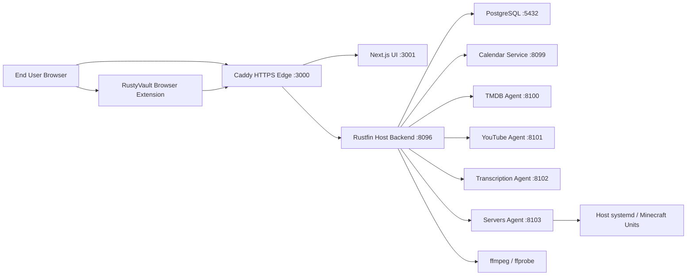

# Rustyfin Current-State Design Baseline

Date: 2026-03-13

Status: current-state architecture and planning baseline

Primary runtime target: native Debian 12 and Debian 13

## 1. Purpose

This document establishes a verified current-state design baseline for Rustyfin as it exists in the repository today.

It is intended to support:

- architecture understanding
- project planning
- scope management
- future roadmap work
- design-gap analysis
- delivery estimation
- change control

This is not a target-state rewrite proposal. It is a "what exists now, how it is built, how it is operated, and how to plan from here" document.

## 2. Method And Evidence Base

This baseline was assembled from the current authoritative repo sources and direct code inventory, including:

- `/Users/iwanteague/Desktop/Rustyfin/README.md`
- `/Users/iwanteague/Desktop/Rustyfin/AGENTS.md`
- `/Users/iwanteague/Desktop/Rustyfin/docs/README.md`
- `/Users/iwanteague/Desktop/Rustyfin/docs/operations/debian-12-native-runtime.md`
- `/Users/iwanteague/Desktop/Rustyfin/crates/server/src/routes.rs`
- `/Users/iwanteague/Desktop/Rustyfin/crates/server/src/watch_party/router.rs`
- `/Users/iwanteague/Desktop/Rustyfin/crates/server/src/channels/router.rs`
- `/Users/iwanteague/Desktop/Rustyfin/crates/server/src/servers/router.rs`
- `/Users/iwanteague/Desktop/Rustyfin/crates/server/src/rustyvault_host/`
- `/Users/iwanteague/Desktop/Rustyfin/ui/src/app/`
- `/Users/iwanteague/Desktop/Rustyfin/ui/src/features/rustyvault/`
- `/Users/iwanteague/Desktop/Rustyfin/extensions/`
- `/Users/iwanteague/Desktop/Rustyfin/scripts/`
- `/Users/iwanteague/Desktop/Rustyfin/tests/`
- `/Users/iwanteague/Desktop/Rustyfin/docs/reports/rustyvault-migration-blueprint-2026-03-13.md`

## 3. Executive Summary

Rustyfin is a native Debian-first home-server platform that combines media streaming, synchronized shared rooms, text and voice channels, calendar planning, Minecraft server management, and a client-side encrypted vault.

The current system architecture is:

- a Next.js frontend
- a Rust Axum host backend
- several Rust microservices
- PostgreSQL as the only runtime database
- Caddy as the HTTPS edge
- host-native `systemd` supervision

The most important current architectural truths are:

- Rustyfin is no longer a Docker-first or cross-platform runtime; supported Debian hosts are the supported base
- the platform is split into a main host backend plus focused service processes
- AI is a built-in product area with a chat-focused `/ai` surface and admin-only model management
- vault functionality is in a migration state toward a more isolated `RustyVault` boundary while still being presented to users as the `Vault` page
- Minecraft server management is implemented as a privileged host-agent pattern rather than as an in-process backend feature
- testing and operations are organized around native Debian gates, Playwright smoke coverage, and direct host-process health checks

## 4. Scope Statement

### 4.1 In Scope

- current runtime architecture
- current repo/module structure
- current product areas
- current deployment and service model
- current quality and operational controls
- current known architectural transition areas
- project-management decomposition of the existing system

### 4.2 Out Of Scope

- speculative future product scope not implemented in the repo
- detailed cost estimates
- team-specific staffing commitments
- detailed sprint planning
- vendor procurement
- legal/privacy policy wording

## 5. Product Scope Baseline

The current Rustyfin product surface includes:

- setup wizard
- login and account management
- libraries and scanning
- playback and downloads
- rooms / watch-party modes
- channels with text, attachments, voice, and transcription
- calendar
- servers / Minecraft management
- AI assistant
- vault / RustyVault
- downloads page
- admin
- a placeholder network page with a defined RustyNet topology-map direction

It does not currently include a Smart Home product surface, but Smart Home is now a defined planned direction for future Rustyfin expansion.

The current main navigation confirms these user-facing areas:

- Channels
- Rooms
- Network
- Servers
- AI
- Calendar
- Libraries
- Vault
- Downloads
- Admin (admin only)

## 6. System Context

## 7. Architectural Principles Already In Force

The repository and runtime rules make the following current decisions effectively non-negotiable:

- Rust-first backend and systems integration
- PostgreSQL-only runtime database
- native Debian runtime only
- POSIX shell operational scripting only
- server-side authorization as the real control plane
- frontend checks are UX, not trust boundaries
- host paths are real host paths; there is no container path abstraction
- deploys rebuild artifacts on-host rather than promoting container images

## 8. Current Runtime Architecture

### 8.1 Runtime Shape

Rustyfin runs as native host processes:

- `rustfin` main backend
- `rustfin-calendar`
- `rustfin-tmdb-agent`
- `rustfin-youtube-agent`
- `rustfin-transcription-agent`
- `rustfin-servers-agent`
- Next.js standalone UI
- Caddy
- PostgreSQL

### 8.2 Default Ports

| Component | Default Port | Notes |
| --- | --- | --- |
| HTTPS edge | `3000` | primary user entrypoint |
| internal UI | `3001` | Next standalone server |
| host backend | `8096` | main API and orchestration |
| calendar | `8099` | calendar API |
| TMDB agent | `8100` | metadata enrichment |
| YouTube agent | `8101` | audio acquisition / online media support |
| transcription agent | `8102` | Whisper-based transcription |
| servers agent | `8103` | privileged Minecraft host operations |
| PostgreSQL | `5432` | only supported DB |

### 8.3 Native Service Supervision

The systemd model installs:

- `rustyfin-native.service`
- `rustfin-servers-agent.service`
- `rustyfin-post-healthcheck.service`

Operationally:

- the main runtime is supervised through `scripts/run-native-supervisor.sh`
- the servers agent runs separately with root privileges
- the post-start healthcheck verifies readiness and performs one recovery restart if needed

### 8.4 Deployment Model

Current deployment is source-based, on-host, and rebuild-driven:

1. stop native services
2. optionally pull the current branch
3. rebuild Rust binaries and Next.js UI on the Debian host
4. refresh systemd units
5. restart services
6. verify health

This is implemented through:

- `scripts/install_linux.sh`
- `scripts/start-native.sh`
- `scripts/deploy-native.sh`
- `scripts/install_native_systemd.sh`

## 9. Codebase Structure Baseline

### 9.1 Active Rust Crates

| Crate | Role |
| --- | --- |
| `crates/core` | shared domain types, errors, common contracts |
| `crates/db` | PostgreSQL migrations and repository layer |
| `crates/ai-agent` | in-process AI inference engine and chat primitives |
| `crates/installer` | Rust-first Linux installer orchestration |
| `crates/server` | main Rust host backend |
| `crates/calendar` | calendar service |
| `crates/metadata` | metadata merge/provider logic |
| `crates/scanner` | media scanning and parsing |
| `crates/transcoder` | ffmpeg session/orchestration logic |
| `crates/tmdb-agent` | metadata enrichment service |
| `crates/youtube-agent` | online audio acquisition service |
| `crates/transcription-agent` | transcription service |
| `crates/servers-host` | host-level Minecraft management logic |
| `crates/servers-agent` | privileged system-facing Minecraft agent |
| `crates/rustyvault` | RustyVault product logic, shared types, and extension packaging |

### 9.2 Frontend Structure

The UI uses the Next.js App Router under `ui/src/app/`.

Current top-level routes include:

- `/`
- `/ai`
- `/login`
- `/setup`
- `/account`
- `/admin`
- `/calendar`
- `/channels`
- `/downloads`
- `/libraries`
- `/network`
- `/rooms`
- `/servers`
- `/vault`
- `/runtime-config`

### 9.3 Frontend Feature Boundary Note

Vault is no longer implemented directly in the route file. The host route:

- `ui/src/app/vault/page.tsx`

is now a thin adapter over:

- `ui/src/features/rustyvault/`

This is architecturally important because it reflects an explicit host/feature split rather than a generic page-local implementation.

### 9.4 Browser Extension

The current extension distribution directory is:

- `extensions/rustyvault-webext`

It is an unpacked WebExtension-style MVP with:

- `background.js`
- `content.js`
- popup UI
- options UI
- manifest

The extension is served to users through the vault/download flows rather than through a browser store release process.

## 10. Service Catalog

| Service | Binary/Entry | Primary Responsibility | Main Dependencies |
| --- | --- | --- | --- |
| Rustfin host backend | `crates/server` | auth, users, libraries, playback, watch-party, channels, AI routes, admin, vault mount, system APIs | PostgreSQL, agents, ffmpeg/ffprobe, `crates/ai-agent` |
| Calendar | `crates/calendar` | calendar event APIs and user availability data | PostgreSQL, host auth context |
| TMDB agent | `crates/tmdb-agent` | media enrichment and artwork/metadata tasks | TMDB API, scanner/metadata/db |
| YouTube agent | `crates/youtube-agent` | online audio download/search pipeline | external media sources, yt/ytdl stack |
| Transcription agent | `crates/transcription-agent` | Whisper session lifecycle and chunk transcription | GPU/CPU runtime, audio input |
| Servers agent | `crates/servers-agent` | privileged Minecraft lifecycle, logs, discovery, provisioning | `systemd`, Java, filesystem |
| Next.js UI | `ui` | browser-facing app shell and feature UI | host backend APIs |
| RustyVault extension | `extensions/rustyvault-webext` | save prompts, lookup, pairing, autofill assist | host backend vault APIs |

## 11. Backend API Surface Baseline

### 11.1 Main Host Backend Families

Representative host API families mounted under `/api/v1` include:

| Family | Representative Paths | Purpose |
| --- | --- | --- |
| setup | `/setup/*` | first-run ownership claim and server bootstrap |
| auth/users | `/auth/login`, `/users`, `/users/me` | login, user CRUD, self-service profile |
| preferences/activity | `/users/me/preferences`, `/users/me/activity/*` | account settings and browser activity |
| AI | `/ai/models`, `/ai/chat`, `/system/ai`, `/system/ai/models/*` | chat surface plus admin-only model management |
| libraries | `/libraries`, `/libraries/{id}`, `/libraries/{id}/scan` | library management and scans |
| items | `/items/{id}`, `/items/{id}/playback`, `/items/{id}/providers` | media item retrieval and enrichment |
| playback | `/playback/*` | sessions, progress, downloads, continue watching |
| system | `/system/host-directories`, `/system/gpu`, `/system/runtime-diagnostics` | host integration and diagnostics |
| vault | `/vault/*` | RustyVault host adapter routes |
| servers | `/servers/minecraft/*` | Minecraft orchestration and discovery |
| watch-party | `/watch-party/*` | rooms, invites, sync, audio/video flows |
| channels | `/channels/*` | text, attachments, voice, transcription |
| jobs | `/jobs`, `/jobs/{id}`, `/jobs/{id}/cancel` | background task inspection/control |
| events | `/events` | SSE event stream |

### 11.2 Watch-Party API Summary

The watch-party subsystem currently exposes:

- room lifecycle
- public room listing
- WebSocket room connection
- inviteable users
- eligible libraries
- room reconfiguration
- audio queueing/search/streaming
- YouTube search/lookup
- invite management
- admin room controls

This makes it more than a simple "watch together" feature. It is a multi-mode synchronized session platform.

### 11.3 Channels API Summary

The channels subsystem currently includes:

- channel list/create/update/delete
- message fetch/send/delete
- attachment upload/download
- transcription status/session lifecycle
- transcript download
- WebSocket real-time channel transport

### 11.4 Servers API Summary

The servers subsystem currently exposes Minecraft-specific endpoints for:

- capabilities
- instance list/create/get/update/delete
- status refresh
- provision
- import
- event history
- log retrieval
- lifecycle actions
- discovery scan

## 12. Microservice Endpoint Baseline

| Service | Representative Endpoints |
| --- | --- |
| calendar | `/health`, `/api/v1/calendar/events`, `/api/v1/calendar/users` |
| TMDB agent | `/health`, `/enrich/library/{id}` |
| YouTube agent | `/health`, `/api/v1/download/audio` |
| transcription agent | `/health`, `/v1/sessions/start`, `/v1/transcribe/chunk` |
| servers agent | `/health`, `/v1/minecraft/status`, `/v1/minecraft/provision`, `/v1/minecraft/logs` |

## 13. Frontend Functional Baseline

### 13.1 Home

The home page currently:

- checks setup completion
- redirects to setup if needed
- requires login after setup
- surfaces continue-watching data
- surfaces public rooms

### 13.2 Setup

The setup wizard currently supports:

- session claim / ownership protection
- base server configuration
- first admin creation
- metadata language/region setup
- network policy setup
- completion flow

### 13.3 Account

The account page currently handles:

- personal account profile
- preferences
- time zone handling
- audio device settings
- account metadata views

### 13.4 Admin

The admin surface currently includes:

- users
- libraries
- TMDB settings
- music import controls
- background jobs
- server event/log visibility

### 13.5 Calendar

The calendar page is a richer planner, not a simple list. It supports:

- multiple views
- event CRUD
- admin visibility into personal calendar events
- recurrence
- side panel editing modes

### 13.6 Channels

The channels UI supports:

- text channels
- voice channels
- attachment flows
- channel creation
- audio device preferences
- presence and voice controls

### 13.7 Rooms

The rooms UI supports multiple room modes:

- watch
- audio
- play
- create

It also supports:

- room creation
- invite management
- library eligibility selection
- public room discovery
- policy controls

### 13.8 Libraries

The libraries page currently provides:

- library list
- featured items
- continue-watching integration

### 13.9 Servers

The servers UI is a guided Minecraft management wizard with:

- create vs import mode
- capability-driven forms
- host directory browsing
- settings editing
- lifecycle action controls

### 13.10 Vault

The `/vault` route is now a host shell for the RustyVault feature module. The feature implementation includes:

- vault bootstrap and unlock
- client-side crypto
- encrypted item CRUD
- search and lookup
- password generator
- import/export
- device sessions
- protected actions
- audit view
- extension pairing

### 13.11 Downloads

The `/downloads` page currently acts as a release/distribution surface. It presently includes:

- RustyVault extension download
- install instructions for unpacked extension loading
- placeholders for future downloadable Rustyfin artifacts

The intended direction for Downloads is now explicit:

- Windows desktop application packages
- macOS desktop application packages
- Linux desktop application packages
- Android APK releases
- iOS application release/download guidance
- companion downloads should stay centralized on `/downloads` instead of being scattered across feature pages

### 13.12 Network

The `/network` page currently exists as a placeholder for future capability rather than as a mature product surface.

The intended direction for this page is now defined:

- integrate the RustyNet project as the canonical network experience inside Rustyfin
- make the primary surface a visual network map rather than a plain settings or status page
- present devices as node-based topology elements with a peer-to-peer / neural-network / mesh-like composition
- render currently connected or reachable devices as green nodes
- render known but currently offline or disconnected devices as grey nodes
- support lightweight hover inspection for each node instead of forcing table-first navigation
- the first hover payload should stay concise and useful, starting with node name, IP address, connection status, and any other low-risk identity metadata already available from RustyNet
- the map should feel live and spatial, with relationships or adjacency implied visually where the backing RustyNet data supports it
- the default experience should prioritize read-only visibility and situational awareness before deeper management actions are added later
- if RustyNet data is unavailable, the page should degrade to an unavailable or empty-state view rather than crashing or blocking the rest of Rustyfin

This means the Network page should no longer be treated as an undefined placeholder. It is now a planned RustyNet-powered topology surface with cinematic Rustyfin styling and lightweight node inspection as the initial product shape.

### 13.13 Smart Home

Smart Home does not currently exist as a shipped Rustyfin product surface.

The intended direction for this area is now defined:

- add a dedicated Smart Home surface where users can see linked smart-home devices in one place
- start with read-first situational awareness before deeper control actions
- support linked security cameras, smart lights, doors/locks, alarm systems, and other smart-home devices already integrated into the host environment
- show concise live state for each linked device, such as online/offline, armed/disarmed, open/closed, on/off, brightness, lock state, or motion/alarm state where available
- prioritize a visually scannable dashboard rather than forcing a settings-first or table-first experience
- allow camera surfaces to show useful lightweight previews or snapshot-oriented visibility where the backing integration supports it
- group devices by home/zone/room where the source integration already provides that structure
- keep the first hover/detail payload concise and useful, starting with device name, type, current state, room/zone, and any low-risk metadata already available from the underlying integration
- treat security-sensitive controls carefully; initial product shape should emphasize visibility, awareness, and state reporting before high-risk write actions such as unlocking doors or disarming alarms
- if Smart Home integrations are unavailable, the surface should degrade to an empty or unavailable state rather than blocking the rest of Rustyfin

This means Smart Home should be treated as a planned product surface alongside the broader Rustyfin ecosystem, even though it is not yet implemented in the current repo/runtime.

## 14. Data And Persistence Baseline

### 14.1 Database Model

Rustyfin is PostgreSQL-only at runtime.

The migration history currently reaches:

- `039_rustyvault_schema_rename.sql`

Recent migration themes confirm major delivered domains:

- servers / Minecraft
- denormalized counters
- continue watching
- user activity
- vault
- vault refresh tokens
- RustyVault schema rename

### 14.2 Repository Modules

Current repo modules in `crates/db/src/repo/` show the active data domains:

- users
- setup sessions
- libraries
- items
- media files
- playstate
- jobs
- channels
- channel transcripts
- calendar
- watch party
- servers
- settings
- user activity
- RustyVault

### 14.3 Runtime Files And State

Operational runtime state is written under:

- `.tmp/native-runtime/`
- `/etc/rustyfin/native-runtime.defaults.sh`
- `.rustyfin.runtime.env`

This is important because Rustyfin relies on local host state and logs rather than external orchestration metadata.

## 15. Security Baseline

### 15.1 General Security Controls

The repo rules and code indicate these baseline security controls:

- bearer-token based authenticated API access
- login rate limiting
- server-side authorization as the trust boundary
- no sensitive tokens in query strings
- explicit runtime/service health checks
- controlled host path validation

### 15.2 RustyVault Security Controls

Current RustyVault design/implementation characteristics include:

- client-side encrypted vault data
- separate vault device sessions
- protected-action tokens
- dedicated vault audit events
- blinded lookup hashes
- extension pairing approval model
- no-store response headers
- graceful disable / `503` behavior when RustyVault is unavailable

### 15.3 Host Privilege Separation

Minecraft host control is intentionally separated:

- main backend runs as the normal service user
- `rustfin-servers-agent` runs as root
- privileged actions are delegated rather than run directly in the host backend

This is one of the clearest security boundary decisions in the system.

## 16. Operational Baseline

### 16.1 Primary Scripts

| Script | Purpose |
| --- | --- |
| `scripts/install_linux.sh` | Linux bootstrap installer that installs Rust if needed and hands off to `rustfin-installer` |
| `scripts/start-native.sh` | compatibility wrapper that loads env/default layers, plans the runtime, builds artifacts, and hands launch/health to `rustfin-installer` |
| `scripts/deploy-native.sh` | stop, rebuild, and restart the current branch on Debian |
| `scripts/install_native_debian.sh` | host prerequisite installation |
| `scripts/install_native_systemd.sh` | compatibility wrapper for Rust-owned native systemd install/refresh |
| `scripts/stop-native.sh` | compatibility wrapper for Rust-owned native stop |
| `scripts/clean_install.sh` | interactive confirmation wrapper for Rust-owned native reset |
| `scripts/ci/debian_native_gates.sh` | Debian confidence sweep |
| `scripts/ci/debian_browser_smoke.sh` | isolated Playwright browser smoke against Debian runtime DB |

Current installer ownership split:

- `scripts/install_linux.sh` handles Linux bootstrap and Rust handoff
- `crates/installer` handles Debian prerequisite installation, native-user detection, native-user Rust provisioning, `yt-dlp`, PostgreSQL bootstrap, managed Java 21 provisioning, installer-written native runtime defaults, native runtime planning, runtime TLS/token/snapshot persistence, native Linux binary build orchestration, native runtime artifact builds for Rust services plus the Next standalone UI, native runtime launch/stop orchestration, native clean-reset behavior, native deploy orchestration, direct systemd install/refresh, and install-manifest output
- Native build/start still reuse the existing shell scripts

### 16.2 Runtime Health Pattern

The platform uses a layered health model:

- per-service `/health` endpoints
- post-start healthcheck service
- browser smoke gate
- Markdown gate reports

This is stronger than a simple "backend responds" model.

## 17. Testing And Quality Baseline

Current test assets include:

- Rust unit tests
- Rust integration tests
- Playwright browser tests
- API contract checks
- UI build/typecheck gates
- Debian-specific native smoke tests

Representative test suites cover:

- smoke
- setup
- auth
- users/permissions
- libraries/scanning
- directory picker
- accessibility
- API contract
- playback
- Rust unit tests
- UI build

The Debian native gates combine:

- host assumption checks
- formatting/lint/test checks
- UI lint/typecheck/build
- browser smoke
- runtime endpoint health
- journal/runtime diagnostics

## 18. Architectural Transition Areas

The most important current transition area is Vault to RustyVault.

### 18.1 What Is Already True

- the host backend mounts `rustyvault_host`
- the UI `/vault` route is a host adapter
- the canonical frontend implementation lives under `ui/src/features/rustyvault`
- the DB repo module is `rustyvault`
- the schema has been renamed to `rustyvault_*`
- the feature is explicitly disableable

### 18.2 What This Means For Planning

This subsystem should be treated as:

- implemented
- live
- boundary-hardening in progress

It should not be treated as greenfield, but it also should not be assumed to be fully stabilized as a final platform boundary.

## 19. Constraints, Assumptions, And Dependencies

### 19.1 Constraints

- Debian runtime only
- no Docker runtime
- no Windows runtime
- no macOS runtime
- PostgreSQL only
- host-installed `systemd`, Node, Rust, Caddy, ffmpeg/ffprobe required
- Rust-first backend policy

### 19.2 Assumptions

- the primary deployment model remains source-on-host
- direct host filesystem visibility remains required for media/server operations
- the UI continues to rely on the host backend as its API gateway
- service sprawl remains acceptable as long as operational controls stay native

### 19.3 External Dependencies

- TMDB
- online media/video source tooling for YouTube/audio flows
- Whisper / GPU stack for transcription
- Java and `systemd` for Minecraft management
- Caddy for TLS edge

## 20. Current-State Work Breakdown Structure

This WBS is not a future backlog. It is a decomposition of the current Rustyfin system as a managed product/program baseline.

```mermaid
graph TD
    A["1.0 Rustyfin Program"] --> B["1.1 Host Platform"]
    A --> C["1.2 Setup, Auth, And Identity"]
    A --> D["1.3 Media Domain"]
    A --> E["1.4 Shared Experience Domain"]
    A --> F["1.5 Servers Domain"]
    A --> G["1.6 Vault Domain"]
    A --> H["1.7 Operations And Quality"]

    B --> B1["1.1.1 Native Debian Runtime"]
    B --> B2["1.1.2 Systemd And Service Supervision"]
    B --> B3["1.1.3 Edge, Config, And Health"]

    C --> C1["1.2.1 Setup Wizard"]
    C --> C2["1.2.2 Login And Session Handling"]
    C --> C3["1.2.3 User Profiles And Preferences"]

    D --> D1["1.3.1 Libraries And Scanning"]
    D --> D2["1.3.2 Metadata And Artwork"]
    D --> D3["1.3.3 Playback And Continue Watching"]

    E --> E1["1.4.1 Rooms / Watch Party"]
    E --> E2["1.4.2 Channels / Voice / Transcription"]
    E --> E3["1.4.3 Calendar"]
    E --> E4["1.4.4 Admin Surface"]

    F --> F1["1.5.1 Minecraft Host Logic"]
    F --> F2["1.5.2 Privileged Servers Agent"]
    F --> F3["1.5.3 Servers UI Wizard"]

    G --> G1["1.6.1 RustyVault Host APIs"]
    G --> G2["1.6.2 RustyVault UI Feature"]
    G --> G3["1.6.3 Browser Extension"]
    G --> G4["1.6.4 Migration Boundary Hardening"]

    H --> H1["1.7.1 Rust Tests"]
    H --> H2["1.7.2 UI Checks"]
    H --> H3["1.7.3 Playwright And Debian Gates"]
    H --> H4["1.7.4 Docs And Operational Runbooks"]
```

### 20.1 WBS Dictionary

| WBS ID | Deliverable / Scope | Current-State Interpretation |
| --- | --- | --- |
| `1.1` | Host platform | Debian-native runtime, process model, Caddy, PostgreSQL, env/config |
| `1.2` | Setup/Auth/Identity | first-run claim flow, admin bootstrap, user auth, preferences |
| `1.3` | Media domain | libraries, items, metadata, playback, downloads |
| `1.4` | Shared experience domain | rooms, channels, calendar, admin capabilities |
| `1.5` | Servers domain | Minecraft-specific orchestration via host + agent |
| `1.6` | Vault domain | RustyVault backend, UI, extension, migration boundary work |
| `1.7` | Operations and quality | scripts, systemd, health checks, CI gates, docs |

## 21. Dependency Register

| ID | Dependency | Type | Why It Matters |
| --- | --- | --- | --- |
| `D-01` | Debian 12 or Debian 13 host | runtime | supported operating base |
| `D-02` | PostgreSQL | runtime | sole supported DB |
| `D-03` | Caddy | runtime | HTTPS edge termination |
| `D-04` | Rust toolchain | build/runtime | native host builds |
| `D-05` | Node/npm | build/runtime | UI build and standalone server |
| `D-06` | ffmpeg/ffprobe | runtime | playback, probing, download/transcode |
| `D-07` | Java | runtime | Minecraft managed instances |
| `D-08` | external metadata/media providers | external service | TMDB and online audio/video support |
| `D-09` | GPU stack | runtime optional/required by feature | transcription acceleration and constraints |

## 22. RAID Baseline

### 22.1 Risks

| ID | Risk | Impact |
| --- | --- | --- |
| `R-01` | Debian-only operational model limits contributor/dev host flexibility | medium |
| `R-02` | Multi-process native topology increases operational coupling and startup ordering complexity | medium |
| `R-03` | RustyVault boundary migration may leave temporary duplication or naming drift | medium |
| `R-04` | External-provider volatility can affect TMDB/YouTube-dependent features | medium |
| `R-05` | Privileged servers-agent boundary introduces operational/security sensitivity | high |

### 22.2 Assumptions

| ID | Assumption |
| --- | --- |
| `A-01` | Debian-native remains the strategic runtime model |
| `A-02` | PostgreSQL remains the only supported production DB |
| `A-03` | users access the product primarily through the web UI and, for vault, the browser extension |

### 22.3 Issues

| ID | Current Issue | Notes |
| --- | --- | --- |
| `I-01` | RustyVault migration is still in progress | boundary work remains |
| `I-02` | `/network` is still a placeholder surface | no mature feature set yet |
| `I-03` | Downloads is presently lightweight and partly RustyVault-oriented | not yet a broader product release center |

### 22.4 Dependencies

Handled in Section 21.

## 23. Proposed Planning Structure For The Next Documentation Program

This current-state baseline should become Phase 0 of a larger planning effort.

### Phase 0

- current-state inventory
- baseline diagrams
- scope decomposition
- risk and dependency baseline

### Phase 1

- subsystem deep dives
- interface contracts
- data flow documentation
- user journey mapping

### Phase 2

- current-vs-target gap analysis
- technical debt inventory
- architectural decision register
- prioritized remediation roadmap

### Phase 3

- milestone planning
- effort sizing
- release sequencing
- acceptance criteria by subsystem

## 24. Recommended Next Deliverables

Based on this baseline, the highest-value next documents would be:

1. subsystem deep-dive: media, playback, and transcoding
2. subsystem deep-dive: rooms/channels real-time architecture
3. subsystem deep-dive: servers/Minecraft control plane
4. subsystem deep-dive: RustyVault host-feature boundary and graceful disable behavior
5. API catalog with endpoint-level contracts
6. data model catalog mapping tables to repo modules and user-facing domains
7. operations runbook with troubleshooting trees and failure-mode handling

## 25. Acceptance Criteria For This Baseline Document

This document should be considered successful if it allows a new technical stakeholder to answer:

- what Rustyfin is today
- what runs where
- which components are first-class and which are transitional
- how the runtime is deployed
- how the product is decomposed into manageable work packages
- where the biggest boundary or planning risks currently sit

## 26. Conclusion

Rustyfin is already a substantial multi-domain platform, not a single-purpose media app. The present architecture is opinionated, host-native, Rust-heavy, and operationally centered on supported Debian hosts.

The immediate planning implication is that any future roadmap should treat Rustyfin as a coordinated program with at least seven major workstreams:

- host platform
- setup/auth/identity
- media/playback
- shared real-time experiences
- servers
- vault
- operations/quality

This document provides the baseline from which a deeper target-state architecture and project plan can now be produced.
