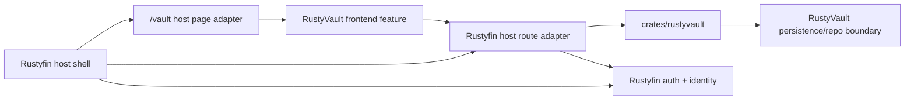

# RustyVault Migration Blueprint

Date: 2026-03-13

Status: migration tracker, repo implementation complete with follow-up operational validation notes

Owner: Product / Backend / UI

## Current Implementation Progress

The migration has started. These boundary moves are already in place:

- the server no longer mounts `crate::vault`; it mounts `crates/server/src/rustyvault_host/`
- the frontend `/vault` route is now a thin host adapter over `ui/src/features/rustyvault/`
- the canonical shared RustyVault types have moved from `crates/core/src/vault.rs` to `crates/rustyvault/src/types.rs`
- the canonical DB repo module has moved from `crates/db/src/repo/vault.rs` to `crates/db/src/repo/rustyvault.rs`
- the DB repo/API/auth layer now uses `RustyVault*` identifiers, `rustyvault_session`, and RustyVault-branded internal audit/action strings
- live SQL has been switched to `rustyvault_*` table names, with convergence handled by `crates/db/migrations_pg/039_rustyvault_schema_rename.sql`
- internal access/protected-action headers have moved to `x-rustyvault-*`
- the browser extension directory and package naming have moved to `extensions/rustyvault-webext` and `rustyvault-webext-*`
- the RustyVault frontend now owns its password generator utility under `ui/src/features/rustyvault/passwordGenerator.ts`
- extension helper/storage internals are now RustyVault-branded, including `rustyvault_session_v1`, `rustyvault_settings_v1`, and `rustyvault-auto-lock`
- the versioned wrap/index/AAD crypto protocol strings are now RustyVault-branded because there is no existing encrypted data to preserve
- the generic UI compatibility re-export shims under `ui/src/lib/vault*.ts` have been removed
- the server can now compile without RustyVault using the `rustyvault` Cargo feature
- runtime graceful-disable now exists through `RUSTFIN_RUSTYVAULT_ENABLED=0`
- when RustyVault schema or runtime prerequisites are missing, Vault routes now return `503` instead of taking down unrelated Rustyfin features
- the UI host route can render an unavailable fallback with `NEXT_PUBLIC_RUSTYVAULT_ENABLED=0`, and the RustyVault page now collapses to an unavailable state on backend `503`
- RustyVault session validation now lives in `crates/server/src/rustyvault_host/auth.rs` instead of generic server auth code
- the canonical RustyVault preference model now owns its own normalization rules in `crates/rustyvault/src/types.rs`
- RustyVault settings now use a dedicated host adapter at `/api/v1/vault/preferences` backed by the RustyVault-owned `rustyvault_preference` table
- legacy Vault settings are migrated out of the shared `user_pref.json` blob by `crates/db/migrations_pg/040_rustyvault_preferences.sql`
- the generic `/users/me/preferences` host API no longer carries Vault settings
- `cargo check -p rustfin-server --no-default-features` still passes without a RustyVault preference fallback in `account_prefs`
- the Downloads page now uses a host-owned downloads catalog and artifact pipeline through `/api/v1/downloads/catalog` and `/api/v1/downloads/artifacts/{artifact_id}/package`
- the frontend Downloads surface no longer imports `ui/src/features/rustyvault/api.ts` for package delivery
- the old `/api/v1/vault/extension` and `/api/v1/vault/extension/package` endpoints have been removed; host Downloads is now the authoritative public delivery path for the RustyVault browser extension
- the host route audit has now removed `/api/v1/vault/sync` and `/api/v1/vault/protected-actions/complete` because they had no live web UI or extension consumer
- retained RustyVault reads and management views like `/api/v1/vault/config`, `/api/v1/vault/preferences`, `/api/v1/vault/device-sessions`, and `/api/v1/vault/audit` now default to the RustyVault session boundary instead of plain host auth
- `/api/v1/vault/bootstrap`, `/api/v1/vault/protected-actions/challenge`, and `/api/v1/vault/device-sessions/revoke-others` are now session-bound too, so the host default is effectively "session-bound unless a bootstrap or recovery exception is documented"
- mixed Rustyfin-auth plus RustyVault-session routes now explicitly reject cross-user token mixing instead of assuming both credentials belong to the same user
- browser-extension pairing creation now requires the active RustyVault session header to match the protected-action challenge that authorized it
- the RustyVault runtime availability probe now also requires the dedicated `rustyvault_preference` table before marking the service available
- focused removability validation now exists through `./scripts/ci/rustyvault_removability_gates.sh`
- repo-native routing coverage now proves that when RustyVault is unavailable, Vault routes return `503` while unrelated host routes still respond normally

## Phase Status

- Phase 0: complete
- Phase 1: complete
- Phase 2: complete
- Phase 3: complete
- Phase 4: complete
- Phase 5: complete at repo level
  - repo validation now covers disabled-build compilation, host-UI disabled build, and runtime-unavailable route isolation
  - deployment-host DB-backed/runtime smoke is still recommended after major Vault changes

## Remaining Operational Validation

- run the focused removability gate on a deployment-like host when changing Vault runtime wiring
- run DB-backed integration coverage when `RUSTFIN_TEST_DATABASE_URL` is available

## Goal

Convert the current Vault implementation into a separate internal product module named `RustyVault`, while keeping Rustyfin free to present it simply as the `Vault` page in the host UI.

This migration is successful only if:

- all Vault implementation code becomes `RustyVault` code
- Rustyfin keeps only a thin host-facing `Vault` adapter
- Downloads is not treated as part of the migration scope
- if RustyVault is removed, the only Rustyfin product area that should break is the Vault surface

This is not a branding-only plan. It is a boundary and ownership migration.

## Non-Negotiable Requirements

These requirements take precedence over backward-compatibility convenience.

### 1. RustyVault must become its own crate/entity

RustyVault should not remain as a broad folder of `vault` code inside `crates/server`.

The target is a dedicated crate:

- `crates/rustyvault`

and a dedicated frontend feature boundary:

- `ui/src/features/rustyvault`

### 2. Rustyfin may still expose it as `Vault`

Rustyfin is allowed to keep:

- the top-nav label `Vault`
- the host page route `/vault`
- a host page shell in `ui/src/app/vault/page.tsx`

But those host-facing names must be adapters only. The underlying implementation should belong to RustyVault.

### 3. Downloads is out of scope

This migration must not be defined around the Downloads page.

RustyVault should not require Downloads work to justify its architecture. If Downloads currently has RustyVault coupling, that is a boundary violation to be removed or isolated, not a reason to make Downloads part of the migration target.

### 4. Graceful unavailability is a hard acceptance criterion

The architecture should aim for this operational test:

- remove or disable RustyVault
- Rustyfin still builds and runs
- only the Vault page and Vault-owned APIs/features become unavailable
- channels, rooms, servers, calendar, libraries, playback, admin, setup, and account remain intact

Full physical detachability is useful where it falls out naturally, but it is not the requirement. The hard requirement is that RustyVault becoming unavailable must degrade to a controlled `503`/unavailable state instead of crashing the host.

### 5. No legacy `vault` naming inside RustyVault

Inside RustyVault-owned code, do not preserve old `vault` naming for convenience.

That means the target state should not contain RustyVault-owned identifiers like:

- `vaultApi.ts`
- `vaultSession.ts`
- `crates/server/src/vault/...`
- `crates/core/src/vault.rs`
- `x-rustfin-vault-access`

Inside RustyVault, it should look as if it had always been named RustyVault.

The only acceptable remaining `Vault` naming is at the Rustyfin host boundary where the product is intentionally presented as a Vault page.

## Architectural Intent

Rustyfin should host RustyVault, not own RustyVault internals.

The host/product split should look like this:

Key point:

- the Rustyfin shell owns the mount points
- RustyVault owns the product logic

## Current State (Verified Repo Inventory)

### Current backend ownership is mostly RustyVault-shaped

Today the backend implementation is centered on:

- `crates/rustyvault/`
- `crates/db/src/repo/rustyvault.rs`
- `crates/server/src/rustyvault_host/`
- `crates/server/src/routes.rs` mounting `mounted_rustyvault_router()`
- `crates/db/migrations_pg/039_rustyvault_schema_rename.sql`

This is a major improvement over the original `crate::vault` shape. Session validation now lives in `crates/server/src/rustyvault_host/auth.rs`, and RustyVault preferences now live behind RustyVault-owned persistence instead of the shared account-preferences blob.

### Current frontend ownership is now feature-scoped

Today the UI implementation is centered on:

- `ui/src/app/vault/page.tsx` as a host adapter
- `ui/src/features/rustyvault/RustyVaultPage.tsx`
- `ui/src/features/rustyvault/api.ts`
- `ui/src/features/rustyvault/crypto.ts`
- `ui/src/features/rustyvault/session.ts`
- `ui/src/features/rustyvault/passwordGenerator.ts`

This is now the right frontend ownership shape. The RustyVault UI no longer depends on the generic account-preferences UI API, and the backend storage path is also RustyVault-owned.

### Current host route audit result

The host-facing `/api/v1/vault/*` surface has now been audited against real consumers.

Retained because they are used by the web UI and/or browser extension:

- `/config`
- `/preferences`
- `/bootstrap`
- `/rekey`
- `/items`
- `/items/{id}`
- `/lookup`
- `/device-sessions/pair`
- `/device-sessions/pair/consume`
- `/device-sessions/refresh`
- `/device-sessions`
- `/device-sessions/revoke-others`
- `/device-sessions/{id}`
- `/protected-actions/challenge`
- `/audit`
- `/export`
- `/import/bitwarden`
- `/`

Removed as legacy convenience surface with no live product consumer:

- `/sync`
- `/protected-actions/complete`

The rule going forward is simple: host-visible RustyVault endpoints stay only when there is a concrete web UI or extension consumer, and retained read/management routes should prefer the RustyVault session boundary over plain host auth.

The tighter security rule is now:

- require a RustyVault session for all retained RustyVault operations by default
- document any bootstrap/recovery exception instead of silently falling back to plain host auth
- if both Rustyfin auth and a RustyVault session are present, reject the request unless they belong to the same user

### Remaining extension and download coupling is now host-scoped

Today RustyVault-related distribution still appears in:

- `extensions/rustyvault-webext`
- `crates/server/src/downloads.rs`
- `crates/server/src/rustyvault_host/extension_package.rs`

This is now the intended shape: Downloads stays a Rustyfin host capability, while RustyVault only supplies the package metadata/bytes behind a host adapter.

## Desired End State

## Host-visible behavior

Rustyfin should still be able to present:

- nav label: `Vault`
- host route: `/vault`
- host product copy: optional `Vault`

This is purely host presentation.

## Internal product identity

Every RustyVault-owned implementation detail should use `rustyvault`, not `vault`.

That includes:

- crate names
- module names
- frontend feature folders
- TypeScript APIs and session helpers
- Rust types and files
- extension package names
- API headers
- storage keys
- audit/event names where appropriate

## Separation objective

Rustyfin should depend on RustyVault only through a narrow host adapter contract.

RustyVault should not be allowed to bleed into:

- channels
- rooms
- playback
- servers
- libraries
- admin
- setup
- general downloads infrastructure

## Required Boundary Contract

Rustyfin should provide only these host-side dependencies to RustyVault:

- authenticated Rustyfin user identity
- Rustyfin account-password verification for step-up actions, if that stays shared
- host layout/theme shell
- route mounting
- optional product availability flag

RustyVault should own:

- wrapped-key metadata
- encrypted vault item behavior
- blinded lookup logic
- device session lifecycle
- pairing flow
- protected-action tokens specific to RustyVault
- RustyVault audit events
- extension packaging and extension-facing APIs
- frontend state and UI composition for the product

## The Removability Standard

This migration should be judged against a concrete removability standard.

### Build-time standard

The workspace should be able to disable or remove RustyVault without invalidating unrelated Rustyfin crates and routes.

Recommended mechanism:

- add a workspace feature or server feature such as `rustyvault`
- make RustyVault enabled by default
- allow server route mounting to compile without it

### Runtime standard

If RustyVault is absent or disabled:

- `/vault` can render a host-owned unavailable page or 404
- RustyVault-specific APIs can be absent or return unavailable
- the rest of Rustyfin should still run normally

### UI standard

The host app should keep a minimal adapter page:

- `ui/src/app/vault/page.tsx`

That file should not contain product logic. It should only:

- gate auth
- load the RustyVault feature if present
- show a host-level unavailable state if RustyVault is disabled

This is what makes removability realistic on the frontend.

## Naming Policy

## Host boundary names that may remain `Vault`

Allowed at the Rustyfin host boundary:

- `/vault`
- nav label `Vault`
- page title `Vault`
- `ui/src/app/vault/page.tsx`

These exist because Rustyfin is presenting the product as a Vault page.

## Internal names that must become `RustyVault`

Inside RustyVault-owned code, rename everything to `rustyvault`:

- `crates/server/src/vault/*` -> no longer valid target
- `crates/core/src/vault.rs` -> move/rename out of `vault`
- `crates/db/src/repo/vault.rs` -> move or wrap behind a RustyVault-owned boundary
- `ui/src/lib/vaultApi.ts` -> `ui/src/features/rustyvault/api.ts`
- `ui/src/lib/vaultCrypto.ts` -> `ui/src/features/rustyvault/crypto.ts`
- `ui/src/lib/vaultSession.ts` -> `ui/src/features/rustyvault/session.ts`
- browser extension naming -> `rustyvault-*`
- headers -> `x-rustyvault-*`
- session storage keys -> `rustyvault_*`

This migration should be a hard rename at the RustyVault boundary, not a compatibility alias strategy.

## Downloads Constraint

Downloads is explicitly not part of this migration.

That means:

- do not define the migration around the Downloads UX
- do not expand Downloads as part of the RustyVault separation work
- do not let Downloads remain a hard runtime dependency of RustyVault if the removability objective matters

If RustyVault artifacts need distribution, there are only two acceptable long-term outcomes:

1. RustyVault owns its own artifact/distribution adapter behind the host boundary
2. Rustyfin exposes a generic artifact registry interface that does not hard-code RustyVault into core app behavior

What is not acceptable:

- core Rustyfin Downloads page directly depending on RustyVault implementation details forever

The generic host artifact-registry route is now implemented, so current Downloads work should continue through host-owned contracts rather than direct RustyVault UI imports.

## Recommended Repository Shape

## Backend target shape

Recommended target:

- `crates/rustyvault`
  - canonical RustyVault domain crate
- `crates/rustyvault/src/lib.rs`
- `crates/rustyvault/src/service.rs`
- `crates/rustyvault/src/device_sessions.rs`
- `crates/rustyvault/src/audit.rs`
- `crates/rustyvault/src/extension_package.rs`
- `crates/rustyvault/src/types.rs`

Host-side integration in Rustyfin:

- `crates/server/src/rustyvault_host/`
  - thin host mount only
- `crates/server/src/rustyvault_host/router.rs`
- `crates/server/src/rustyvault_host/handlers.rs`

The host adapter may still mount at `/vault`, but the mounted logic should come from RustyVault-owned code.

## Frontend target shape

Recommended target:

- `ui/src/app/vault/page.tsx`
  - host adapter only
- `ui/src/features/rustyvault/`
  - all real product code
- `ui/src/features/rustyvault/api.ts`
- `ui/src/features/rustyvault/crypto.ts`
- `ui/src/features/rustyvault/session.ts`
- `ui/src/features/rustyvault/components/...`
- `ui/src/features/rustyvault/hooks/...`
- `ui/src/features/rustyvault/RustyVaultRoot.tsx`

## Extension target shape

Recommended target:

- `extensions/rustyvault-webext`

The extension should belong to RustyVault, not to a legacy `vault` naming scheme.

## Migration Strategy

The migration should be done as a hard ownership split, not as a long compatibility period.

## Phase 0: Freeze Hard Decisions

Before editing code, freeze:

- internal product name: `RustyVault`
- crate name: `rustyvault`
- TS feature path: `features/rustyvault`
- extension package name: `rustyvault-webext`
- API header names: `x-rustyvault-*`
- host-visible Rustyfin route: `/vault`
- host-visible Rustyfin nav label: `Vault`

Do not begin migration without freezing those names.

## Phase 1: Create Host Adapter Boundaries

First create the shape that allows removal.

### Backend

Introduce a Rustyfin host boundary for the product:

- `crates/server/src/rustyvault_host/`

This host adapter should do as little as possible:

- mount host-visible routes
- bridge host auth/user context into RustyVault
- return unavailable when RustyVault is disabled

### Frontend

Keep:

- `ui/src/app/vault/page.tsx`

but reduce it to a host adapter page only.

It should not own:

- crypto logic
- product state
- item editor logic
- audit/device session logic

Those belong in `ui/src/features/rustyvault`.

### Acceptance criteria

- the host page can exist even if the RustyVault feature is disabled
- the host route is the only Rustyfin page directly tied to RustyVault

## Phase 2: Backend Extraction and Hard Rename

This phase converts all backend vault code into RustyVault-owned code.

### Move out of `crates/server/src/vault`

The target state should eliminate `crates/server/src/vault` as the canonical implementation location.

Move or recreate equivalent logic in:

- `crates/rustyvault/src/service.rs`
- `crates/rustyvault/src/device_sessions.rs`
- `crates/rustyvault/src/audit.rs`
- `crates/rustyvault/src/extension_package.rs`

### Shared types

Do not leave RustyVault’s canonical shared types in `crates/core/src/vault.rs`.

Preferred target:

- `crates/rustyvault/src/types.rs`

If some shared host contract must remain visible elsewhere, expose it from RustyVault rather than keeping a `vault.rs` file in `crates/core`.

### Persistence

The current `crates/db/src/repo/vault.rs` is still Rustyfin-owned persistence naming.

Preferred target:

- move RustyVault persistence code behind a RustyVault-owned repo module
- or wrap `crates/db` access behind `crates/rustyvault` so Rustyfin never touches vault persistence directly

The end state should not require unrelated Rustyfin code to import a `vault` repo.

### Header rename

Rename internal/product headers to RustyVault names:

- `x-rustyvault-access`
- `x-rustyvault-protected-action`

Do not preserve old header names inside RustyVault internals.

### Acceptance criteria

- no RustyVault implementation lives under `crates/server/src/vault`
- no canonical RustyVault type file is named `vault.rs`
- Rustyfin server code only depends on RustyVault through a host adapter boundary

## Phase 3: Frontend Extraction and Hard Rename

This phase converts all product logic into a dedicated RustyVault feature module.

### Move out of generic app libs

The following are no longer canonical locations:

- `ui/src/lib/vaultApi.ts`
- `ui/src/lib/vaultCrypto.ts`
- `ui/src/lib/vaultSession.ts`

Create:

- `ui/src/features/rustyvault/api.ts`
- `ui/src/features/rustyvault/crypto.ts`
- `ui/src/features/rustyvault/session.ts`

### Page ownership

The real product tree should live under `features/rustyvault`.

The host route file should only render something like:

- `RustyVaultRoot`
- or a host fallback if disabled

### Middleware

If `/vault` keeps special CSP/no-store behavior, that protection should remain host-owned.

That is acceptable because it is tied to the host route, not to RustyVault naming.

### Acceptance criteria

- almost all product logic is in `ui/src/features/rustyvault`
- `ui/src/app/vault/page.tsx` is thin
- there are no canonical `vault*.ts` product files left in generic app libraries

## Phase 4: Extension Realignment

The browser extension is part of RustyVault and should be renamed accordingly.

### Required rename direction

- `extensions/rustfin-vault-webext` -> `extensions/rustyvault-webext`
- visible extension labels -> `RustyVault`
- package naming -> `rustyvault-webext-*`

### API ownership

The extension should talk to RustyVault-owned APIs and header names.

The host may still expose those through Rustyfin route mounts, but the product language must be RustyVault.

### Acceptance criteria

- extension source directory is RustyVault-branded
- extension manifest is RustyVault-branded
- extension no longer uses legacy `vault` naming internally

## Phase 5: Removability Validation

This phase proves the architecture actually met the goal.

### Backend validation

Recommended test:

- disable the `rustyvault` feature or remove the crate dependency
- build the workspace
- verify all non-Vault services and routes still compile and run

### Frontend validation

Recommended test:

- disable the RustyVault feature module import
- verify the app still builds
- `/vault` should render a host-owned unavailable state or fail in isolation
- unrelated routes still work

### Product validation

If RustyVault is removed:

- only Vault page/UI should become unavailable
- Downloads should not become a blocking failure
- core Rustyfin app should remain healthy

## Concrete File-Level Migration Targets

### Former backend files that are no longer canonical

- `crates/server/src/vault/mod.rs`
- `crates/server/src/vault/router.rs`
- `crates/server/src/vault/handlers.rs`
- `crates/server/src/vault/service.rs`
- `crates/server/src/vault/device_sessions.rs`
- `crates/server/src/vault/audit.rs`
- `crates/server/src/vault/extension_package.rs`
- `crates/core/src/vault.rs`
- `crates/db/src/repo/vault.rs`

### Target backend files

- `crates/rustyvault/src/lib.rs`
- `crates/rustyvault/src/types.rs`
- `crates/rustyvault/src/service.rs`
- `crates/rustyvault/src/device_sessions.rs`
- `crates/rustyvault/src/audit.rs`
- `crates/rustyvault/src/extension_package.rs`
- `crates/db/src/repo/rustyvault.rs`
- `crates/db/migrations_pg/039_rustyvault_schema_rename.sql`
- `crates/server/src/rustyvault_host/router.rs`
- `crates/server/src/rustyvault_host/handlers.rs`

### Former frontend files that are no longer canonical

- `ui/src/lib/vaultApi.ts`
- `ui/src/lib/vaultCrypto.ts`
- `ui/src/lib/vaultSession.ts`
- `ui/src/lib/vaultGenerator.ts`
- `ui/src/app/vault/page.tsx` as a product-logic file

### Target frontend files

- `ui/src/app/vault/page.tsx` as host adapter only
- `ui/src/features/rustyvault/api.ts`
- `ui/src/features/rustyvault/crypto.ts`
- `ui/src/features/rustyvault/session.ts`
- `ui/src/features/rustyvault/passwordGenerator.ts`
- `ui/src/features/rustyvault/RustyVaultPage.tsx`

### Extension target

- `extensions/rustyvault-webext/...`

## Things Rustyfin Must Not Depend On After Migration

After migration, unrelated Rustyfin areas must not import or depend on RustyVault internals.

This includes:

- channels
- rooms
- watch-party
- playback
- servers
- libraries
- admin
- setup
- general downloads page behavior

Only the Vault host route and explicitly Vault-owned APIs should depend on RustyVault.

## Main Risks

### Risk 1: only renaming strings, not boundaries

If the code still lives in generic `vault` files under Rustyfin, the migration failed even if the UI says RustyVault.

### Risk 2: leaving Downloads coupled

If Downloads remains a direct dependency on RustyVault, the removability objective fails.

### Risk 3: keeping legacy names inside RustyVault

If the new crate still exposes `vault` file names, modules, headers, and TS helpers internally, the architecture will remain conceptually split.

### Risk 4: overusing compatibility shims

Excessive aliasing keeps the old architecture alive and weakens the point of the migration.

## Resolved Decisions

These decisions are now settled in the implemented repo shape:

- RustyVault shared types are exposed directly from `crates/rustyvault`
- the host Rustyfin page remains `/vault` and is allowed to present the product generically as `Vault`
- Rustyfin exposes RustyVault distribution only through the host-owned Downloads/artifact registry boundary
- removability is enforced through both the `rustyvault` Cargo feature and the host/runtime unavailable route behavior

## Final Recommendation

Treat RustyVault as a separate internal product, not as a renamed Rustyfin submodule.

Implement the migration in this order:

1. create host adapter boundaries in Rustyfin
2. move all implementation code into RustyVault-owned crates/modules
3. hard-rename RustyVault-owned files, modules, headers, and extension assets
4. keep Rustyfin’s host-facing page label and route as `Vault` if desired
5. validate removability by disabling RustyVault and proving only the Vault surface breaks

If the final state still has broad canonical `vault` implementation code living inside Rustyfin, the migration should be considered incomplete.
