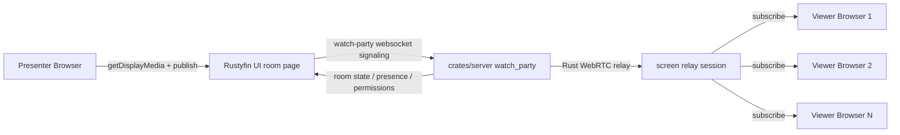

# Rustyfin Watch Together Screen Share Design

Date: 2026-03-12

Status: proposed design

## Goal

Add a `Screen` source to Watch Together alongside Local Media, YouTube, and Web.

The feature should let a joined user share:

- an entire screen,
- a single application window,
- or a browser tab when the browser offers it,

while keeping the room lifecycle, permissions, signaling, and most orchestration in Rust.

## Short Answer

Rustyfin should implement screen sharing as a new watch source backed by a new watch-party room mode: `screen`.

Recommended delivery shape:

- use the browser-native `getDisplayMedia()` chooser for capture,
- keep room authority and permissions in `crates/server/src/watch_party`,
- add Rust-managed WebRTC signaling and one-to-many relay logic for screen streams,
- support one active presenter at a time in v1,
- support optional shared audio when the browser and OS expose it,
- avoid remote control, recording, and multi-presenter mosaics in v1.

This is the best fit for the current codebase because it extends the existing watch-party mode model instead of introducing a parallel subsystem.

## Why This Fits The Current Repo

The existing room implementation already maps user-facing modes to backend state:

- `ui/src/app/rooms/components/WatchSourceTabsBar.tsx` currently exposes `video`, `youtube`, and `web`.
- `ui/src/app/rooms/hooks/useRoomReconfigure.ts` already switches sources by reconfiguring the room.
- `crates/server/src/watch_party/handlers.rs` and `crates/server/src/watch_party/ws.rs` already route behavior by `room_mode`.
- `crates/server/src/watch_party/manager.rs` already maintains room-specific runtime state for `video`, `audio`, `youtube`, `web`, `create`, and `play`.
- `crates/server/src/channels/ws.rs` already contains Rust-side RTC offer/answer/ICE forwarding patterns that can be reused.

Important implementation detail:

- `watch_party_room.room_mode` is already stored as text in PostgreSQL.
- Adding `screen` as a new room mode does not require a schema migration just to persist the new mode string.

That means the screen-share feature can be added as an additive mode extension rather than a structural rewrite.

## External Product Patterns Worth Copying

### Discord

Discord currently supports sharing either an application window or an entire screen, lets users change window, exposes stream quality settings, shows a picture-in-picture preview to the presenter, and supports pop-out/full-screen viewer modes. It also gates who can share by permission and calls out browser and OS audio limitations clearly. Source: [Discord Go Live and Screen Share](https://support.discord.com/hc/en-us/articles/360040816151-Go-Live-and-Screen-Share)

Useful patterns to borrow:

- one clear `Screen` action,
- simple chooser flow,
- local presenter preview,
- easy `Change Window`,
- explicit viewer pop-out/full-screen,
- clear permission boundary for who can present,
- blunt messaging when audio sharing is unavailable.

### Google Meet

Google Meet presents three clear share types: tab, window, or entire screen. It also supports tab or system audio when available, lets hosts disable presenting, supports "Share this tab instead", and emphasizes picture-in-picture while presenting. Source: [Google Meet Help: Present during a video meeting](https://support.google.com/meet/answer/9308856?co=GENIE.Platform%3DDesktop&hl=en)

Useful patterns to borrow:

- keep the share choice simple,
- support host controls for allowing or blocking presentation,
- support in-session surface switching where the browser allows it,
- keep participants visible while presenting,
- support "join only to present" later if Watch Together grows into meeting-style rooms.

### Zoom

Zoom supports sharing an entire desktop, specific apps, a portion of the screen, optional sound sharing, video optimization, pause/resume, side-by-side viewing, acknowledgement banners once viewers are receiving the stream, and strong host controls over who can share. Source: [Zoom Support: Sharing your screen or desktop on Zoom](https://support.zoom.com/hc/en/article?id=zm_kb&pStoreID=massmutual%27A&sysparm_article=KB0060596)

Useful patterns to borrow:

- "share sound" as an explicit option,
- a presenter toolbar with stop/change/pause controls,
- a viewer acknowledgement banner,
- fit-to-window and full-screen viewing,
- optional motion optimization for video-heavy shares.

### Browser Reality

On the web, the browser owns the actual picker. `getDisplayMedia()` is only available in secure contexts, requires a direct user gesture, cannot persist permission across sessions, and lets the browser decide the final capture picker. It can expose hints such as `selfBrowserSurface`, `surfaceSwitching`, `systemAudio`, and `monitorTypeSurfaces`, but those are only hints. Source: [MDN: MediaDevices.getDisplayMedia()](https://developer.mozilla.org/en-US/docs/Web/API/MediaDevices/getDisplayMedia)

That means Rustyfin should not try to recreate Discord's native picker UX exactly. In the browser, the right design is:

- show one clear `Share screen` button,
- explain that the browser will ask for a tab, window, or screen,
- and then let the browser/OS picker do the selection.

## Product Decision

### Recommended v1 Feature Set

Ship these in the first implementation:

- `Screen` tab in the watch-source bar.
- `screen` room mode in the watch-party backend.
- Single active presenter at a time.
- Explicit presenter session states: `idle`, `requesting_capture`, `starting`, `live`, `ended`, `error`.
- Browser-native share picker for tab/window/screen.
- Preflight capability checks before the user clicks Share: HTTPS, browser support, likely audio availability, and current room permission.
- Optional share-audio toggle when supported.
- Presenter preview card.
- Presenter claim lock before the browser picker opens.
- Presenter toolbar with `Share screen`, `Stop sharing`, and `Change shared item`.
- `Stop sharing` and `Change shared item` actions.
- Viewer full-screen mode.
- Viewer fit/fill toggle.
- Viewer stream volume control when shared audio is present.
- Presenter name, source type, and live status in the room header.
- A viewer-ready acknowledgement banner once at least one subscriber is receiving the stream.
- Automatic cleanup when the browser stops sharing or the presenter disconnects.
- Basic troubleshooting messages for the common failures seen in other products: no HTTPS, OS permission denial, browser audio limitation, and lost capture.

Do not ship these in v1:

- remote control,
- recording,
- annotations over the live share,
- multiple simultaneous presenters,
- simultaneous webcam plus screen composition,
- screen-share thumbnails on the room list,
- arbitrary region/portion capture,
- server-side transcoding ladders.

### Recommended v1.1 / Follow-up Features

- quality profile selector: `Auto`, `Text clarity`, `Motion`.
- request-to-present flow for non-host members.
- `allow_non_host_present` policy flag.
- picture-in-picture mini preview for the presenter.
- browser-assisted surface switching when supported.
- basic network-quality indicator.
- optional viewer pop-out window.
- optional `stay on top` pop-out viewer.
- side-by-side `content + people` layout for viewers.
- presenter-plus-camera mode for demos and walkthroughs.
- live captions and post-session notes generated through `rustfin-transcription-agent` when shared audio is available.
- lightweight timestamped notes or bookmarks while presenting.
- moderated pin or spotlight controls for hosts.
- annotation layer for shared content.
- remote control only as a later, explicitly separate security-reviewed feature.

## Proposed User Experience

### Entry Points

Add `Screen` anywhere Watch Together already exposes source switching:

- room watch-source tabs,
- room reconfigure modal,
- any watch-mode summary copy that currently says "Local Media, YouTube, or Web".

Recommended watch-source labels:

- `Local Media`
- `YouTube`
- `Web`
- `Screen`

### Presenter Flow

1. Host switches the room to `Screen`.
2. Room shows a `Screen` stage panel instead of the local media, YouTube, or web UI.
3. Presenter clicks `Share screen`.
4. Rustyfin calls `navigator.mediaDevices.getDisplayMedia()` from that click handler.
5. The browser chooser lets the user pick a tab, window, or entire screen.
6. After capture starts, Rustyfin shows:
   - a small local preview,
   - presenter name,
   - share type such as `Tab`, `Window`, or `Screen`,
   - whether audio is included,
   - `Stop sharing`,
   - `Change shared item`.
7. Viewers automatically attach to the live stream.

Recommended UI copy near the share button:

- "Share a browser tab, app window, or entire screen. Your browser will ask what to share."

### Viewer Flow

Viewers should see:

- the live shared content in the main stage,
- presenter attribution,
- a `Live` badge,
- optional shared-audio badge,
- `Full screen`,
- `Fit` / `Fill`,
- `Open side panel` or persistent roster view.

### Permissions

Recommended v1 rule set:

- only the host can switch the room into or out of `screen` mode,
- clicking `Share screen` claims the presenter slot before the browser picker opens,
- the active presenter can always stop their own share,
- other members cannot displace or force-stop the active presenter,
- only the active presenter can replace their own shared item in v1.

Recommended follow-up:

- add `allow_non_host_present` to the room policy JSON so controllers can present when the host allows it.

That mirrors Meet and Zoom host controls more closely than trying to overload `allow_non_host_play_pause`.

## UX Details To Copy From Other Products

These are worth adopting because they are useful without blowing up scope:

- A presenter preview card.
- A persistent `Change shared item` action.
- A viewer `Full screen` action.
- A viewer `side-by-side` content layout in a follow-up iteration.
- A visible sharing banner so the presenter knows the share is live.
- A clear host control over who can present.
- A clear audio-sharing toggle with platform caveats.
- A stream volume slider for viewers.
- A presenter toolbar that stays available while sharing.
- A message when browser or OS support blocks audio sharing.
- A browser or app hint to switch shared tabs/windows without ending the session.

These should be deferred:

- remote control,
- annotation,
- simultaneous shares,
- recording/export,
- whiteboard overlay on top of a screen share.

Those features add disproportionate security and complexity risk for a first version.

## Review Additions

This design is directionally correct, but it was missing a few things that mature screen-sharing products consistently treat as first-class:

- preflight capability checks before capture starts,
- a clearer presenter session state model,
- better viewer niceties around layout, volume, and acknowledgement,
- explicit platform troubleshooting guidance,
- adaptive quality behavior for text versus motion,
- accessibility follow-through,
- and a project-specific opportunity to reuse Rustyfin's transcription stack for captions and notes.

The sections below fold those improvements into the proposal.

## How Mature Services Ship Screen Share

Across Discord, Google Meet, Microsoft Teams, Zoom, and Slack, the overall model is very consistent:

- a single prominent share button,
- browser or OS-native surface picker,
- host or admin permission gates,
- a presenter toolbar that stays visible while sharing,
- layout controls for viewers,
- audio sharing as a separate opt-in,
- collaboration add-ons around the stream,
- and centralized media relays or servers once the feature needs to support more than trivial participant counts.

### Common UX Pattern

What these products generally do:

- let the browser or native client own the surface picker,
- keep the meeting UI visible while presenting,
- expose `change what you are sharing` without forcing a full restart,
- give the presenter and host clear authority,
- and give the viewer layout controls instead of one fixed stage.

That matches the current Rustyfin recommendation, but Rustyfin should be more explicit about the same supporting UX.

### Common Niceties

Useful niceties that show up repeatedly:

- Discord: stream preview toggle, in-call quality changes, pop-out viewer, stay-on-top, per-stream volume, easy `Change Window`. Source: [Discord Go Live and Screen Share](https://support.discord.com/hc/en-us/articles/360040816151-Go-Live-and-Screen-Share), [Discord video and screenshare updates](https://support.discord.com/hc/en-us/articles/360045784891-Video-Screenshare-Updates-Multistream-and-More-)
- Google Meet: `Share this tab instead`, PiP while presenting, enlarge shared content, host/co-host pinning, file-sharing suggestions for presented tabs. Source: [Google Meet present during a meeting](https://support.google.com/meet/answer/9308856?hl=en-gb&ref_topic=14074743), [Google Meet pinning](https://support.google.com/meet/answer/7501121?hl=en-IE)
- Microsoft Teams: presenter toolbar, include sound toggle, presenter modes, side-by-side content views, managed attendee view, annotation, request/give control. Source: [Teams show your screen](https://support.microsoft.com/en-us/office/show-your-screen-during-a-meeting-90c84e5a-b6fe-4ed4-9687-5923d230d3a7), [Teams present content](https://support.microsoft.com/en-us/office/present-content-in-microsoft-teams-meetings-fcc2bf59-aecd-4481-8f99-ce55dd836ce8), [Teams presenter modes](https://support.microsoft.com/en-us/office/presenter-modes-in-microsoft-teams-a3599bcb-bb35-4e9c-8dbb-72775eb91e04)
- Zoom: portion-of-screen sharing, side-by-side mode, annotation, optimize for video, 60fps content sharing, remote control, dim flashing content. Source: [Zoom screen sharing](https://support.zoom.com/hc/en/article?id=zm_kb&pStoreID=massmutual%27A&sysparm_article=KB0060596), [Zoom side-by-side mode](https://support.zoom.com/hc/en/article?id=zm_kb&sysparm_article=KB0067526), [Zoom annotation](https://support.zoom.com/hc/en/article?id=zm_kb&sysparm_article=KB0067931), [Zoom remote control](https://support.zoom.com/hc/en/article?id=zm_kb&sysparm_article=KB0065790), [Zoom dim flashing video](https://support.zoom.com/hc/en/article?id=zm_kb&sysparm_article=KB0058139)
- Slack: up to two simultaneous screen shares in huddles, drawing on shared screens, dedicated notes thread and canvas, live captions, AI notes. Source: [Slack huddles](https://slack.com/help/articles/4402059015315-Use-huddles-in-Slack), [Slack AI huddle notes](https://slack.com/help/articles/31377193680019-Use-AI-to-take-huddle-notes-in-Slack)

## Problems Mature Products Hit And How They Mitigate Them

### Oversharing And Hall Of Mirrors

This is one of the most common problems in browser-based screen sharing:

- users accidentally share the meeting tab,
- users accidentally share an entire screen instead of a window,
- users expose notifications or background content,
- and self-preview can create a recursive hall-of-mirrors effect.

Mitigations used by browsers and products:

- prefer tabs or windows over full-screen sharing,
- exclude self-capture where possible,
- support browser-managed tab switching,
- and add cropping or capture-handle features for self-capture scenarios.

Relevant web-platform improvements:

- Chrome's privacy-preserving screen sharing controls: `displaySurface`, `monitorTypeSurfaces`, `surfaceSwitching`, `selfBrowserSurface`. Source: [Chrome screen-sharing controls](https://developer.chrome.com/docs/web-platform/screen-sharing-controls), [Chrome avoiding oversharing](https://developer.chrome.com/blog/avoiding-oversharing-when-screen-sharing/)
- Capture Handle for safer collaboration between captured and capturing apps. Source: [Chrome Capture Handle](https://developer.chrome.com/docs/web-platform/capture-handle/)
- Region Capture to reduce accidental oversharing within a tab. Source: [Chrome Region Capture](https://developer.chrome.com/docs/web-platform/region-capture/)

Rustyfin implication:

- bias the picker toward `browser` or `window` when possible,
- set `selfBrowserSurface: "exclude"`,
- show a pre-share warning before entire-screen capture,
- and suppress or hide the local preview if self-capture is detected.

### Focus Thrash While Presenting

Presenters often need to keep chat, roster, and room controls visible while also interacting with the shared surface. That creates annoying context switching.

Mitigations used elsewhere:

- Google Meet PiP and minimized presenter views,
- Teams presenter toolbar and minimized meeting window,
- Chrome Conditional Focus and Captured Surface Control APIs.

Sources:

- [Chrome Conditional Focus](https://developer.chrome.com/docs/web-platform/conditional-focus)
- [MDN Captured Surface Control](https://developer.mozilla.org/en-US/docs/Web/API/Screen_Capture_API/Captured_Surface_Control)

Rustyfin implication:

- keep the room controls visible in a compact presenter strip,
- expose `Change shared item` without forcing the user to navigate away,
- and evaluate Conditional Focus or captured-surface-control hooks behind feature detection.

### Audio Echo And Audio Availability Gaps

System-audio sharing is inconsistent across browsers and platforms. Mature products repeatedly document:

- Linux limitations,
- macOS driver or permission requirements,
- echo when meeting audio and shared system audio loop into each other,
- and cases where tab audio works but full-screen audio does not.

Examples:

- Discord documents no Linux screen-share audio and different audio behavior by platform. Source: [Discord Go Live and Screen Share](https://support.discord.com/hc/en-us/articles/360040816151-Go-Live-and-Screen-Share)
- Teams documents Mac audio-driver installation, same-output-device requirements on Windows, and explicit echo-avoidance guidance. Source: [Teams share sound](https://support.microsoft.com/en-gb/office/share-sound-from-your-computer-in-microsoft-teams-meetings-or-live-events-dddede9f-e3d0-4330-873a-fa061a0d8e3b)
- Meet explicitly warns about echo and recommends the system default audio output device for system-audio sharing. Source: [Google Meet present during a meeting](https://support.google.com/meet/answer/9308856?hl=en-gb&ref_topic=14074743)

Rustyfin implication:

- audio must always be optional and visibly best-effort,
- show browser- and platform-specific caveats before capture,
- expose a viewer volume slider,
- and prefer tab or window capture for audio-sharing workflows.

### Bandwidth And CPU Pressure

Large or multi-viewer screen sharing stresses both the sender and the relay. Other services have addressed this with:

- adaptive content behavior for static text versus motion,
- simulcast or multiple quality layers,
- suppression of layers not currently being viewed,
- signaling reductions for larger calls,
- and low-resource or efficiency modes.

Examples:

- Teams uses local AI to detect whether shared content is static or in motion, prioritizing readability for static content and frame rate for moving content. Source: [Teams AI quality processing](https://support.microsoft.com/en-us/office/how-microsoft-teams-uses-ai-to-enhance-audio-and-video-in-meetings-40e054ef-2b7a-4b19-9bd0-e7cd3288a5a6)
- Jitsi added off-stage layer suppression to reduce CPU and bandwidth and later introduced SSRC rewriting to reduce signaling and decoder load in very large calls. Source: [Jitsi off-stage layer suppression](https://jitsi.org/blog/new-off-stage-layer-suppression-feature/), [Jitsi SSRC rewriting](https://jitsi.org/blog/improving-performance-on-very-large-calls-introducing-ssrc-rewriting/)
- Zoom exposes efficiency mode and explicit video-share optimization settings. Source: [Zoom efficiency mode](https://support.zoom.com/hc/en/article?id=zm_kb&sysparm_article=KB0080877), [Zoom 60fps content sharing](https://support.zoom.com/hc/en/article?id=zm_kb&sysparm_article=KB0084387)

Rustyfin implication:

- add content-mode adaptation early,
- instrument sender CPU and attach times,
- keep v1 to one active presenter,
- and defer more expensive multi-layer behavior until metrics justify it.

### Platform Permission And OS Edge Cases

These products all hit messy OS and packaging issues:

- Slack documents a specific macOS App Store versus direct-download permission bug and a reset path.
- Slack and Zoom both document monitor and Wayland-specific limitations.
- Teams documents driver installation steps for Mac audio.

Sources:

- [Slack Mac screen-share bug](https://slack.com/help/articles/29407960918291-Troubleshoot-huddles-screen-sharing-bug-on-the-Slack-Mac-desktop-app)
- [Slack audio and video troubleshooting](https://slack.com/help/articles/115003538426-Troubleshoot-audio-and-video-issues-in-Slack)
- [Zoom screen sharing](https://support.zoom.com/hc/en/article?id=zm_kb&pStoreID=massmutual%27A&sysparm_article=KB0060596)

Rustyfin implication:

- build a first-class troubleshooting panel instead of a generic failure toast,
- report which step failed: secure context, browser API, permission denial, audio unavailable, or transport failure,
- and keep platform troubleshooting copy in the UI rather than only in documentation.

### Accessibility Risks

Screen-shared video can be hard to follow or even harmful for some viewers.

Mitigations already used by other services:

- Zoom can dim shared video with flashing patterns for viewers. Source: [Zoom dim flashing video](https://support.zoom.com/hc/en/article?id=zm_kb&sysparm_article=KB0058139)
- Meet and Teams keep participant tiles visible while content is enlarged or pinned.
- Meet documents screen-reader-specific presenting behavior and audio caveats. Source: [Google Meet screen reader presentation help](https://support.google.com/meet/answer/15738543?hl=en-your-windows-device)

Rustyfin implication:

- keyboard-first presenter controls,
- accessible labels and focus order,
- optional reduced-motion viewer mode,
- and a future accessibility setting to dim flashing screen-share content.

## Technical Design

### Core Decision: Add `screen` As A Room Mode

Treat screen sharing as a new watch-party mode:

- `video`
- `youtube`
- `web`
- `screen`

This keeps the semantics clean:

- `video` is synchronized playback of Rustyfin media,
- `youtube` is synchronized external video playback,
- `web` is synchronized shared navigation,
- `screen` is live captured pixels.

Do not try to overload `web` for this. A live screen share is not just a web URL change.

### Capture Boundary

The browser must own capture. Rust cannot bypass this on the web.

The correct split is:

- browser UI:
  - call `getDisplayMedia()`,
  - own the local `MediaStream`,
  - render preview,
  - detect `track.onended`,
  - negotiate WebRTC.
- Rust backend:
  - authorize the action,
  - own room state,
  - own presenter state,
  - own signaling,
  - own relay session lifecycle,
  - own metrics and audit logging.

### Preflight And Health Model

Before Rustyfin calls `getDisplayMedia()`, the UI should run a fast preflight and render concrete status lines:

- `Secure context`: pass or fail.
- `Screen capture API available`: pass or fail.
- `System audio likely available`: yes, no, or unknown.
- `Room permission`: allowed or blocked by room policy.
- `Browser recommendation`: `Tab`, `Window`, or `Screen`.

This avoids a lot of the "click share, get a vague failure" behavior that users hit in other products.

During capture, Rustyfin should track:

- capture granted,
- local track live,
- publish negotiated,
- at least one viewer attached,
- reconnecting,
- stopped or failed.

That state should drive the toolbar and banners in `ScreenPlayer.tsx`.

### Transport Decision

Recommended v1 transport:

- browser capture,
- Rust-managed WebRTC relay,
- one publisher,
- many subscribers.

Do not use full peer-to-peer mesh as the primary design.

Why not mesh:

- screen sharing is much heavier than mic audio,
- one presenter uploading separately to every viewer scales poorly,
- presenter CPU and uplink become the bottleneck,
- quality becomes unstable as viewer count grows.

Why a Rust relay is the right fit:

- keeps most orchestration in Rust,
- keeps one upstream from the presenter,
- centralizes metrics and admission control,
- makes late joins cleaner,
- fits the current service-oriented Rust architecture.

Recommended Rust implementation path:

- start with the `webrtc` crate for browser-compatible peer connection, DTLS, SRTP, and track handling,
- only evaluate a lower-level alternative if relay-specific scaling needs outgrow that surface.

### Adaptive Content Strategy

Rustyfin should explicitly treat screen share as two different classes of content:

- text or detail-heavy content such as IDEs, terminals, documents, admin pages,
- motion-heavy content such as trailers, gameplay, animation, or scrolling demos.

Recommended implementation:

- default screen-share video tracks to `contentHint = "text"` or `contentHint = "detail"` when the selected quality profile is `Text clarity`,
- switch to `contentHint = "motion"` when the user selects `Motion`,
- keep `Auto` as the default and allow the UI to flip between readability-biased and motion-biased behavior.

Sources:

- [MDN contentHint](https://developer.mozilla.org/en-US/docs/Web/API/MediaStreamTrack/contentHint)
- [Teams AI screen content processing](https://support.microsoft.com/en-us/office/how-microsoft-teams-uses-ai-to-enhance-audio-and-video-in-meetings-40e054ef-2b7a-4b19-9bd0-e7cd3288a5a6)

This is a concrete improvement over only naming quality modes without specifying how Rustyfin should drive them.

### Where The Rust Relay Should Live

Recommended starting point:

- add a new `watch_party::rtc` module inside `crates/server`.

Reason:

- it minimizes deployment churn for v1,
- it keeps the watch-party control plane and screen-share relay close together,
- it avoids introducing a new service before the protocol stabilizes.

If screen sharing later becomes heavy enough to justify isolation, extract the same module into a dedicated Rust microservice after the protocol is stable.

### Recommended Codec Baseline

Use:

- VP8 for screen video in v1,
- Opus for optional shared audio.

Reason:

- broad browser interoperability,
- lower implementation risk,
- clean support in Rust WebRTC stacks.

VP9 or AV1 can be evaluated later for better screen-text quality if CPU and browser support prove acceptable.

## Suggested Runtime Model



## Browser Capture Options

When starting capture, Rustyfin should pass browser hints that bias toward sane meeting behavior:

- `selfBrowserSurface: "exclude"` to reduce hall-of-mirrors accidents,
- `surfaceSwitching: "include"` where supported,
- `systemAudio: "include"` where supported,
- `monitorTypeSurfaces: "include"` so full-screen sharing stays available.

Rustyfin should then inspect the resulting track settings and label the session as:

- `browser`,
- `window`,
- or `monitor`.

Important limitation:

- these are only hints,
- the browser still decides the final picker and the final available choices.

Rustyfin should also inspect the resulting track settings and capabilities where available:

- `displaySurface`
- `cursor`
- `screenPixelRatio`
- whether an audio track was actually returned

Source: [MDN MediaTrackSettings for shared screen tracks](https://developer.mozilla.org/docs/Web/API/MediaTrackSettings)

## Proposed Backend Changes

### `crates/server/src/watch_party/handlers.rs`

Extend create and reconfigure validation to accept `screen`.

Behavior:

- create room with `room_mode: "screen"` and no `item_id`,
- reconfigure room to `screen`,
- when reconfiguring away from `screen`, terminate any active screen session.

### `crates/server/src/watch_party/protocol.rs`

Add:

- `ScreenState` server message,
- screen-specific signaling messages,
- presenter lifecycle messages.

Recommended new server message:

```json
{
  "type": "screen_state",
  "room_id": "room-123",
  "active": true,
  "presenter_user_id": "user-1",
  "presenter_username": "alice",
  "surface_type": "window",
  "audio_enabled": true,
  "quality_profile": "auto",
  "started_ts_ms": 1741795200000,
  "updated_ts_ms": 1741795202000,
  "viewer_count": 3,
  "members": []
}
```

Recommended new client messages:

- `screen_claim`
- `screen_release`
- `screen_start`
- `screen_stop`
- `screen_replace`
- `screen_offer`
- `screen_answer`
- `screen_ice`
- `screen_quality`

If later desired, these can be collapsed into a more generic room-level RTC message format, but screen-specific names will be easier to reason about initially.

### `crates/server/src/watch_party/manager.rs`

Extend `RoomRuntime` with screen state:

- current presenter user id,
- session status,
- surface type,
- audio flag,
- quality profile,
- started and updated timestamps,
- lightweight viewer count cache,
- relay handle.

Recommended runtime struct shape:

```rust
pub struct ScreenRuntimeState {
    pub presenter_user_id: Option<String>,
    pub surface_type: Option<String>,
    pub audio_enabled: bool,
    pub quality_profile: String,
    pub started_ts_ms: Option<i64>,
    pub updated_ts_ms: i64,
    pub active: bool,
}
```

The actual WebRTC peer/track state should stay in a relay/session manager rather than being stored directly on `RoomRuntime`.

### `crates/server/src/watch_party/ws.rs`

Add handlers for:

- authorization to present,
- screen start/stop,
- signaling frame forwarding,
- cleanup when the presenter disconnects,
- state rebroadcast to late joiners.

### Database

Required v1 migration count:

- zero, if only adding `screen` as a `room_mode` string.

Possible later DB additions:

- policy JSON field `allow_non_host_present`,
- audit/event log rows for present-start and present-stop if the existing logging model is not enough.

## Suggested Frontend Changes

### New Or Updated Files

- update `ui/src/app/rooms/components/WatchSourceTabsBar.tsx`
- add `ui/src/app/rooms/components/ScreenPlayer.tsx`
- update `ui/src/app/rooms/[roomId]/page.tsx`
- update `ui/src/app/rooms/hooks/useRoomReconfigure.ts`
- update `ui/src/app/rooms/hooks/useRoomRealtime.ts`
- update `ui/src/app/rooms/realtimeTypes.ts`
- update `ui/src/lib/watchPartyApi.ts`
- optionally update `ui/src/app/rooms/components/RoomOptions.tsx` if `allow_non_host_present` is added

### `ScreenPlayer.tsx` Responsibilities

- render idle state when nobody is presenting,
- render presenter preview when current user is sharing,
- render viewer player when another user is sharing,
- run preflight checks and display concrete readiness states,
- own `getDisplayMedia()` call,
- own local capture lifecycle,
- own `RTCPeerConnection` setup for publish or subscribe,
- emit screen-specific websocket messages,
- show browser/OS caveats for audio availability,
- expose viewer-side full-screen, fit/fill, and volume controls,
- expose presenter-side quality profile changes,
- tear down on room change, disconnect, or `track.onended`.

### Viewer Layout

Recommended layout:

- main stage: shared screen video element,
- top badge row: presenter name, share type, audio status, live status,
- top-right actions: full screen, fit/fill,
- optional side-by-side people/content toggle in a follow-up iteration,
- right rail: room members and invites, unchanged from the current room layout.

This keeps the feature aligned with the current room page rather than turning the entire page into a conferencing UI.

## Permissions And Safety

### Presenter Safety

Rustyfin should:

- never auto-start capture,
- require a direct button click for capture,
- show a local "You are sharing" banner,
- allow the presenter to stop immediately,
- avoid persisting window titles or other sensitive source labels beyond runtime state.
- suggest `Do Not Disturb` or notification silencing before whole-screen capture, following the same privacy posture other products recommend on mobile and desktop.

### Logging Safety

Do not log:

- raw SDP,
- ICE candidates,
- capture source window titles,
- track labels.

Safe things to log:

- room id,
- presenter user id,
- session started/stopped,
- surface type,
- whether audio was present,
- quality profile,
- viewer counts,
- failure reason class.

### Host Controls

Recommended host capabilities:

- switch room into `screen` mode,
- decide who is allowed to present,
- optionally allow controllers to present later.

## Rustyfin-Specific Add-Ons Worth Planning

Rustyfin has one strong advantage over generic web meeting apps: it already has Rust-native service boundaries for realtime state, transcription, and rooms.

That creates some useful follow-up opportunities:

- live captions for shared audio via `rustfin-transcription-agent`,
- post-session transcript or summary for screen-share sessions with audio,
- timestamped notes or bookmarks attached to the room,
- optional export of notes into `Create Together`,
- and future policy-driven room artifacts without adding a separate SaaS dependency.

These should stay outside v1, but they are stronger product differentiators than generic annotation or remote control.

## Quality Profiles

Instead of exposing raw FPS and resolution controls in v1, use named presets:

- `Auto`
  - browser defaults, tuned by current connection.
- `Text clarity`
  - bias toward sharper text and lower frame rate.
- `Motion`
  - bias toward smoother frame rate with lower resolution if necessary.

This is simpler than Discord's native-quality matrix while still solving the same user need.

## Failure Handling

Handle these cases explicitly:

- user cancels the picker,
- browser blocks screen capture,
- insecure origin,
- capture starts without audio even though audio was requested,
- presenter manually stops sharing from browser chrome,
- presenter disconnects,
- relay negotiation times out,
- room is reconfigured away from `screen`,
- presenter abandons the picker after claiming the share slot.

Recommended user-facing messages:

- "Screen sharing requires HTTPS and a direct button click."
- "This browser/OS combination did not expose shareable audio."
- "The presenter stopped sharing."
- "The room switched away from Screen mode."

## Metrics

Add runtime counters for:

- active screen rooms,
- active presenters,
- active viewers,
- publish negotiation failures,
- subscribe negotiation failures,
- median publish setup time,
- median viewer attach time,
- average viewer count per screen room,
- quality-profile distribution,
- percentage of sessions with audio requested versus audio actually available,
- count of whole-screen versus window versus tab shares,
- count of sessions stopped by `track.onended`,
- count of presenter claims released before a live share starts.

This should plug into the existing runtime metrics style used by the backend.

## Test Plan

### Rust Integration Coverage

Add backend integration tests for:

- create room with `room_mode: "screen"`,
- reconfigure to `screen`,
- unauthorized presenter rejection,
- presenter claim locking,
- screen state reset when presenter disconnects,
- websocket auth and permission checks for screen messages.

### Frontend Coverage

Add frontend tests for:

- `Screen` tab rendering,
- idle state and live state rendering,
- start-share error handling,
- `track.onended` cleanup,
- state transitions from websocket events.

### Manual Verification

Manual matrix should cover:

- Chrome on desktop,
- Edge on desktop,
- Safari if screen capture support is sufficient for the target flow,
- Linux desktop browsers for audio caveats,
- window share,
- full-screen share,
- tab share,
- with audio and without audio,
- presenter handoff,
- late viewer join,
- claim cancellation before a live share starts.

## Recommended Implementation Order

1. Add `screen` as a recognized room mode across TypeScript and Rust types.
2. Add room reconfigure and room load plumbing for `screen`.
3. Add `screen_state` websocket message and idle UI shell.
4. Add `ScreenPlayer.tsx` with browser capture and local preview only.
5. Add Rust signaling path and relay session manager.
6. Attach viewer playback.
7. Add presenter locking, disconnect cleanup, and metrics.
8. Add polish: quality profiles, fit/fill, better errors.

## Current Repository Implementation Note

The first shipped implementation in this repository intentionally stops short of the full Rust relay described above.

What is implemented now:

- `screen` is a first-class watch-party room mode in Rust and TypeScript,
- browser capture stays in the UI with `getDisplayMedia()`,
- Rust owns room authority, permissions, lifecycle, websocket signaling, presence, presenter claim locking, and disconnect cleanup,
- hosts and controllers can present; viewers cannot,
- clicking `Share screen` first claims the presenter slot in Rust before the browser picker opens,
- only the active presenter can stop or replace the share once locked,
- media transport uses one-presenter-to-many-viewers browser WebRTC fan-out, using the existing websocket signaling model.

Why the implementation differs:

- there is no existing Rust WebRTC relay/SFU stack in the current workspace,
- landing the complete relay in the same pass would have made the feature materially larger and riskier,
- the shipped path keeps the control plane in Rust and keeps the protocol/session model compatible with a later Rust relay cutover.

What should happen next if this feature proves valuable:

- move browser-to-browser media fan-out behind a Rust-managed relay/session layer,
- keep the current `screen_state` and room authority model stable so the transport can change without breaking the UI contract,
- use the current browser fan-out implementation as the functional baseline for that cutover.

## Open Questions

- Should v1 allow only the host to present, or should controllers also be allowed?
- Should audio sharing default to on or off when available?
- Should we expose a viewer pop-out window in v1 or hold it for v1.1?
- Do we want a generic room-level RTC signaling abstraction now, or only after screen share proves stable?
- Should live captions for shared audio be a room-level toggle in v1.1, using the existing transcription service?
- Should whole-screen capture require an extra confirmation step because of privacy risk, even after the browser picker?

## Recommendation

Adopt `screen` as a first-class Watch Together source and implement it as:

- browser-native capture,
- Rust watch-party state and signaling,
- Rust-managed one-to-many WebRTC relay,
- single active presenter,
- explicit host controls,
- a narrow, reliable v1 scope.

That gives Rustyfin a Discord/Meet-style screen-share flow without breaking the current watch-party architecture or pushing too much business logic into the frontend.

## References

- Discord, "Go Live and Screen Share": [https://support.discord.com/hc/en-us/articles/360040816151-Go-Live-and-Screen-Share](https://support.discord.com/hc/en-us/articles/360040816151-Go-Live-and-Screen-Share)
- Discord, "Video & Screenshare Updates - Multistream and More!": [https://support.discord.com/hc/en-us/articles/360045784891-Video-Screenshare-Updates-Multistream-and-More-](https://support.discord.com/hc/en-us/articles/360045784891-Video-Screenshare-Updates-Multistream-and-More-)
- Google Meet Help, "Present during a video meeting": [https://support.google.com/meet/answer/9308856?co=GENIE.Platform%3DDesktop&hl=en](https://support.google.com/meet/answer/9308856?co=GENIE.Platform%3DDesktop&hl=en)
- Google Meet Help, "Pin or mute Google Meet participants": [https://support.google.com/meet/answer/7501121?hl=en-IE](https://support.google.com/meet/answer/7501121?hl=en-IE)
- Zoom Support, "Sharing your screen or desktop on Zoom": [https://support.zoom.com/hc/en/article?id=zm_kb&pStoreID=massmutual%27A&sysparm_article=KB0060596](https://support.zoom.com/hc/en/article?id=zm_kb&pStoreID=massmutual%27A&sysparm_article=KB0060596)
- Zoom Support, "Side-by-side mode for screen sharing": [https://support.zoom.com/hc/en/article?id=zm_kb&sysparm_article=KB0067526](https://support.zoom.com/hc/en/article?id=zm_kb&sysparm_article=KB0067526)
- Zoom Support, "Using annotation tools for collaboration": [https://support.zoom.com/hc/en/article?id=zm_kb&sysparm_article=KB0067931](https://support.zoom.com/hc/en/article?id=zm_kb&sysparm_article=KB0067931)
- Zoom Support, "Requesting or giving remote control": [https://support.zoom.com/hc/en/article?id=zm_kb&sysparm_article=KB0065790](https://support.zoom.com/hc/en/article?id=zm_kb&sysparm_article=KB0065790)
- Zoom Support, "Dim flashing video shared in a meeting or webinar": [https://support.zoom.com/hc/en/article?id=zm_kb&sysparm_article=KB0058139](https://support.zoom.com/hc/en/article?id=zm_kb&sysparm_article=KB0058139)
- Slack Help, "Use huddles in Slack": [https://slack.com/help/articles/4402059015315-Use-huddles-in-Slack](https://slack.com/help/articles/4402059015315-Use-huddles-in-Slack)
- Slack Help, "Use AI to take huddle notes in Slack": [https://slack.com/help/articles/31377193680019-Use-AI-to-take-huddle-notes-in-Slack](https://slack.com/help/articles/31377193680019-Use-AI-to-take-huddle-notes-in-Slack)
- Slack Help, "Troubleshoot huddles screen-sharing bug on the Slack Mac desktop app": [https://slack.com/help/articles/29407960918291-Troubleshoot-huddles-screen-sharing-bug-on-the-Slack-Mac-desktop-app](https://slack.com/help/articles/29407960918291-Troubleshoot-huddles-screen-sharing-bug-on-the-Slack-Mac-desktop-app)
- Microsoft Support, "Show your screen during a meeting": [https://support.microsoft.com/en-us/office/show-your-screen-during-a-meeting-90c84e5a-b6fe-4ed4-9687-5923d230d3a7](https://support.microsoft.com/en-us/office/show-your-screen-during-a-meeting-90c84e5a-b6fe-4ed4-9687-5923d230d3a7)
- Microsoft Support, "Present content in Microsoft Teams meetings": [https://support.microsoft.com/en-us/office/present-content-in-microsoft-teams-meetings-fcc2bf59-aecd-4481-8f99-ce55dd836ce8](https://support.microsoft.com/en-us/office/present-content-in-microsoft-teams-meetings-fcc2bf59-aecd-4481-8f99-ce55dd836ce8)
- Microsoft Support, "Presenter modes in Microsoft Teams": [https://support.microsoft.com/en-us/office/presenter-modes-in-microsoft-teams-a3599bcb-bb35-4e9c-8dbb-72775eb91e04](https://support.microsoft.com/en-us/office/presenter-modes-in-microsoft-teams-a3599bcb-bb35-4e9c-8dbb-72775eb91e04)
- Microsoft Support, "Share sound from your computer in Microsoft Teams meetings or live events": [https://support.microsoft.com/en-gb/office/share-sound-from-your-computer-in-microsoft-teams-meetings-or-live-events-dddede9f-e3d0-4330-873a-fa061a0d8e3b](https://support.microsoft.com/en-gb/office/share-sound-from-your-computer-in-microsoft-teams-meetings-or-live-events-dddede9f-e3d0-4330-873a-fa061a0d8e3b)
- Microsoft Support, "How Microsoft Teams uses AI to enhance audio and video in meetings": [https://support.microsoft.com/en-us/office/how-microsoft-teams-uses-ai-to-enhance-audio-and-video-in-meetings-40e054ef-2b7a-4b19-9bd0-e7cd3288a5a6](https://support.microsoft.com/en-us/office/how-microsoft-teams-uses-ai-to-enhance-audio-and-video-in-meetings-40e054ef-2b7a-4b19-9bd0-e7cd3288a5a6)
- MDN, "MediaDevices.getDisplayMedia()": [https://developer.mozilla.org/en-US/docs/Web/API/MediaDevices/getDisplayMedia](https://developer.mozilla.org/en-US/docs/Web/API/MediaDevices/getDisplayMedia)
- MDN, "MediaStreamTrack.contentHint": [https://developer.mozilla.org/en-US/docs/Web/API/MediaStreamTrack/contentHint](https://developer.mozilla.org/en-US/docs/Web/API/MediaStreamTrack/contentHint)
- MDN, "MediaTrackSettings": [https://developer.mozilla.org/docs/Web/API/MediaTrackSettings](https://developer.mozilla.org/docs/Web/API/MediaTrackSettings)
- MDN, "Using the Screen Capture API": [https://developer.mozilla.org/en-US/docs/Web/API/Screen_Capture_API/Using_Screen_Capture](https://developer.mozilla.org/en-US/docs/Web/API/Screen_Capture_API/Using_Screen_Capture)
- MDN, "Using the Captured Surface Control API": [https://developer.mozilla.org/en-US/docs/Web/API/Screen_Capture_API/Captured_Surface_Control](https://developer.mozilla.org/en-US/docs/Web/API/Screen_Capture_API/Captured_Surface_Control)
- Chrome for Developers, "Privacy-preserving screen sharing controls": [https://developer.chrome.com/docs/web-platform/screen-sharing-controls](https://developer.chrome.com/docs/web-platform/screen-sharing-controls)
- Chrome for Developers, "Avoid over-sharing when screen sharing": [https://developer.chrome.com/blog/avoiding-oversharing-when-screen-sharing/](https://developer.chrome.com/blog/avoiding-oversharing-when-screen-sharing/)
- Chrome for Developers, "Better screen sharing with Conditional Focus": [https://developer.chrome.com/docs/web-platform/conditional-focus](https://developer.chrome.com/docs/web-platform/conditional-focus)
- Chrome for Developers, "Better tab sharing with Capture Handle": [https://developer.chrome.com/docs/web-platform/capture-handle/](https://developer.chrome.com/docs/web-platform/capture-handle/)
- Chrome for Developers, "Better tab sharing with Region Capture": [https://developer.chrome.com/docs/web-platform/region-capture/](https://developer.chrome.com/docs/web-platform/region-capture/)
- Jitsi, "Introducing: Presenter Mode": [https://jitsi.org/blog/introducing-presenter-mode/amp/](https://jitsi.org/blog/introducing-presenter-mode/amp/)
- Jitsi, "New off-stage layer suppression feature": [https://jitsi.org/blog/new-off-stage-layer-suppression-feature/](https://jitsi.org/blog/new-off-stage-layer-suppression-feature/)
- Jitsi, "Improving performance on very large calls: introducing SSRC rewriting": [https://jitsi.org/blog/improving-performance-on-very-large-calls-introducing-ssrc-rewriting/](https://jitsi.org/blog/improving-performance-on-very-large-calls-introducing-ssrc-rewriting/)
