# Rustyfin Setup Wizard Spec — v4 (OpenAPI YAML + Per-Endpoint Sequence Diagrams)

This artifact aims to leave **nothing to the imagination**: it includes a complete OpenAPI 3.1 definition
for the setup wizard endpoints *and* request→middleware→transaction→response sequence diagrams for each endpoint.

## 1) OpenAPI 3.1 YAML (canonical)

> Also saved as a standalone file: `rustyfin-setup-wizard.openapi.yaml`.

```yaml
openapi: 3.1.1
info:
  title: Rustyfin Setup Wizard API
  version: 1.0.0
  summary: First-time setup wizard endpoints (Jellyfin-mirroring, hardened)
  description: 'This OpenAPI document covers the endpoints required to implement Rustyfin''s first-time setup wizard.
    It assumes a JSON error envelope: {"error":{"code":"...","message":"...","details":{}}}.'
servers:
- url: http://localhost:8096
  description: Default local dev server
tags:
- name: System
  description: Public system info
- name: Setup Session
  description: Setup session claim/release (concurrency guard)
- name: Setup Config
  description: Server identity and locale defaults
- name: Setup Admin
  description: Create the initial admin account
- name: Setup Libraries
  description: Optional library creation during setup
- name: Setup Metadata
  description: Server-wide metadata defaults
- name: Setup Network
  description: Remote access defaults and proxy safety
- name: Setup Completion
  description: Finish setup and exit setup mode
- name: Setup Reset
  description: Admin-only reset of setup mode
paths:
  /api/v1/system/info/public:
    get:
      tags:
      - System
      operationId: getPublicSystemInfo
      summary: Public system info for first-run routing
      description: Unauthenticated. The UI MUST call this before showing login. If setup_completed=false, the UI
        MUST redirect into the setup wizard.
      responses:
        '200':
          description: Public system info
          content:
            application/json:
              schema:
                $ref: '#/components/schemas/PublicSystemInfo'
              examples:
                setupIncomplete:
                  summary: Setup not completed
                  value:
                    server_name: Rustyfin
                    version: 0.1.0
                    setup_completed: false
                    setup_state: NotStarted
                setupComplete:
                  summary: Setup completed
                  value:
                    server_name: Rustyfin
                    version: 0.1.0
                    setup_completed: true
                    setup_state: Completed
  /api/v1/setup/session/claim:
    post:
      tags:
      - Setup Session
      operationId: claimSetupSession
      summary: Claim the setup session (exclusive writer lock)
      description: Claims the setup session for this client and returns an owner_token. While a session is active,
        all setup write endpoints require X-Setup-Owner-Token.
      requestBody:
        required: true
        content:
          application/json:
            schema:
              $ref: '#/components/schemas/ClaimSessionRequest'
            examples:
              default:
                value:
                  client_name: WebUI (Chrome on iPad)
                  force: false
                  confirm_takeover: false
      responses:
        '200':
          description: Session claimed
          content:
            application/json:
              schema:
                $ref: '#/components/schemas/ClaimSessionResponse'
        '409':
          description: Session already claimed by another client
          content:
            application/json:
              schema: &id001
                $ref: '#/components/schemas/ErrorEnvelope'
              examples:
                setupClaimed:
                  $ref: '#/components/examples/ErrSetupClaimed'
        '429':
          description: Rate limited
          content:
            application/json:
              schema: *id001
              examples:
                tooManyRequests:
                  $ref: '#/components/examples/ErrTooManyRequests'
  /api/v1/setup/session/release:
    post:
      tags:
      - Setup Session
      operationId: releaseSetupSession
      summary: Release the setup session early (idempotent)
      security:
      - setupOwnerToken: []
      responses:
        '200':
          description: Released
          content:
            application/json:
              schema:
                $ref: '#/components/schemas/ReleaseSessionResponse'
              examples:
                ok:
                  value:
                    released: true
        '401':
          description: Missing/invalid setup owner token
          content:
            application/json:
              schema: *id001
              examples:
                missingOwnerToken:
                  $ref: '#/components/examples/ErrMissingOwnerToken'
  /api/v1/setup/config:
    get:
      tags:
      - Setup Config
      operationId: getSetupConfig
      summary: Get current setup config draft
      security:
      - setupOwnerToken: []
      responses:
        '200':
          description: Current config (may be defaults)
          content:
            application/json:
              schema:
                $ref: '#/components/schemas/SetupConfig'
        '401':
          description: Missing/invalid setup owner token
          content:
            application/json:
              schema: *id001
              examples:
                missingOwnerToken:
                  $ref: '#/components/examples/ErrMissingOwnerToken'
        '409':
          description: Setup state violation
          content:
            application/json:
              schema: *id001
              examples:
                stateViolation:
                  $ref: '#/components/examples/ErrStateViolation'
    put:
      tags:
      - Setup Config
      operationId: putSetupConfig
      summary: Save server identity and locale defaults
      security:
      - setupOwnerToken: []
      parameters:
      - $ref: '#/components/parameters/SetupRemoteToken'
      requestBody:
        required: true
        content:
          application/json:
            schema:
              $ref: '#/components/schemas/SetupConfig'
            examples:
              default:
                value:
                  server_name: Rustyfin (Basement NAS)
                  default_ui_locale: en-IE
                  default_region: IE
                  default_time_zone: Europe/Dublin
      responses:
        '200':
          description: Saved
          content:
            application/json:
              schema:
                $ref: '#/components/schemas/OkWithSetupState'
              examples:
                ok:
                  value:
                    ok: true
                    setup_state: ServerConfigSaved
        '401':
          description: Missing/invalid setup owner token
          content:
            application/json:
              schema: *id001
              examples:
                missingOwnerToken:
                  $ref: '#/components/examples/ErrMissingOwnerToken'
        '403':
          description: Remote setup denied (non-local without remote token/enablement)
          content:
            application/json:
              schema: *id001
              examples:
                remoteDenied:
                  $ref: '#/components/examples/ErrRemoteSetupDenied'
        '409':
          description: Setup state violation
          content:
            application/json:
              schema: *id001
              examples:
                stateViolation:
                  $ref: '#/components/examples/ErrStateViolation'
        '422':
          description: Validation failed
          content:
            application/json:
              schema: *id001
              examples:
                validationFailed:
                  $ref: '#/components/examples/ErrValidationFailed'
        '429':
          description: Rate limited
          content:
            application/json:
              schema: *id001
              examples:
                tooManyRequests:
                  $ref: '#/components/examples/ErrTooManyRequests'
  /api/v1/setup/admin:
    post:
      tags:
      - Setup Admin
      operationId: createInitialAdmin
      summary: Create initial admin user (idempotent)
      description: Creates the first admin user. MUST require Idempotency-Key to support safe retries if the client
        double-submits.
      security:
      - setupOwnerToken: []
      parameters:
      - $ref: '#/components/parameters/SetupRemoteToken'
      - $ref: '#/components/parameters/IdempotencyKey'
      requestBody:
        required: true
        content:
          application/json:
            schema:
              $ref: '#/components/schemas/CreateAdminRequest'
            examples:
              example:
                value:
                  username: iwan
                  password: a-very-long-passphrase
      responses:
        '201':
          description: Admin created
          content:
            application/json:
              schema:
                $ref: '#/components/schemas/CreateAdminResponse'
              examples:
                created:
                  value:
                    user_id: c0a8012e-1234-5678-90ab-acde48001122
                    setup_state: AdminCreated
        '401':
          description: Missing/invalid setup owner token
          content:
            application/json:
              schema: *id001
              examples:
                missingOwnerToken:
                  $ref: '#/components/examples/ErrMissingOwnerToken'
        '403':
          description: Remote setup denied
          content:
            application/json:
              schema: *id001
              examples:
                remoteDenied:
                  $ref: '#/components/examples/ErrRemoteSetupDenied'
        '409':
          description: Conflict (state violation / admin exists / idempotency conflict)
          content:
            application/json:
              schema: *id001
              examples:
                stateViolation:
                  $ref: '#/components/examples/ErrStateViolation'
                adminAlreadyExists:
                  $ref: '#/components/examples/ErrAdminAlreadyExists'
                idempotencyConflict:
                  $ref: '#/components/examples/ErrIdempotencyConflict'
        '422':
          description: Validation failed
          content:
            application/json:
              schema: *id001
              examples:
                validationFailed:
                  $ref: '#/components/examples/ErrValidationFailed'
        '429':
          description: Rate limited
          content:
            application/json:
              schema: *id001
              examples:
                tooManyRequests:
                  $ref: '#/components/examples/ErrTooManyRequests'
  /api/v1/setup/paths/validate:
    post:
      tags:
      - Setup Libraries
      operationId: validateLibraryPath
      summary: Validate a server filesystem path (exists/readable/writable)
      security:
      - setupOwnerToken: []
      parameters:
      - $ref: '#/components/parameters/SetupRemoteToken'
      requestBody:
        required: true
        content:
          application/json:
            schema:
              $ref: '#/components/schemas/ValidatePathRequest'
            examples:
              example:
                value:
                  path: /media/movies
      responses:
        '200':
          description: Path check result
          content:
            application/json:
              schema:
                $ref: '#/components/schemas/ValidatePathResponse'
              examples:
                ok:
                  value:
                    path: /media/movies
                    exists: true
                    readable: true
                    writable: false
                    hint: null
        '401':
          description: Missing/invalid setup owner token
          content:
            application/json:
              schema: *id001
        '403':
          description: Remote setup denied
          content:
            application/json:
              schema: *id001
              examples:
                remoteDenied:
                  $ref: '#/components/examples/ErrRemoteSetupDenied'
        '422':
          description: Validation failed
          content:
            application/json:
              schema: *id001
              examples:
                validationFailed:
                  $ref: '#/components/examples/ErrValidationFailed'
        '429':
          description: Rate limited
          content:
            application/json:
              schema: *id001
              examples:
                tooManyRequests:
                  $ref: '#/components/examples/ErrTooManyRequests'
  /api/v1/setup/libraries:
    post:
      tags:
      - Setup Libraries
      operationId: createLibrariesDuringSetup
      summary: Create libraries in batch (optional step)
      security:
      - setupOwnerToken: []
      parameters:
      - $ref: '#/components/parameters/SetupRemoteToken'
      requestBody:
        required: true
        content:
          application/json:
            schema:
              $ref: '#/components/schemas/CreateLibrariesRequest'
            examples:
              example:
                value:
                  libraries:
                  - name: Movies
                    kind: movie
                    paths:
                    - /media/movies
                    is_read_only: true
                  - name: Shows
                    kind: show
                    paths:
                    - /media/shows
                    is_read_only: true
      responses:
        '200':
          description: Created
          content:
            application/json:
              schema:
                $ref: '#/components/schemas/CreateLibrariesResponse'
        '401':
          description: Missing/invalid setup owner token
          content:
            application/json:
              schema: *id001
        '403':
          description: Remote setup denied
          content:
            application/json:
              schema: *id001
              examples:
                remoteDenied:
                  $ref: '#/components/examples/ErrRemoteSetupDenied'
        '409':
          description: Setup state violation
          content:
            application/json:
              schema: *id001
              examples:
                stateViolation:
                  $ref: '#/components/examples/ErrStateViolation'
        '422':
          description: Validation failed
          content:
            application/json:
              schema: *id001
              examples:
                validationFailed:
                  $ref: '#/components/examples/ErrValidationFailed'
        '429':
          description: Rate limited
          content:
            application/json:
              schema: *id001
              examples:
                tooManyRequests:
                  $ref: '#/components/examples/ErrTooManyRequests'
  /api/v1/setup/metadata:
    get:
      tags:
      - Setup Metadata
      operationId: getSetupMetadata
      security:
      - setupOwnerToken: []
      responses:
        '200':
          description: Current metadata defaults
          content:
            application/json:
              schema:
                $ref: '#/components/schemas/SetupMetadata'
        '401':
          description: Missing/invalid setup owner token
          content:
            application/json:
              schema: *id001
        '409':
          description: Setup state violation
          content:
            application/json:
              schema: *id001
              examples:
                stateViolation:
                  $ref: '#/components/examples/ErrStateViolation'
    put:
      tags:
      - Setup Metadata
      operationId: putSetupMetadata
      security:
      - setupOwnerToken: []
      parameters:
      - $ref: '#/components/parameters/SetupRemoteToken'
      requestBody:
        required: true
        content:
          application/json:
            schema:
              $ref: '#/components/schemas/SetupMetadata'
            examples:
              example:
                value:
                  metadata_language: en
                  metadata_region: IE
      responses:
        '200':
          description: Saved
          content:
            application/json:
              schema:
                $ref: '#/components/schemas/OkWithSetupState'
              examples:
                ok:
                  value:
                    ok: true
                    setup_state: MetadataSaved
        '401':
          description: Missing/invalid setup owner token
          content:
            application/json:
              schema: *id001
        '403':
          description: Remote setup denied
          content:
            application/json:
              schema: *id001
              examples:
                remoteDenied:
                  $ref: '#/components/examples/ErrRemoteSetupDenied'
        '409':
          description: Setup state violation
          content:
            application/json:
              schema: *id001
              examples:
                stateViolation:
                  $ref: '#/components/examples/ErrStateViolation'
        '422':
          description: Validation failed
          content:
            application/json:
              schema: *id001
              examples:
                validationFailed:
                  $ref: '#/components/examples/ErrValidationFailed'
        '429':
          description: Rate limited
          content:
            application/json:
              schema: *id001
              examples:
                tooManyRequests:
                  $ref: '#/components/examples/ErrTooManyRequests'
  /api/v1/setup/network:
    get:
      tags:
      - Setup Network
      operationId: getSetupNetwork
      security:
      - setupOwnerToken: []
      responses:
        '200':
          description: Current network defaults
          content:
            application/json:
              schema:
                $ref: '#/components/schemas/SetupNetwork'
        '401':
          description: Missing/invalid setup owner token
          content:
            application/json:
              schema: *id001
        '409':
          description: Setup state violation
          content:
            application/json:
              schema: *id001
              examples:
                stateViolation:
                  $ref: '#/components/examples/ErrStateViolation'
    put:
      tags:
      - Setup Network
      operationId: putSetupNetwork
      security:
      - setupOwnerToken: []
      parameters:
      - $ref: '#/components/parameters/SetupRemoteToken'
      requestBody:
        required: true
        content:
          application/json:
            schema:
              $ref: '#/components/schemas/SetupNetwork'
            examples:
              example:
                value:
                  allow_remote_access: true
                  enable_automatic_port_mapping: false
                  trusted_proxies: []
      responses:
        '200':
          description: Saved
          content:
            application/json:
              schema:
                $ref: '#/components/schemas/OkWithSetupState'
              examples:
                ok:
                  value:
                    ok: true
                    setup_state: NetworkSaved
        '401':
          description: Missing/invalid setup owner token
          content:
            application/json:
              schema: *id001
        '403':
          description: Remote setup denied
          content:
            application/json:
              schema: *id001
              examples:
                remoteDenied:
                  $ref: '#/components/examples/ErrRemoteSetupDenied'
        '409':
          description: Setup state violation
          content:
            application/json:
              schema: *id001
              examples:
                stateViolation:
                  $ref: '#/components/examples/ErrStateViolation'
        '422':
          description: Validation failed
          content:
            application/json:
              schema: *id001
              examples:
                validationFailed:
                  $ref: '#/components/examples/ErrValidationFailed'
        '429':
          description: Rate limited
          content:
            application/json:
              schema: *id001
              examples:
                tooManyRequests:
                  $ref: '#/components/examples/ErrTooManyRequests'
  /api/v1/setup/complete:
    post:
      tags:
      - Setup Completion
      operationId: completeSetup
      summary: Mark setup complete and exit setup mode (idempotent)
      security:
      - setupOwnerToken: []
      parameters:
      - $ref: '#/components/parameters/SetupRemoteToken'
      requestBody:
        required: true
        content:
          application/json:
            schema:
              $ref: '#/components/schemas/CompleteSetupRequest'
            examples:
              example:
                value:
                  confirm: true
      responses:
        '200':
          description: Completed (or already completed)
          content:
            application/json:
              schema:
                $ref: '#/components/schemas/CompleteSetupResponse'
              examples:
                completed:
                  value:
                    setup_completed: true
                    setup_state: Completed
        '401':
          description: Missing/invalid setup owner token
          content:
            application/json:
              schema: *id001
        '403':
          description: Remote setup denied
          content:
            application/json:
              schema: *id001
              examples:
                remoteDenied:
                  $ref: '#/components/examples/ErrRemoteSetupDenied'
        '409':
          description: Setup state violation
          content:
            application/json:
              schema: *id001
              examples:
                stateViolation:
                  $ref: '#/components/examples/ErrStateViolation'
        '422':
          description: Validation failed
          content:
            application/json:
              schema: *id001
              examples:
                validationFailed:
                  $ref: '#/components/examples/ErrValidationFailed'
        '429':
          description: Rate limited
          content:
            application/json:
              schema: *id001
              examples:
                tooManyRequests:
                  $ref: '#/components/examples/ErrTooManyRequests'
  /api/v1/setup/reset:
    post:
      tags:
      - Setup Reset
      operationId: resetSetup
      summary: Admin-only reset of setup mode
      security:
      - bearerAuth: []
      requestBody:
        required: true
        content:
          application/json:
            schema:
              $ref: '#/components/schemas/ResetSetupRequest'
            examples:
              example:
                value:
                  confirm: RESET
                  delete_users: false
                  delete_settings: true
      responses:
        '200':
          description: Reset performed
          content:
            application/json:
              schema:
                $ref: '#/components/schemas/ResetSetupResponse'
              examples:
                ok:
                  value:
                    reset: true
                    setup_completed: false
                    setup_state: NotStarted
        '401':
          description: Missing/invalid JWT
          content:
            application/json:
              schema: *id001
        '403':
          description: Not an admin
          content:
            application/json:
              schema: *id001
        '422':
          description: Validation failed
          content:
            application/json:
              schema: *id001
              examples:
                validationFailed:
                  $ref: '#/components/examples/ErrValidationFailed'
components:
  securitySchemes:
    bearerAuth:
      type: http
      scheme: bearer
      bearerFormat: JWT
      description: 'Authorization: Bearer <jwt>'
    setupOwnerToken:
      type: apiKey
      in: header
      name: X-Setup-Owner-Token
      description: Setup session owner token returned by /setup/session/claim
  parameters:
    SetupRemoteToken:
      name: X-Setup-Remote-Token
      in: header
      required: false
      schema:
        type: string
      description: Required only for non-local requests when remote setup is enabled. See implementation spec for
        exact rules.
    IdempotencyKey:
      name: Idempotency-Key
      in: header
      required: true
      schema:
        type: string
        minLength: 8
        maxLength: 128
      description: Unique key for safely retrying create-only operations. UUID recommended.
  schemas:
    SetupState:
      type: string
      enum:
      - NotStarted
      - SessionClaimed
      - ServerConfigSaved
      - AdminCreated
      - LibrariesSaved
      - MetadataSaved
      - NetworkSaved
      - Completed
    PublicSystemInfo:
      type: object
      additionalProperties: false
      required:
      - server_name
      - version
      - setup_completed
      - setup_state
      properties:
        server_name:
          type: string
        version:
          type: string
        setup_completed:
          type: boolean
        setup_state:
          $ref: '#/components/schemas/SetupState'
    ClaimSessionRequest:
      type: object
      additionalProperties: false
      required:
      - client_name
      - force
      - confirm_takeover
      properties:
        client_name:
          type: string
          minLength: 1
          maxLength: 128
        force:
          type: boolean
          description: Attempt takeover if already claimed (restricted server-side)
        confirm_takeover:
          type: boolean
          description: Additional user confirmation for takeover in UI
    ClaimSessionResponse:
      type: object
      additionalProperties: false
      required:
      - owner_token
      - expires_at
      - claimed_by
      - setup_state
      properties:
        owner_token:
          type: string
          description: Opaque token (store client-side; never log)
        expires_at:
          type: string
          format: date-time
        claimed_by:
          type: string
        setup_state:
          $ref: '#/components/schemas/SetupState'
    ReleaseSessionResponse:
      type: object
      additionalProperties: false
      required:
      - released
      properties:
        released:
          type: boolean
    SetupConfig:
      type: object
      additionalProperties: false
      required:
      - server_name
      - default_ui_locale
      - default_region
      properties:
        server_name:
          type: string
          minLength: 1
          maxLength: 64
        default_ui_locale:
          type: string
          minLength: 2
          maxLength: 32
          description: BCP-47 (relaxed validation)
        default_region:
          type: string
          pattern: ^[A-Z]{2}$
          description: ISO 3166-1 alpha-2
        default_time_zone:
          type:
          - string
          - 'null'
          maxLength: 64
          description: IANA TZ name (optional)
    OkWithSetupState:
      type: object
      additionalProperties: false
      required:
      - ok
      - setup_state
      properties:
        ok:
          type: boolean
        setup_state:
          $ref: '#/components/schemas/SetupState'
    CreateAdminRequest:
      type: object
      additionalProperties: false
      required:
      - username
      - password
      properties:
        username:
          type: string
          minLength: 3
          maxLength: 32
          pattern: ^[a-zA-Z0-9._-]{3,32}$
        password:
          type: string
          minLength: 12
          maxLength: 1024
    CreateAdminResponse:
      type: object
      additionalProperties: false
      required:
      - user_id
      - setup_state
      properties:
        user_id:
          type: string
          description: UUID or stable user id
        setup_state:
          $ref: '#/components/schemas/SetupState'
    ValidatePathRequest:
      type: object
      additionalProperties: false
      required:
      - path
      properties:
        path:
          type: string
          minLength: 1
          maxLength: 4096
    ValidatePathResponse:
      type: object
      additionalProperties: false
      required:
      - path
      - exists
      - readable
      - writable
      - hint
      properties:
        path:
          type: string
        exists:
          type: boolean
        readable:
          type: boolean
        writable:
          type: boolean
        hint:
          type:
          - string
          - 'null'
          description: Optional actionable hint for users
    LibraryKind:
      type: string
      enum:
      - movie
      - show
      - music
      - mixed
    LibrarySpec:
      type: object
      additionalProperties: false
      required:
      - name
      - kind
      - paths
      - is_read_only
      properties:
        name:
          type: string
          minLength: 1
          maxLength: 64
        kind:
          $ref: '#/components/schemas/LibraryKind'
        paths:
          type: array
          minItems: 1
          maxItems: 32
          items:
            type: string
            minLength: 1
            maxLength: 4096
        is_read_only:
          type: boolean
    CreateLibrariesRequest:
      type: object
      additionalProperties: false
      required:
      - libraries
      properties:
        libraries:
          type: array
          minItems: 1
          maxItems: 32
          items:
            $ref: '#/components/schemas/LibrarySpec'
    LibraryRef:
      type: object
      additionalProperties: false
      required:
      - id
      - name
      properties:
        id:
          type: string
        name:
          type: string
    CreateLibrariesResponse:
      type: object
      additionalProperties: false
      required:
      - created
      - libraries
      - setup_state
      properties:
        created:
          type: integer
          minimum: 0
        libraries:
          type: array
          items:
            $ref: '#/components/schemas/LibraryRef'
        setup_state:
          $ref: '#/components/schemas/SetupState'
    SetupMetadata:
      type: object
      additionalProperties: false
      required:
      - metadata_language
      - metadata_region
      properties:
        metadata_language:
          type: string
          minLength: 2
          maxLength: 32
        metadata_region:
          type: string
          pattern: ^[A-Z]{2}$
    SetupNetwork:
      type: object
      additionalProperties: false
      required:
      - allow_remote_access
      - enable_automatic_port_mapping
      - trusted_proxies
      properties:
        allow_remote_access:
          type: boolean
        enable_automatic_port_mapping:
          type: boolean
        trusted_proxies:
          type: array
          maxItems: 64
          items:
            type: string
            description: CIDR string
    CompleteSetupRequest:
      type: object
      additionalProperties: false
      required:
      - confirm
      properties:
        confirm:
          type: boolean
    CompleteSetupResponse:
      type: object
      additionalProperties: false
      required:
      - setup_completed
      - setup_state
      properties:
        setup_completed:
          type: boolean
        setup_state:
          $ref: '#/components/schemas/SetupState'
    ResetSetupRequest:
      type: object
      additionalProperties: false
      required:
      - confirm
      - delete_users
      - delete_settings
      properties:
        confirm:
          type: string
          enum:
          - RESET
        delete_users:
          type: boolean
        delete_settings:
          type: boolean
    ResetSetupResponse:
      type: object
      additionalProperties: false
      required:
      - reset
      - setup_completed
      - setup_state
      properties:
        reset:
          type: boolean
        setup_completed:
          type: boolean
        setup_state:
          $ref: '#/components/schemas/SetupState'
    ErrorEnvelope:
      type: object
      additionalProperties: false
      required:
      - error
      properties:
        error:
          type: object
          additionalProperties: false
          required:
          - code
          - message
          - details
          properties:
            code:
              type: string
            message:
              type: string
            details:
              type: object
              additionalProperties: true
  examples:
    ErrMissingOwnerToken:
      summary: Missing setup owner token
      value:
        error:
          code: unauthorized
          message: 'unauthorized: missing setup owner token'
          details: {}
    ErrSetupClaimed:
      summary: Setup session already claimed
      value:
        error:
          code: setup_claimed
          message: Setup is currently being configured.
          details:
            claimed_by: WebUI (Firefox)
            expires_at: '2026-02-13T17:10:00Z'
    ErrStateViolation:
      summary: Setup state violation
      value:
        error:
          code: setup_state_violation
          message: 'conflict: setup state violation'
          details:
            current_state: SessionClaimed
            expected_min_state: ServerConfigSaved
    ErrAdminAlreadyExists:
      summary: Admin already exists
      value:
        error:
          code: admin_already_exists
          message: 'conflict: admin already exists'
          details: {}
    ErrIdempotencyConflict:
      summary: Idempotency key reused with different payload
      value:
        error:
          code: idempotency_conflict
          message: 'conflict: idempotency key payload mismatch'
          details: {}
    ErrValidationFailed:
      summary: Validation failed with per-field errors
      value:
        error:
          code: validation_failed
          message: validation failed
          details:
            fields:
              username:
              - must match ^[a-zA-Z0-9._-]{3,32}$
              password:
              - must be at least 12 characters
    ErrRemoteSetupDenied:
      summary: Remote setup denied
      value:
        error:
          code: remote_setup_denied
          message: 'forbidden: remote setup is disabled or token missing'
          details: {}
    ErrTooManyRequests:
      summary: Too many requests
      value:
        error:
          code: too_many_requests
          message: too many requests
          details:
            retry_after_seconds: 30
```
mermaid
sequenceDiagram
  participant Client
  participant Router
  participant Handler
  participant DB

  Client->>Router: GET /api/v1/system/info/public
  activate Router
  Router->>Handler: dispatch getPublicSystemInfo()
  activate Handler
  Handler->>DB: SELECT settings (setup_completed, setup_state, server_name, version)
  activate DB
  DB-->>Handler: rows
  deactivate DB
  Handler-->>Router: 200 PublicSystemInfo JSON
  deactivate Handler
  Router-->>Client: 200
  deactivate Router
```

### POST /api/v1/setup/session/claim

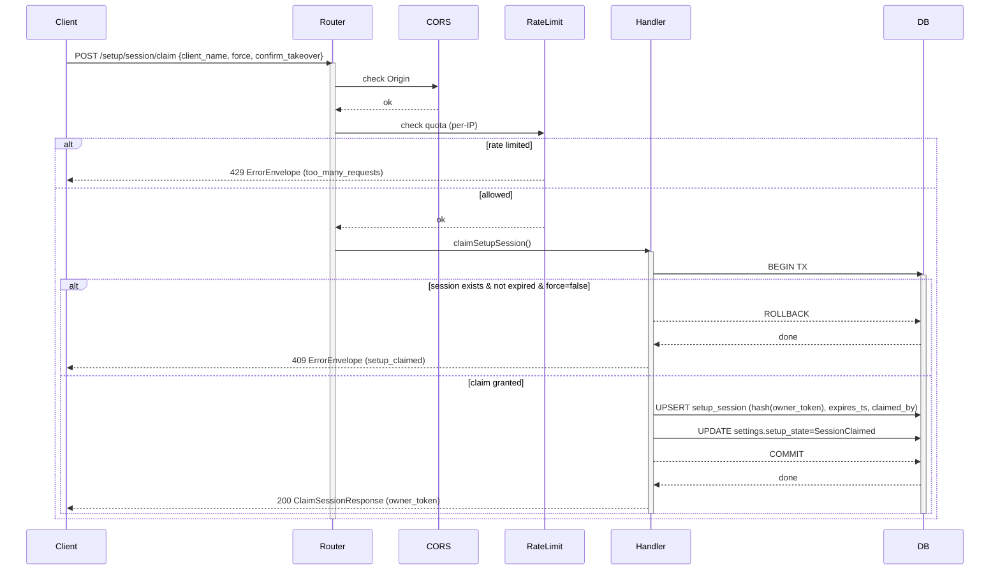

### POST /api/v1/setup/session/release

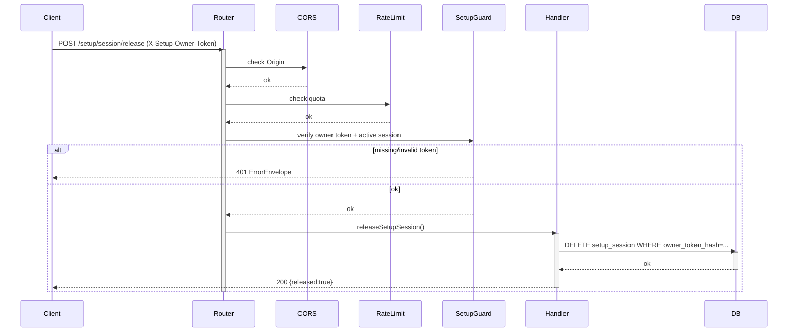

### GET /api/v1/setup/config

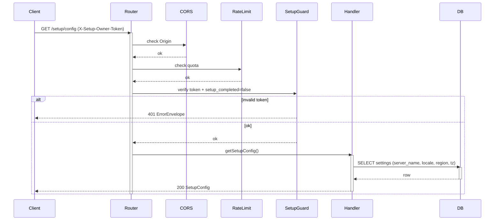

### PUT /api/v1/setup/config

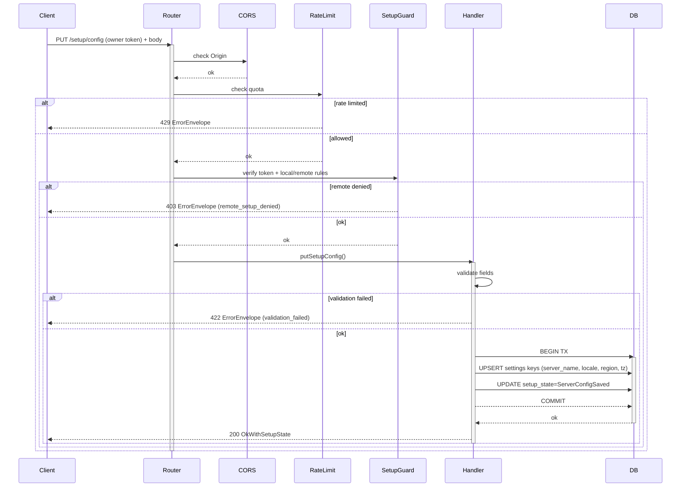

### POST /api/v1/setup/admin

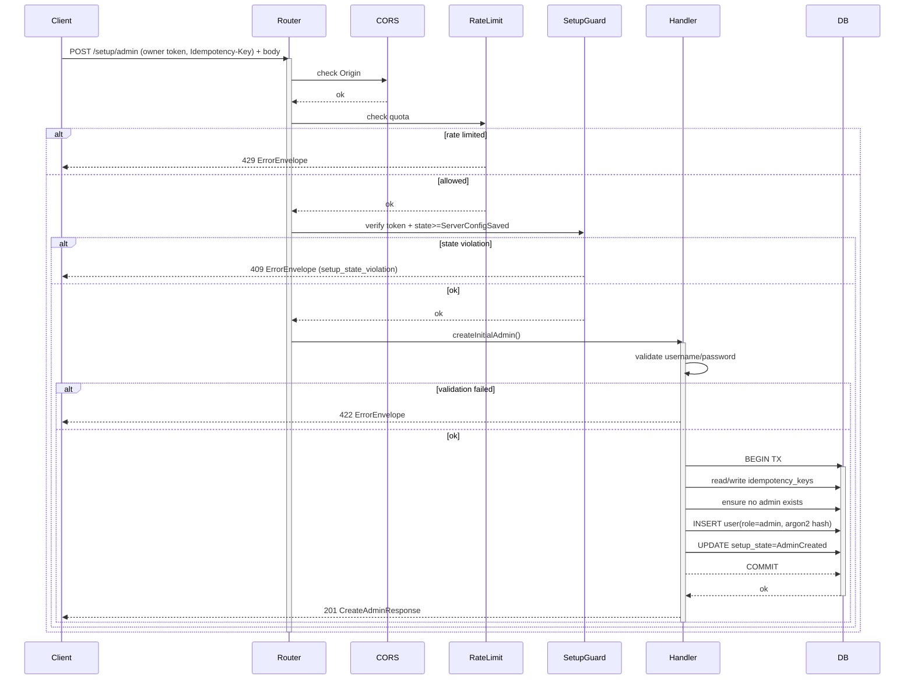

### POST /api/v1/setup/paths/validate

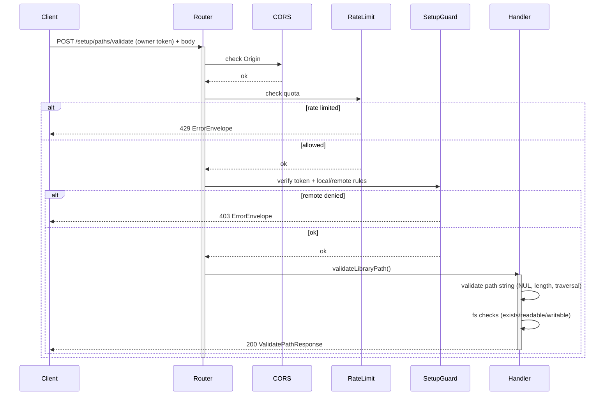

### POST /api/v1/setup/libraries

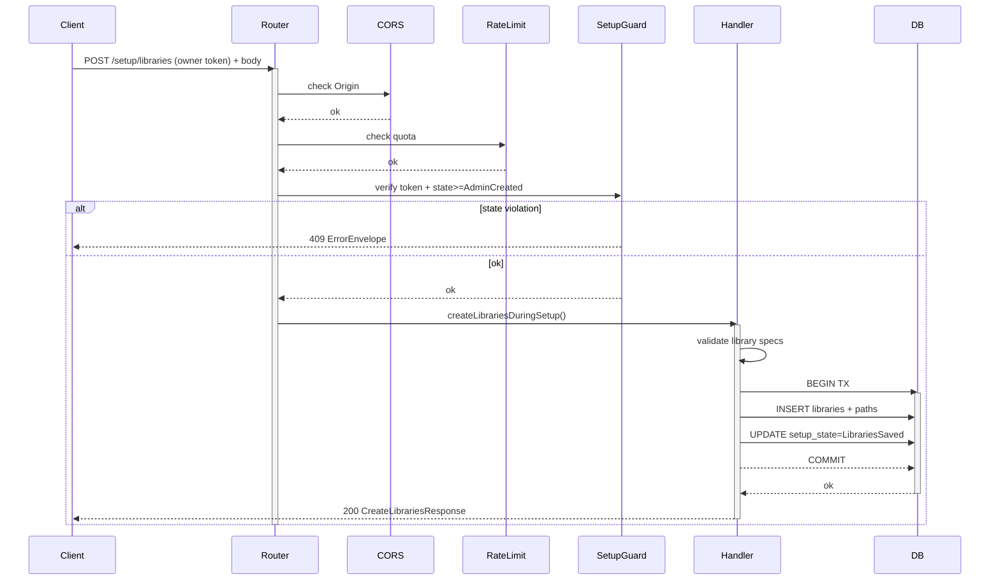

### GET /api/v1/setup/metadata

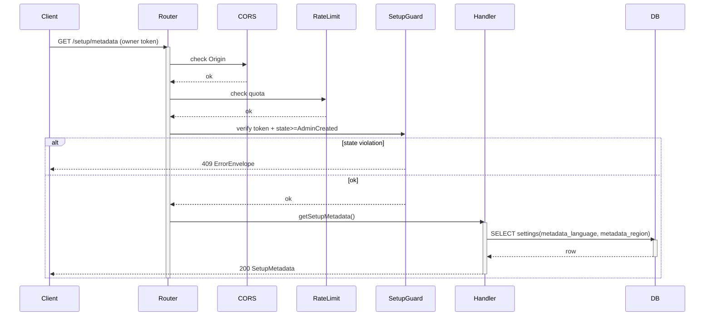

### PUT /api/v1/setup/metadata

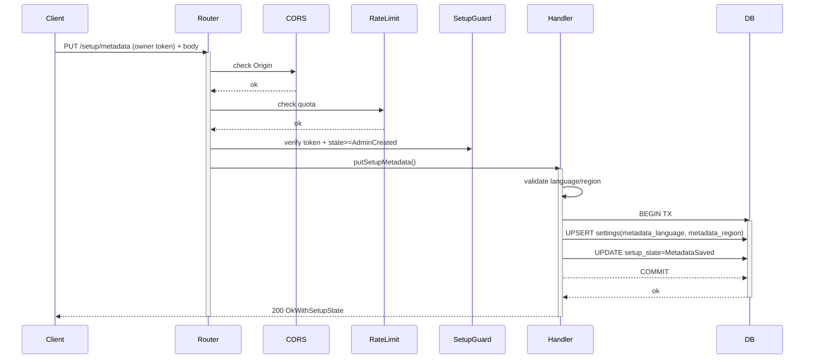

### GET /api/v1/setup/network

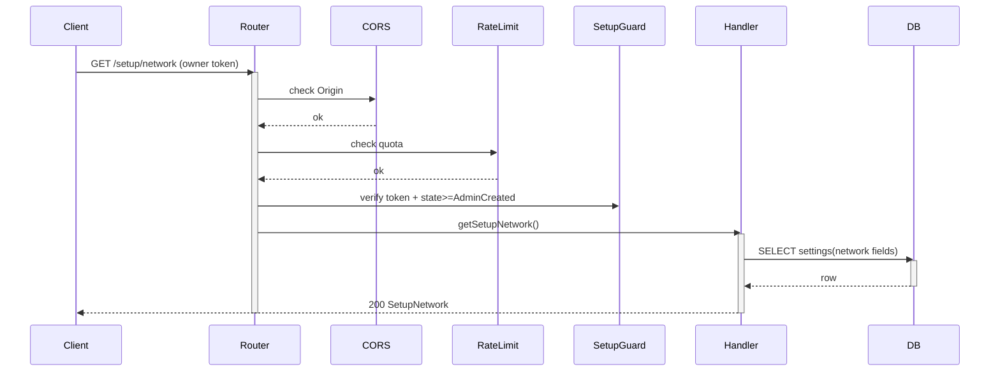

### PUT /api/v1/setup/network

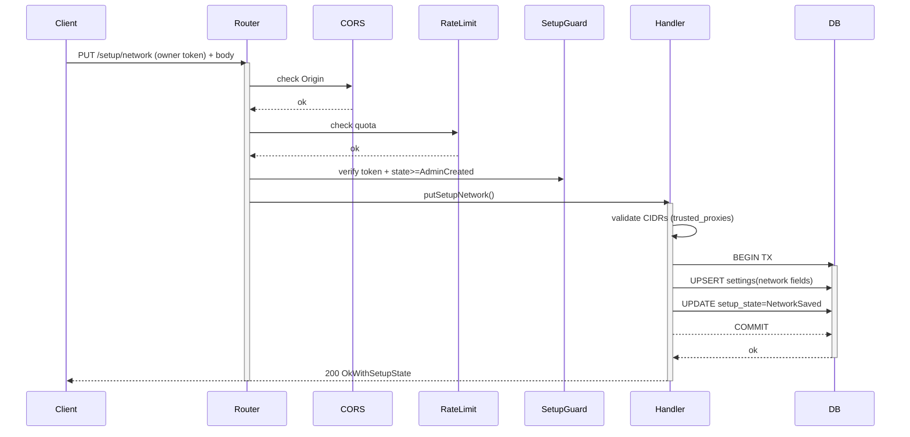

### POST /api/v1/setup/complete

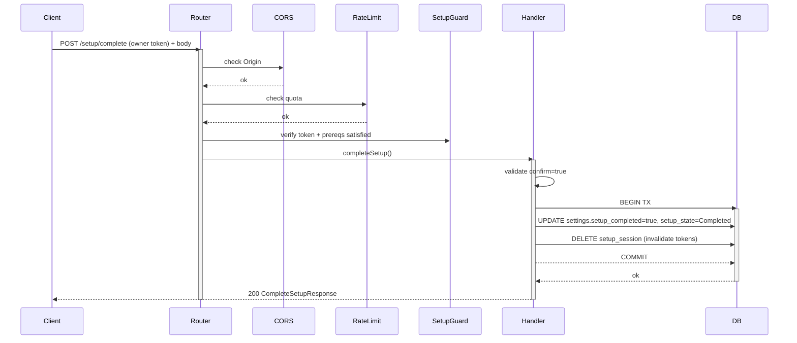

### POST /api/v1/setup/reset

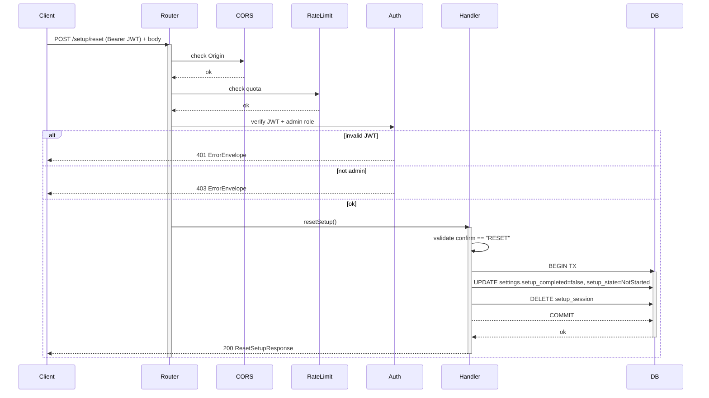

## 3) Tower rate limiting implementation (spec-level)

### 3.1 Recommended layer: tower-governor

Implement rate limiting as a **Router-scoped Tower layer** (apply it to `/api/v1/setup/**` routes).
Expose Retry-After behavior via the error envelope + `Retry-After` header.

### 3.2 Hard quotas (defaults)

- `POST /setup/session/claim`: 10/min per IP (burst 3)
- Setup writes: 60/min per owner-token (burst 15) and 30/min per IP (burst 10)
- Path validation: 60/min per IP (burst 20)

### 3.3 Must-have proxy safety

If you run behind a reverse proxy, do **not** trust `X-Forwarded-For` unless the peer IP is in a configured trusted proxy CIDR list.
Use that same resolved “effective client IP” for rate limiting keys.
