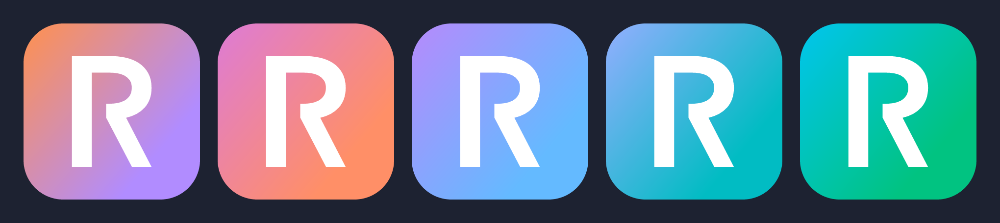
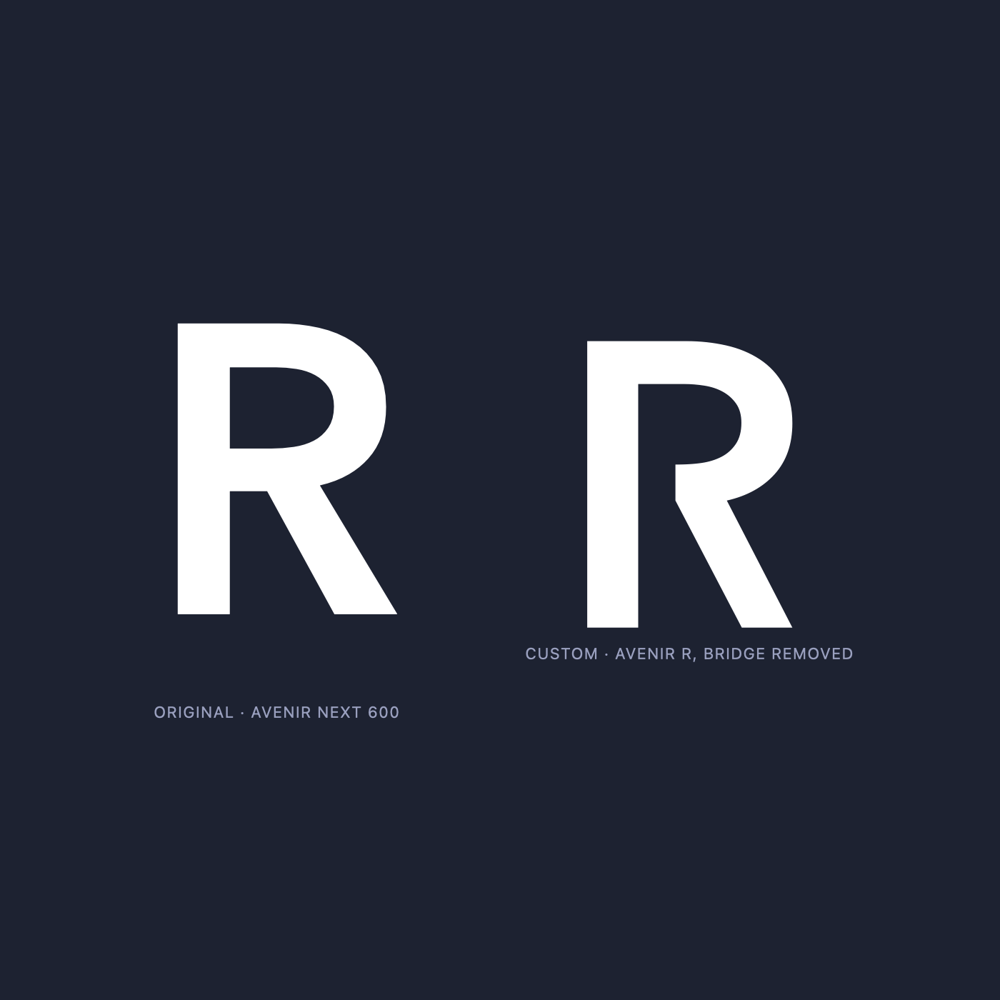

# Rusty\* suite logo

The shared logo mark for the Rusty\* suite (Rustyfin, Rustynet, Rustychat, Rustydns, Rustytorrent, …) and per‑app colorways.



## The mark

A custom **R**: the real **Avenir Next Demi Bold** "R" outline with the middle bridge that connects the bowl/leg back to the stem **removed** — leaving an open notch with a clean vertical cut. The leg is pulled in so its bottom‑right corner lines up vertically with the dome's widest point, and the top of the leg is leveled with where the dome ends.

- Every curve (bowl, leg, stem, terminals) is the genuine Avenir outline; only the stem bridge was re-routed.
- The glyph is geometrically centered (symmetric padding in the viewBox).



```
mark/
  R-mark.svg         R as a path, fill="currentColor"  — drop on any background, set the color in CSS
  R-mark-white.svg   white fill
  R-mark-black.svg   black fill
  R-mark-white.png   1024×1024, transparent background
  R-mark-black.png   1024×1024, transparent background
```

Use `R-mark.svg` for web (inherits `color`); use the PNGs where a raster asset is needed.

## The logos

Complete app icons — rounded gradient tile + white R — at 1024×1024 with transparent corners:

```
logos/rustyfin.png  rustynet.png  rustychat.png  rustydns.png  rustytorrent.png
```

### Colorways

Each tile is `linear-gradient(130deg, A 0%, B 75%)`. All gradients are built on Rustyfin's lightness/chroma (OKLCH **L ≈ 0.74, C ≈ 0.15**, locked) with only the hue changing, so the set stays cohesive side‑by‑side in a tray. Hues are hand‑picked from well‑liked regions (no olive dead‑zone, no red+green clash).

| App           | Colorway          | A (0%)    | B (75%)   |
|---------------|-------------------|-----------|-----------|
| Rustyfin      | ember             | `#ff914d` | `#b18cff` |
| Rustynet      | flame (reversed)  | `#dd7bd6` | `#ff8f67` |
| Rustychat     | twilight (reversed)| `#b68afc`| `#64baff` |
| Rustydns      | nebula            | `#94aeff` | `#01bcc3` |
| Rustytorrent  | lagoon            | `#01c5ee` | `#01c381` |

Rustyfin keeps the original brand gradient (orange → purple) untouched.

## Sources (all in Rust)

```
src/extract-glyph/   cargo project — pulls the Avenir Next Demi Bold "R" outline from
                     /System/Library/Fonts/Avenir Next.ttc via ttf-parser (prints the SVG path).
src/render-logos/    cargo project — renders the 5 logo PNGs + the R-mark PNGs with resvg.
src/palette/         standalone rustc programs that compute the OKLCH colorways and build the
                     preview board:
                       suite_palette.rs    panorama ramp exploration
                       suite_palette2.rs   rotated-recipe exploration
                       suite_palette3.rs   final: curated board, colorways, the R, A/B toggle
```

### Regenerate

```sh
# logo + mark PNGs  (writes into ../../logos and ../../mark)
cd src/render-logos && cargo run --release -- ../..

# the colorway preview board (writes suite-curated.html next to the source)
cd src/palette && rustc -O suite_palette3.rs -o /tmp/sp3 && /tmp/sp3

# re-extract the base Avenir outline (macOS, font must be installed)
cd src/extract-glyph && cargo run --release
```

## Previews

Open in a browser:

```
preview/suite-curated.html   the 12-candidate board + 5-app proposal, with a button that
                             toggles every tile between the custom R and the original Avenir R
preview/compare.html         original Avenir R vs the custom R, side by side
preview/glyph-zoom.html      large custom R with construction guide lines
preview/align-check.html     custom vs original overlaid, to check size/position
preview/center-check.html    centering crosshairs
preview/contact-sheet.png    rendered image: all 5 logos in a row (README hero)
preview/before-after.png     rendered image: original Avenir R vs the custom R
```

## Note on the typeface

The mark is derived from **Avenir Next**, which is Apple's proprietary system font. Deriving a custom outline for prototyping is fine on a licensed machine, but **using a font glyph as a shipping brand logo can run into the font EULA**. Before shipping, confirm licensing or rebuild the mark on a licensed / open near‑Avenir (e.g. Nunito Sans, Mulish). The construction (bridge removed, vertical cut, aligned leg) transfers to any geometric‑humanist R.
